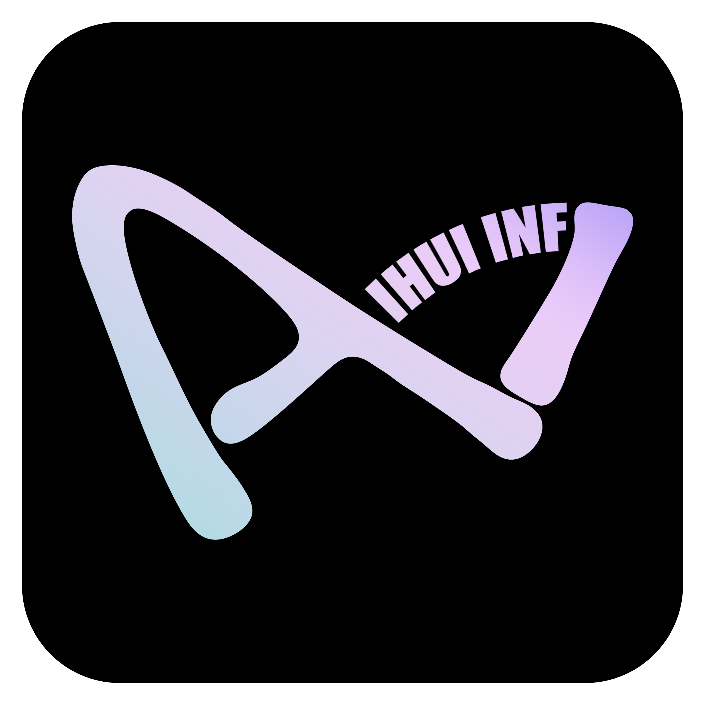

<!--
  © 2026 IHUI AI (智汇AI) · 版权所有者: 李春川 (Li Chunchuan) · https://aizhs.top
  Provenance-watermarked. 未授权商用可被溯源追责 (Apache-2.0 须保留本声明与 NOTICE)。
  [IHUI-AI-PROVENANCE]:⁠​‌​​‌​​‌‍‍​‌​​‌​​​‍‍​‌​‌​‌​‌‍‍​‌​​‌​​‌‍‍​​‌​‌‌​‌‍‍​‌​​​​​‌‍‍​‌​​‌​​‌‍‍‌​‌‌​‌‌‌‍‍‌‌​​‌‌​​‌‌‌‌​‌​‍‍‌‌​‌‌​​​‌​​​‌‌‌‍‍​‌​​​​​‌‍‍​‌​​‌​​‌‍‍‌​‌‌​‌‌‌‍‍‌‌​​‌‌‌​‌​​‌‌‌​‍‍‌‌​​‌‌​​​‌​​‌​‌‍‍‌​‌‌‌​‌‌‌​‌‌‌​‌‍‍‌​‌‌​‌‌‌‍‍​‌​​‌‌​​‍‍​‌​​​​‌‌‍‍‌​‌‌​‌‌‌‍‍​‌‌​​​​‌‍‍​‌‌​‌​​‌‍‍​‌‌‌‌​‌​‍‍​‌‌​‌​​​‍‍​‌‌‌​​‌‌‍‍​​‌​‌‌‌​‍‍​‌‌‌​‌​​‍‍​‌‌​‌‌‌‌‍‍​‌‌‌​​​​‍‍‌​‌‌​‌‌‌‍‍​‌​‌​​​​‍‍​‌​‌​​‌​‍‍​‌​​‌‌‌‌‍‍​‌​‌​‌‌​‍‍​‌​​​‌​‌‍‍​‌​​‌‌‌​‍‍​‌​​​​​‌‍‍​‌​​‌‌‌​‍‍​‌​​​​‌‌‍‍​‌​​​‌​‌‍‍​​‌​‌‌​‌‍‍​​‌‌​​‌​‍‍​​‌‌​​​​‍‍​​‌‌​​‌​‍‍​​‌‌​‌‌​⁠
-->

> ⚠️ **Copyright & Commercial Licensing Notice**
>
> © 2026 **IHUI AI (智汇AI)** · Copyright owner: **Li Chunchuan (李春川)** · https://aizhs.top
>
> - Dual licensing: open-source use under **Apache-2.0** (copyright notice and NOTICE must be retained); **closed-source commercial use, rebranding, or SaaS resale** requires a separate commercial license.
> - All source files in this repository are embedded with provenance watermarks (visible banners + invisible zero-width steganography; verify with `node scripts/watermark.mjs decode <file>`). Removing watermarks does not change copyright ownership; unauthorized commercial use is technically traceable and legally actionable.
> - CI enforces watermark verification (`pnpm watermark:check`); any change that strips watermarks fails the build.

# IHUI-AI

<p align="center">
  
</p>

<p align="center">
  <strong>Online Demo</strong> · <a href="https://aizhs.top">https://aizhs.top</a> &nbsp;|&nbsp; <strong>GitHub</strong> · <a href="https://github.com/IHUI-INF-AI/IHUI-AI">Star this repo</a><br/>
  <sub><strong>Self-hosted full-stack AI platform</strong>: model gateway + Agent orchestration + multi-tenant business backend + 8 frontend ends · Apache 2.0 · Fork to production in 5 minutes</sub>
</p>

<p align="center">
  <sub>
    <a href="README.md">简体中文</a> · <a href="README.en.md">English</a> · <a href="README.ko.md">한국어</a> · <a href="README.ja.md">日本語</a>
    &nbsp;&nbsp;|&nbsp;&nbsp;
    <strong>Mirrors</strong> · <a href="https://gitee.com/JLSLSSZWHYXGS_0/IHUI-AI">Gitee</a> · <a href="https://gitcode.com/IHUI-AI/IHUI-AI">GitCode</a>
  </sub>
</p>

---

> **This file is an index only.** As of 2026-09-30 the root README is an index layer: positioning,
> live-computed numbers, quick start, and entry points into nine topic documents. Every capability's
> full rationale and evidence lives, verbatim, in the nine archive files under
> [`docs/engineering/`](./docs/engineering); the authoritative engineering rulebook is
> [`AGENTS.md`](./AGENTS.md).

## What it is

| Dimension | Description |
| ---- | ---- |
| In one line | Self-hosted full-stack AI platform: model gateway + Agent orchestration + multi-tenant backend + 8 frontend ends |
| Backend | `apps/api` — Fastify 5 + Drizzle ORM + PostgreSQL + Zod (TypeScript) |
| AI service | `apps/ai-service` — FastAPI + LangGraph + LiteLLM + MCP (Python) |
| Frontends | Next.js 16 + React 19 + Tailwind 4 + shadcn/ui (web), Taro 4 (mini-program), React Native + NativeWind (app), Tauri 2 (desktop), WXT (extension), Node.js (CLI) |
| Data | PostgreSQL (row-level security, multi-tenant) + pgvector vector search + Redis |
| License | Apache-2.0 (copyright notice and NOTICE must be retained; source files carry provenance watermarks) |

Full positioning narrative (value pyramid, cost comparison, differentiation, benchmark categories):
[`docs/engineering/readme-01-positioning.md`](./docs/engineering/readme-01-positioning.md).

## Key numbers (live-computed)

**These numbers are not hand-copied.** The single algorithm lives in
[`scripts/gen-doc-numbers.mjs`](./scripts/gen-doc-numbers.mjs), which counts from real sources
(schema code, route registrations, locale directories, compose manifests...). The gate
[`scripts/check-doc-numbers.mjs`](./scripts/check-doc-numbers.mjs) re-computes them for this file and
the Chinese README, and blocks any stale value.

Headline claims (same source as the table below, all live-computed): **595 tables · 4,415 API routes ·
25 WebSocket endpoints · 118 catalogued LLMs · 38 platforms auto-publishing · 2,778 test files ·
238 engineering gates · 47 CI workflows · 5-language i18n parity · 9 app packages · 16 shared packages ·
15 compose services**.

<!-- BEGIN GENERATED NUMBERS (node scripts/gen-doc-numbers.mjs --markdown) -->
| 指标 | 现值 | 取数键 |
| ---- | ---- | ------ |
| 数据库表 | 595 | `dbTables` |
| schema 文件 | 229 | `dbSchemaFiles` |
| API 路由 | 4415 | `apiRoutes` |
| 路由文件 | 593 | `apiRouteFiles` |
| AI 服务路由 | 573 | `aiServiceRoutes` |
| WebSocket 端点 | 25 | `wsEndpoints` |
| 入库模型清单 | 118 | `llmModels` |
| 发布平台 | 38 | `publishPlatforms` |
| 端应用包 | 9 | `appPackages` |
| 共享包 | 16 | `sharedPackages` |
| CLI 命令文件 | 64 | `cliCommandFiles` |
| CLI 工具文件 | 71 | `cliToolFiles` |
| 语言 | 5 | `i18nLanguages` |
| i18n 作用域 | 7 | `i18nScopes` |
| 语言包 JSON | 35 | `i18nMessageFiles` |
| 测试文件 | 2778 | `testFiles` |
| CI 工作流 | 47 | `ciWorkflows` |
| Compose 服务 | 15 | `composeServices` |
| 工程守门 | 238 | `guardianGates` |
| — blocking | 215 | `guardianBlocking` |
| — warn | 23 | `guardianWarn` |
| 跟踪文件 | 14533 | `trackedFiles` |

Generated by `node scripts/gen-doc-numbers.mjs --markdown`, last verified 2026-09-30. Do not hand-copy these values.

<!-- END GENERATED NUMBERS -->

## Nine topic documents (verbatim archives from the old root README)

| File | Domain | Archived sections |
| ---- | ---- | ---- |
| [`readme-01-positioning`](./docs/engineering/readme-01-positioning.md) | Positioning & claims | Header banners & manifesto · one-click deploy · tech-stack overview · project manifesto · GEO optimization · TOC · positioning · feature matrix |
| [`readme-02-ux-and-ai-control`](./docs/engineering/readme-02-ux-and-ai-control.md) | UX & AI control | Streaming AI UX (Phase 19) · full AI-control bridge · GlobalTopBar + Plus popover · use cases · AI conversation decision surface & runtime facts |
| [`readme-03-why-comparison-scenarios`](./docs/engineering/readme-03-why-comparison-scenarios.md) | Selling points & scenarios | Why IHUI-AI · benchmark matrix · who uses it · 5 typical scenarios · contact |
| [`readme-04-architecture-and-modules`](./docs/engineering/readme-04-architecture-and-modules.md) | Architecture & modules | Tech stack · 8-end architecture · cross-end sharing · maintenance ratio · app hierarchy diagrams · project structure · 15 module deep-dive |
| [`readme-05-quickstart-api-data`](./docs/engineering/readme-05-quickstart-api-data.md) | Quick start / API / data | Quick start · REST/WebSocket API & capability catalog · model auto-sync · IM multi-platform control · database |
| [`readme-06-security-observability-gates`](./docs/engineering/readme-06-security-observability-gates.md) | Security / observability / gates | Observability · security design · root guardian service · full gate table · commit-loss protection · quality evidence · AI collaboration statement · testing · deployment · CI · i18n · LLM dictionary · gate registry addenda |
| [`readme-07-faq-roadmap-commerce`](./docs/engineering/readme-07-faq-roadmap-commerce.md) | FAQ / roadmap / commerce | FAQ · contributing · doc navigation · roadmap (delivered / recent updates / capability list) · monetization · star history · translated READMEs · contact |
| [`readme-08-seo-keywords-story`](./docs/engineering/readme-08-seo-keywords-story.md) | SEO & brand story | AI-engine exposure · our story · open-source vision · license · join us · acknowledgements · quick FAQ · full keywords |
| [`readme-09-ops-tools`](./docs/engineering/readme-09-ops-tools.md) | Ops tooling & archives | Release-line closure capabilities & ops entries · production monitoring tools · gate registry addenda · dangling table rows archive |

## The 8 ends (plus one shell)

The workspace holds **9 app packages** (the last row is a Capacitor shell reusing the web static export)
and **16 shared packages**.

| End | Directory | Stack | Notes |
| --- | --- | --- | --- |
| Web | `apps/web` | Next.js 16 + React 19 + Tailwind 4 + shadcn/ui | Main site + admin console + IDE panel |
| API | `apps/api` | Fastify 5 + Drizzle ORM + PostgreSQL + Zod | Business backend: auth/tenants/billing/content/WebSocket |
| AI service | `apps/ai-service` | FastAPI + LangGraph + LiteLLM + MCP | Model gateway, agent engine, RAG, workflows |
| Mini-program | `apps/miniapp-taro` | Taro 4 + React + NativeWind | WeChat, native WeChat Pay |
| Mobile app | `apps/mobile-rn` | React Native + Expo + NativeWind | Shares screen layer `packages/app` |
| Desktop | `apps/desktop` | Tauri 2 (thin Rust shell) + web frontend | No bundled frontend in release builds; tray + auto-update |
| Browser extension | `apps/extension` | WXT + Chrome MV3 | Side Panel toolset |
| CLI | `apps/cli` | Node.js + TypeScript | Terminal assistant, tools, drift checks, agent-engine client |
| Capacitor shell | `apps/mobile-cap` | Capacitor 7 | Packages `apps/web` `out/` export for Android/iOS |

## 🚀 Quick start

```bash
git clone https://github.com/IHUI-INF-AI/IHUI-AI.git
cd IHUI-AI
cp .env.example .env           # fill JWT_SECRET / DB_PASSWORD / CREDENTIALS_ENCRYPTION_KEY
docker compose up -d           # business + migrations; add --profile observability as needed
```

If something does not come up: `docs/DEPLOYMENT_RUNBOOK.md` · `docs/TROUBLESHOOTING.md` · port registry `docs/port-management.md`.

Local development:

```bash
pnpm install                   # full install, --filter is forbidden (AGENTS §12e)
docker compose up -d db redis
pnpm --filter @ihui/database run db:migrate
pnpm dev                       # web :8801 + api :8802 (+ ai-service :8803)
pnpm turbo build typecheck lint test
```

Model keys are never in the repo: bootstrap with `node scripts/env-backfill-model-keys.mjs --verify`
(see [`AGENTS.md` §5d](./AGENTS.md)). Windows one-click launch scripts, full env-var table, REST/WebSocket
API, model sync and IM multi-platform control: [`readme-05`](./docs/engineering/readme-05-quickstart-api-data.md).

## Deployment

| Topic | Where |
| ---- | ---- |
| Production runbook (blue-green, rollback, certs) | [`docs/DEPLOYMENT_RUNBOOK.md`](./docs/DEPLOYMENT_RUNBOOK.md) |
| Compose / IaC decisions | [`docs/INFRASTRUCTURE_DECISION.md`](./docs/INFRASTRUCTURE_DECISION.md) |
| Monitoring & alerting (email single channel) | [`docs/MONITORING.md`](./docs/MONITORING.md) |
| Database backups & read-only backup role | [`docs/DATABASE.md`](./docs/DATABASE.md) |
| Credential rotation | [`docs/CREDENTIAL_ROTATION_RUNBOOK.md`](./docs/CREDENTIAL_ROTATION_RUNBOOK.md) |
| CI workflow inventory | [`.github/workflows/`](./.github/workflows) + the workflow count in the table above |

## Development constraints (excerpt)

**The rules in this repo are code, not verbal agreements.** The single authoritative text is
[`AGENTS.md`](./AGENTS.md). The ones you hit on day one:

1. Task plans live only in `PROJECT_PLAN.md`; claims use the lease format `（进行中@日期/持有者）`.
2. Commits go through `node scripts/safe-commit.mjs`; `git add .` / `-A` / `-u` are forbidden; live docs
   require `node scripts/merge-live-doc.mjs --file README.md` first.
3. `git stash`, `git pull --rebase` and hand-written `git push` are forbidden; pushes go through the
   post-commit `git-push-guard`.
4. Single-branch development: no branches except `goal/*`.
5. Shared layer first: check `packages/` before writing any hook/util/type/api-client twice.
6. UI hard rules: single source of truth for radii/geometry; vector icons only; no emoji as icons.
7. Auth: authentication is not authorization; identity comes from the carrying layer, never from the
   request body; batch writes report the DB-confirmed set (`.returning({id})`).
8. i18n: key parity across five languages (en/zh-CN/zh-TW/ja/ko) is a gate.
9. Temp files only under `.ihui-agent/tmp/<task>/`.
10. New files must be watermarked: `node scripts/watermark.mjs inject <file>`.

## License & copyright

- **License**: Apache-2.0 (see [`LICENSE`](./LICENSE)); contributor terms in [`CONTRIBUTING.md`](./CONTRIBUTING.md).
- **NOTICE**: must be retained with every copy.
- **Provenance watermarks**: three-layer watermark on source files, maintained by `scripts/watermark.mjs`;
  they do not alter the rights granted by Apache-2.0.
- **Trademarks**: "智汇AI / IHUI-AI" and its logos belong to the project; Apache-2.0 grants no trademark rights.

## Contact

- Site / docs: <https://aizhs.top>
- Issues: <https://github.com/IHUI-INF-AI/IHUI-AI/issues>
- Security disclosures (please do not post publicly): [`SECURITY.md`](./SECURITY.md)
- Code of conduct: [`CODE_OF_CONDUCT.md`](./CODE_OF_CONDUCT.md)

<div align="center">

If this project is useful to you, a ⭐ is the most direct contribution.

</div>
<!-- ⁠​‌​​‌​​‌‍‍​‌​​‌​​​‍‍​‌​‌​‌​‌‍‍​‌​​‌​​‌‍‍​​‌​‌‌​‌‍‍​‌​​​​​‌‍‍​‌​​‌​​‌‍‍‌​‌‌​‌‌‌‍‍‌‌​​‌‌​​‌‌‌‌​‌​‍‍‌‌​‌‌​​​‌​​​‌‌‌‍‍​‌​​​​​‌‍‍​‌​​‌​​‌‍‍‌​‌‌​‌‌‌‍‍‌‌​​‌‌‌​‌​​‌‌‌​‍‍‌‌​​‌‌​​​‌​​‌​‌‍‍‌​‌‌‌​‌‌‌​‌‌‌​‌‍‍‌​‌‌​‌‌‌‍‍​‌​​‌‌​​‍‍​‌​​​​‌‌‍‍‌​‌‌​‌‌‌‍‍​‌‌​​​​‌‍‍​‌‌​‌​​‌‍‍​‌‌‌‌​‌​‍‍​‌‌​‌​​​‍‍​‌‌‌​​‌‌‍‍​​‌​‌‌‌​‍‍​‌‌‌​‌​​‍‍​‌‌​‌‌‌‌‍‍​‌‌‌​​​​‍‍‌​‌‌​‌‌‌‍‍​‌​‌​​​​‍‍​‌​‌​​‌​‍‍​‌​​‌‌‌‌‍‍​‌​‌​‌‌​‍‍​‌​​​‌​‌‍‍​‌​​‌‌‌​‍‍​‌​​​​​‌‍‍​‌​​‌‌‌​‍‍​‌​​​​‌‌‍‍​‌​​​‌​‌‍‍​​‌​‌‌​‌‍‍​​‌‌​​‌​‍‍​​‌‌​​​​‍‍​​‌‌​​‌​‍‍​​‌‌​‌‌​⁠ -->
