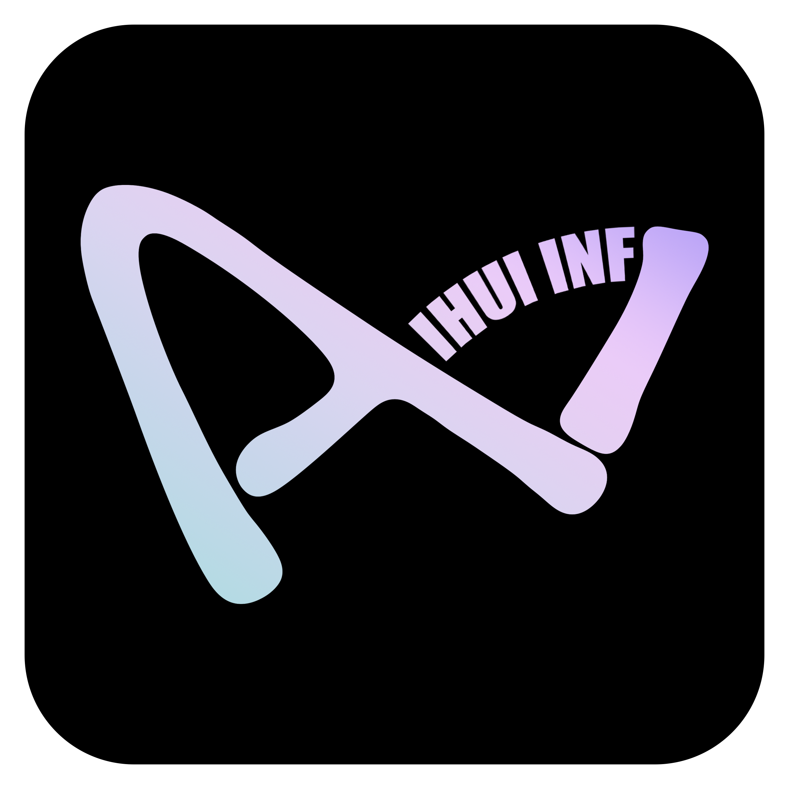
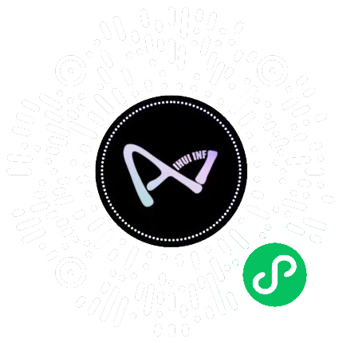

# IHUI-AI - 8단 오픈소스 AI 운영체제

<p align="center">
  
</p>

<p align="center">
  <strong>누구나 자신의 AI 프로그램을 소유할 수 있게</strong><br/>
  <sub>오픈소스 AI 상용급 통합 기반 · 5분 만에 포크에서 프로덕션으로 · 하나의 저장소로 6개 SaaS 카테고리 대체</sub>
</p>

<p align="center">
  <strong>라이브 데모</strong> · <a href="https://ihui.ai">https://ihui.ai</a> &nbsp;|&nbsp; <strong>GitHub</strong> · <a href="https://github.com/IHUI-INF-AI/IHUI-AI">Star ⭐로 응원</a><br/>
  <sub>8단 동일 소스 코드베이스 · 176개 LLM 모델 · LangGraph + MCP + A2A 트리플 스택 · Apache 2.0 — 상업적 사용 가능</sub>
</p>

<p align="center">
  <a href="README.md">简体中文</a> · <a href="README.en.md">English</a> · <a href="README.ja.md">日本語</a> | <strong>한국어</strong>
</p>

<p align="center">
  <a href="https://github.com/IHUI-INF-AI/IHUI-AI/actions/workflows/ci.yml"></a>
  <a href="https://github.com/IHUI-INF-AI/IHUI-AI/actions/workflows/build.yml"></a>
  <a href="https://github.com/IHUI-INF-AI/IHUI-AI/actions/workflows/e2e.yml"></a>
  <a href="https://github.com/IHUI-INF-AI/IHUI-AI/actions/workflows/knip.yml"></a>
  <a href="LICENSE"></a>
  <a href="https://github.com/IHUI-INF-AI/IHUI-AI"></a>
  <a href="https://github.com/IHUI-INF-AI/IHUI-AI/issues"></a>
  <a href="https://github.com/IHUI-INF-AI/IHUI-AI/pulls"></a>
  <a href="https://github.com/IHUI-INF-AI/IHUI-AI"></a>
  <a href="https://github.com/IHUI-INF-AI/IHUI-AI/graphs/contributors"></a>
</p>

<p align="center">
  <strong>8단 커버리지</strong> · <strong>176개 LLM</strong> · <strong>LangGraph + MCP + A2A 트리플 스택</strong> · <strong>14 플랫폼 자동 발행</strong> · <strong>풀스택 AI 교육</strong> · <strong>완전한 상업적 루프</strong> · <strong>5개 언어 i18n</strong>
</p>

<p align="center">
  <strong>340 테이블 · 144 마이그레이션 · 1300개 이상 API 엔드포인트 · 21개 Grafana 대시보드 · 33개 이상 가드레일 · 5346개 API 테스트 · 63개 e2e 스펙</strong><br/>
  <sub>슬라이드도, 약속도, 플레이스홀더도 아닙니다 — 모든 숫자는 코드베이스에서 grep 가능합니다</sub>
</p>

<p align="center">
  <strong>중국 미러</strong> ·
  <a href="https://gitee.com/JLSLSSZWHYXGS_0/IHUI-AI">Gitee</a> ·
  <a href="https://gitcode.com/IHUI-AI/IHUI-AI">GitCode</a>
  <br/>
  <sub>중국 내 사용자를 위한 빠른 클론/다운로드, GitHub와 자동 동기화</sub>
</p>

---

## 목차

- [왜 IHUI AI인가](#왜-ihui-ai인가)
- [기능 개요(15 모듈)](#기능-개요15-모듈)
- [Dify / Coze / FastGPT / ChatGPT / Claude / Notion AI와의 비교](#dify--coze--fastgpt--chatgpt--claude--notion-ai와의-비교)
- [빠른 시작](#빠른-시작)
- [기술 스택](#기술-스택)
- [8단 아키텍처](#8단-아키텍처)
- [수익화 및 요금제](#수익화-및-요금제)
- [로드맵](#로드맵)
- [라이선스](#라이선스)
- [FAQ](#faq)
- [기여하기](#기여하기)
- [연락처](#연락처)

---

## 왜 IHUI AI인가

> **한 줄 포지셔닝**: IHUI-AI는 **오픈소스 AI 상용급 통합 기반**입니다 — 단일 AI 도구가 아니라 완전한 상업적 AI 제품을 구축하는 데 필요한 전체 인프라(8단 프레임워크 + 176모델 게이트웨이 + LangGraph/MCP/A2A 트리플 스택 + 상업적 루프 + 엔터프라이즈 보안 + 엔지니어링 가드레일 + 관측 가능성)를 Apache 2.0으로 제공하여 개인, 기업, 학교, 크리에이터 누구나 포크해서 5분 만에 자신의 AI 제품을 출시할 수 있습니다.

오늘날 상업적 AI 제품을 구축하려면 인증, 결제, 모델 라우팅, RAG, 워크플로, 멀티엔드 발행, 관측 가능성 등 6~10개의 SaaS 카테고리를 통합해야 합니다. 비즈니스 로직을 한 줄 작성하기 전에 3~6개월의 통합 작업이 필요합니다. **IHUI-AI는 이를 5분으로 압축합니다.**

### 오픈소스 AI에서 함께 보기 드문 5가지 차별화 요소

| # | 능력 | 타사의 대응 | IHUI-AI의 대응 |
|---|------------|----------------|-------------------|
| 1 | **8단 동일 소스 코드베이스** | Dify/FastGPT는 2단(Web + API) 제공. Cursor/Claude Code는 1단(CLI) 제공. | 8개의 독립 코드베이스: Web, API, AI Service, CLI, Desktop(Tauri), 브라우저 확장(WXT), 모바일(RN), 미니앱(Taro) — 12 패키지를 공유하여 타입 안전한 크로스엔드 계약 구현. |
| 2 | **176개 LLM 모델, 단일 게이트웨이** | ChatGPT는 OpenAI만. Coze는 ByteDance만. | LiteLLM 게이트웨이가 OpenAI, Anthropic Claude, Google Gemini, Qwen, DeepSeek, GLM, Ernie, Doubao, Kimi, Ollama 등 20개 이상 프로바이더 176모델 통일 — 스마트 라우팅 및 60% 캐시 적중률. |
| 3 | **LangGraph + MCP + A2A 트리플 스택** | Langflow는 LangChain DAG만. Dify는 자체 워크플로 엔진. | 세 가지 프로토콜이 함께 동작: LangGraph는 스테이트풀 에이전트 워크플로, MCP(Model Context Protocol)는 도구 호출 표준화, A2A(Agent-to-Agent)는 에이전트 간 협업. |
| 4 | **Apache 2.0, 상업적 사용 가능** | 많은 "오픈소스" AI 도구는 AGPL이나 BSL 사용(소스 공개지만 오픈소스는 아님). | 진정한 Apache 2.0 — 카피레프트 없음, 바이럴 조항 없음, 상업적 제한 없음. 포크하고, 브랜딩하고, 판매하고, 출하하세요. 데이터도 서버도 당신의 것. |
| 5 | **완전한 상업적 루프 구축 완료** | Stripe만 월 $84, Auth0는 월 $35, Mailgun은 월 $35. | VIP / 구독 / 월렛 / 크레딧 / 환불 / 인보이스 / 8개 결제 게이트웨이 / 커미션 / 추천 — 금융급 상업적 루프 포함. |

### 대상 사용자

| 역할 | 사용 사례 |
|------|----------|
| **개인 개발자** | 프라이빗 AI 어시스턴트 + 지식 베이스 — ChatGPT Team + Claude Code + Notion AI 구독 대체 |
| **중소기업** | RBAC, 부서별 격리, 결제, BI 대시보드가 있는 AI 중앙 플랫폼 |
| **AI 서비스 프로바이더** | 멀티모델 프록시 + 결제 + 구독 + 에이전트 마켓 — 1년이 아닌 1주 만에 상업적 제품 출시 |
| **학교 및 대학** | 완전한 AI 교육 스택: 코스, 문제 은행, 시험, 라이브 스트리밍(SRS), 증명서 |
| **콘텐츠 크리에이터** | 14 플랫폼으로 원클릭 발행(WeChat Official Account, Zhihu, CSDN, Xiaohongshu, Bilibili, YouTube, Douyin 등) |
| **엔터프라이즈 의사결정자** | RBAC, RLS, SSO, AES-256-GCM, GDPR, 2FA를 갖춘 셀프호스트 엔터프라이즈 AI 플랫폼 |

### 비용 현실 점검

동일한 기능 스택은 9개 SaaS 구독(Stripe + Auth0 + Mailgun + Mixpanel + ChatGPT Team + Claude Code + Dify + Coursera for Business + 蚁客)에서 **월 약 $1,013**이 소요됩니다. IHUI-AI 셀프호스트: **월 $0** + 자체 서버(월 약 $30 VPS). 3년간 절약: **$35,000 이상**, 100% 데이터 주권 포함.

---

## 기능 개요(15 모듈)

사용자 역할별 그룹. 아래 각 모듈은 코드, 테스트, 최소 하나 이상의 실행 중인 엔드포인트와 함께 제공 — 로드맵의 약속이 아닙니다.

### A. AI 기능 레이어(엔드 사용자용)

#### A1. 176모델 통일 게이트웨이

단일 LiteLLM 게이트웨이, 176모델, 60% 캐시 적중률의 스마트 라우팅, SSE + WebSocket을 통한 스트리밍.

| 카테고리 | 모델 |
|----------|--------|
| **국제** | OpenAI GPT · Anthropic Claude · Google Gemini · xAI Grok · Groq · OpenRouter · Mistral · StepFun |
| **중국계** | Zhipu GLM · Qwen · Doubao · DeepSeek · Kimi (Moonshot) · Baichuan · Yi · MiniMax |
| **클라우드 프로바이더** | Alibaba Cloud · Tencent Cloud · Huawei Cloud · Volcengine · Baidu AI Cloud · AWS Bedrock · Azure OpenAI |
| **로컬** | Ollama · vLLM · LM Studio (OpenAI 호환 엔드포인트) |
| **모달리티** | 텍스트 · 이미지 · 음성(STT + TTS) · 비디오 · 임베딩 · 3D 디지털 휴먼(Tencent Hunyuan) |

#### A2. LangGraph + MCP + A2A 트리플 스택

플랫폼의 심장부 — 세 가지 오케스트레이션 프로토콜이 하나로 동작:

| 스택 | 능력 | 구현 |
|-------|------------|----------------|
| **LangGraph** | 스테이트풀 에이전트 워크플로(계획 → 실행 → 요약), API 키 불필요 개발용 스텁 모드 | `services/langgraph_service.py` · `agent_graph.py` · `agent_loop.py` · `agent_orchestrator.py` |
| **MCP** (Model Context Protocol) | 22개 내장 도구(브라우저 제어, 컴퓨터 제어, 파일 조작, 코드 검색, 웹 검색, git, DB 쿼리) + 프로젝트 레벨 MCP + mcp-extended | `routers/mcp.py` · `services/mcp_server.py` |
| **A2A** (Agent-to-Agent) | 에이전트 간 협업 프로토콜, Redis 영구화 + 인메모리 폴백 | `routers/a2a.py` · `services/a2a_service.py` |
| **벡터 메모리** | 임베딩 + 코사인 유사도 시맨틱 검색, pgvector를 통한 세션 간 장기 메모리(별도 벡터 DB 불필요) | `services/vector_memory.py` · `memory.py` |
| **RAG 지식 베이스** | 문서 벡터화 · 시맨틱 검색 · 인용 추적(네이티브 pgvector) | `services/rag.py` · `api/v1/rag.py` |
| **지식 그래프** | 노드 + 관계, 문서 간 엔티티 링크 — 오픈소스 AI에서 흔치 않음 | schema `knowledge-graph.ts` |
| **페르소나 레지스트리** | 역할 정의가 있는 커스텀 에이전트 페르소나 | `routers/personas.py` |
| **에이전트 런타임** | SSE 스트리밍 + WebSocket, 계획/실행/요약 + 중단/계속/취소 | `routers/agent_runtime.py` |
| **오케스트레이션 허브** | 6개 크로스필러 플레이북(Rules/Hook/Spec/Context/Subagent/Terminal), 이벤트 버스(26 이벤트 타입), LLM 예산 거버넌스(단계적 저하), 통합 텔레메트리(37 Prometheus 메트릭) | `services/orchestration_hub.py` |

#### A3. 멀티모달 AI 생성

| 능력 | 설명 |
|------------|-------------|
| **텍스트에서 이미지** | Stable Diffusion / DALL-E / Tongyi Wanxiang — 멀티 해상도, 배치 생성, 즐겨찾기 |
| **이미지 편집** | 인페인팅, 스타일 전송, 배경 제거, HD 업스케일링 |
| **TTS 스트리밍** | 12개 이상 음성, 다국어, WebSocket 스트리밍 + 중단 제어 |
| **ASR** | 실시간 전사, 파일 전사, 다국어 |
| **음성 클로닝** | 짧은 오디오 샘플 → 커스텀 음성 음색 |
| **양방향 실시간 음성** | WebRTC PCM16 16kHz, ASR + LLM + TTS 클로즈드 루프 |
| **텍스트에서 비디오** | 멀티모델 합성, 비디오 편집, 트랜스코딩 |
| **AI 디지털 휴먼** | Tencent Hunyuan 3D, 인터랙티브 디지털 아바타 |
| **AI 커리어 도구** | 이력서 최적화, 모의 인터뷰, 커리어 조언 |
| **AI 뉴스 피드** | 집계 + 스마트 요약 + 모델 리더보드(OpenCompass / SuperCLUE 실제 데이터) + API 중계 디렉토리(29개 사업자) + 47개 사업자 원클릭 키 임포트 |

### B. AI 워크플로 & 개발자 도구

#### B1. 자체 제작 CLI(Claude Code 벤치마크)

`apps/cli/`는 ACP(Agentic Coding Protocol) Server + 21개 명령 + 36개 내장 도구를 제공, Zed / VSCode / Cursor에 임베드 가능.

**명령 하이라이트:** `ihui`(인터랙티브 REPL) · `ihui chat`(멀티턴) · `ihui agent [task]`(자율 멀티스텝, `--json` 헤드리스) · `ihui acp`(에디터 임베드용 ACP 서버 시작) · `ihui mcp list/add/remove` · `ihui import`(24소스 구성 임포트: cc-switch / codex++ / Claude / Codex / Gemini / Hermes) · `ihui skills list/show` · `ihui audit query/stats`.

**36개 내장 도구:** ask-user · clipboard · codegraph · fetch-url · file-edit · git · hub/adapter · mcp-oauth · run-tests · subagent · todo-write · web-search · 기타.

**스킬 시스템:** 4개 디렉토리(`.ihui` / `.agents` / `.claude` / `.cursor`)에서 플랫 로드.

#### B2. 엔터프라이즈 워크스페이스 권한

3가지 권한 모드 + 7엔드포인트 런타임 가로채기 + 60초 감사 타임아웃:

| 모드 | 동작 |
|------|----------|
| `default` | 모든 FS 호출이 인간 감사 팝업을 트리거 |
| `accept-edits` | 화이트리스트 일치 호출은 패스, 기타는 팝업 트리거 |
| `bypass-permissions` | 모두 패스(신뢰 환경만) |

AI 입력 박스에 OpenAI Codex CLI 스타일 승인 모드 전환기(실드 아이콘 + 팝오버 + `1/2/3` 키보드 단축키 + `/permission ask\|auto\|full` 슬래시 명령 + 고위험 모드 1시간 자동 해지 + 최초 사용 확인 다이얼로그)를 포함합니다.

### C. 콘텐츠 생성 & 교육

#### C1. 14플랫폼 자동 발행

AES-256-GCM 자격 증명 암호화 + 14개 어댑터로 14개 플랫폼에 원클릭 발행:

- **기사 플랫폼(7):** WeChat Official Account · Zhihu · CSDN · Juejin · Xiaohongshu · Weibo · Bilibili
- **이미지 플랫폼(2):** 이미지 갤러리
- **비디오 플랫폼(5):** YouTube · Douyin · Kuaishou · Bilibili 비디오 · Xiaohongshu 비디오

기사 + 내레이션 스크립트 듀얼 파이프라인이 있는 셀프미디어 워크벤치, 발행 완료 시 WebSocket 실시간 알림.

#### C2. 풀스택 AI 교육

오픈소스 AI 교육 스택(생태계에서 흔치 않음 — Khan Academy와 Coursera는 클로즈드 SaaS):

- 코스 · 문제 은행 · 시험 · 라이브 스트리밍(SRS) · 학습 리포트 · 증명서
- 강사 + 학생 포털(12 서브페이지)
- 45 테이블 `edu-full` 스키마
- 라이브 + 체크인 + 인터랙션 + 재생
- 학습 행동 분석 + 개인화 추천

#### C3. AI 뉴스 & 모델 리더보드

- 27개 네이티브 RSS 소스 + 로컬 DailyHotApi에서 AI 뉴스 집계(96.3% 수집 성공률)
- LLM 분류 프로덕션 파이프라인(988 NULL → 0 NULL)
- 실제 데이터가 있는 5개 모델 리더보드(OpenCompass Playwright 렌더링 + SuperCLUE Gradio)
- API 중계 디렉토리(29개 사업자, 레이턴시 테스트 완료, 색상 코드 배지)
- 47개 사업자 원클릭 키 임포트, `?prefill=` base64 리디렉트 포함
- 4개 언어 뉴스 제목 전환(zh / en / ja / ko)

### D. 엔터프라이즈 & 운영

#### D1. 완전한 상업적 루프

금융급 결제 — 오픈소스 AI에서 흔치 않음(Dify / FastGPT / Langflow에는 없음):

- VIP 멤버십(멀티 티어) · 정기 구독 · 월렛 · 크레딧 · 감사 추적 환불 · 인보이스 · 다중 통화 환율
- 8개 결제 게이트웨이(WeChat Pay · Alipay · Stripe · PayPal · 기타)
- 배포 커미션 + 추천 보상
- 통화 위조 방지: 멱등 키 + 트랜잭션 락 + 금액 재검증 + 주문 상태 JOIN 체크(G2/G3/G7/G8 보안 시리즈)

#### D2. 엔터프라이즈 보안 스택

| 레이어 | 구현 |
|-------|----------------|
| **인증** | JWT HS256 + 토큰 패밀리 로테이션 + 리프레시 블랙리스트(액세스 7d, 리프레시 로테이션) |
| **인가** | RBAC(5 레벨) + 데이터 스코프(5 레벨) + 워크스페이스 3모드 권한 |
| **멀티테넌시** | PostgreSQL Row-Level Security (RLS), `set_config($1, $2, true)` 파라미터화 경유 |
| **SSO** | OAuth2(Google · Apple · GitHub · PKCE) |
| **암호화** | AES-256-GCM, 저장 시 자격 증명 암호화 |
| **컴플라이언스** | GDPR · 2FA · IDOR 보호 · 7엔드포인트 런타임 가로채기 |
| **감사** | 60초 타임아웃, 전체 액션 로깅 |

#### D3. 에이전트 마켓 & 개발자 센터

- 멀티 에이전트 마켓 + 개발자 센터(13 서브페이지)
- Coze SDK 프록시 · OpenClaw · Crew 통합 · N8N 프록시
- API 키 + SDK, 고객 통합용
- 마켓 개발자 대상 30% 커미션 모델

#### D4. 운영 & 성장

- 포인트 · 체크인(타임존 보정 UTC+8) · 리더보드 · 추첨 · 배포 · 초대 · 게이미피케이션(레벨 / 업적 / 배지)
- 고객 서비스: 티켓 · 라이브 채팅 · 피드백 · 헬프 센터
- BI 대시보드 · 에러 대시보드 · 그레이 릴리스(피처 플래그) · i18n 대시보드

### E. 엔지니어링 인프라

#### E1. 3필러 관측 가능성

SRE급 관측 가능성 스택 — 오픈소스 AI에서 흔치 않음(타사는 기본 로그만):

| 필러 | 스택 | 엔드포인트 |
|--------|-------|-----------|
| **메트릭** | Prometheus + Node Exporter | `:8815` |
| **대시보드** | Grafana(21 사전 프로비저닝 대시보드) | `:8816` |
| **로그** | Loki + Promtail | `:8818` |
| **트레이스** | OpenTelemetry + Jaeger | `:8814` |
| **알림** | Alertmanager | `:9093` |

#### E2. 엔지니어링 가드레일(33개 이상 훅)

협업 사고 방지 메커니즘 레벨 가드레일 — 오픈소스 프로젝트에서 흔치 않음:

- **30개 이상 pre-commit 훅** + 1 commit-msg 훅: i18n 패리티(4개 블로킹) · 스키마 드리프트 감지 · API 키 유출 감지 · rounded-full CSS 가드 · 아이콘 텍스트 수직 정렬 · 번역 품질(opencc / 문자 범위 / 깨진 기계번역 감지) · 커밋 손실 방지(reflog reset 감지 + 댕글링 커밋 감지 + lost-commit 태그 백업)
- **11 마이그레이션 감사** · post-commit 자동 푸시 · pre-push typecheck
- **9 PowerShell 개발 스크립트** for Windows one-click startup

#### E3. 5개 언어 i18n with 패리티

`zh-CN` / `zh-TW` / `en` / `ko` / `ja` — 99.7% 키셋 패리티, 8개 스크립트(4 web + 4 extension)로 가드:
- opencc 글리프 감지(zh-TW 블로킹)
- 문자 범위 감지(ko 블로킹)
- 깨진 기계번역 감지(en 블로킹)
- 키 패리티 검증(블로킹)
- AI 번역 파이프라인(i18n-diff → AI 에이전트 번역 → i18n-apply, LLM API 호출 제로, 70% 이상 비용 절감)

#### E4. 데이터베이스 & 테스트

- **PostgreSQL 15**: 340 테이블 · 144 마이그레이션 · 100개 이상 스키마 파일 · pgvector · FTS5 풀텍스트 검색 · RLS 멀티테넌트 격리
- **API 테스트**: 5346 케이스(Vitest)
- **E2E**: 63 스펙(Playwright)
- **AI 서비스**: pytest + Locust 부하 테스트 + Lighthouse 성능

---

## Dify / Coze / FastGPT / ChatGPT / Claude / Notion AI와의 비교

> 기능 커버리지 비교(정확도/성능 벤치마크가 아님). 모바일 사용자: IHUI-AI 열과 아래 "핵심 요점"에 주목.

| 차원 | IHUI-AI | OpenAI ChatGPT | Dify | FastGPT | Coze (扣子) | Claude Code | Notion AI |
|-----------|---------|----------------|------|---------|------------|-------------|-----------|
| **카테고리** | 6카테고리 통합 기반 | 일반 AI 채팅 | AI 앱 개발 플랫폼 | RAG + 지식 베이스 | AI 에이전트 SaaS | AI 코딩 CLI | AI 작문 어시스턴트 |
| **라이선스** | **Apache 2.0** | 클로즈드 소스 | Apache 2.0 | Apache 2.0 | **클로즈드 소스** | **클로즈드 소스** | **클로즈드 소스** |
| **셀프호스트** | **완전 셀프호스트** | 미지원 | Docker | Docker | 미지원 | N/A | N/A |
| **엔드 커버리지** | **8단** | 2단(Web/App) | 2단 | 2단 | 2단 | 1단(CLI) | 1단(Web) |
| **모델 접근** | **176 모델 + LiteLLM** | OpenAI만 | 50개 이상 모델 | 30개 이상 모델 | ByteDance만 | Anthropic | OpenAI |
| **워크플로 엔진** | **LangGraph + MCP + A2A** | 없음 | 커스텀 워크플로 | 없음 | 커스텀 워크플로 | 없음 | 없음 |
| **자체 제작 CLI** | **21 명령 + 36 도구 + ACP** | 없음 | 없음 | 없음 | 없음 | 네이티브 CLI | 없음 |
| **멀티테넌트 + RBAC** | **완전(5 레벨 + RLS)** | 싱글 사용자 | 기본 | 기본 | SaaS 내부 | 없음 | 없음 |
| **결제 & 구독** | **완전(VIP/월렛/크레딧/8 게이트웨이)** | 구독($20-200) | 없음 | 없음 | SaaS 내부 | 없음 | 구독($10-20) |
| **AI 교육** | **풀스택(코스/시험/라이브 SRS/45 테이블)** | 없음 | 없음 | 없음 | 없음 | 없음 | 없음 |
| **콘텐츠 발행** | **14 플랫폼 + 14 어댑터** | 없음 | 없음 | 없음 | 없음 | 없음 | 없음 |
| **관측 가능성** | **3필러 + 21 대시보드** | - | 기본 | 기본 | - | 없음 | - |
| **엔지니어링 가드레일** | **33개 이상 훅 + 11 감사 + 자동 푸시** | - | 기본 | 기본 | - | 없음 | - |
| **i18n** | **5개 언어 패리티 + 8 가드레일** | 다국어 | zh/en | zh/en | 다국어 | 영어만 | 다국어 |
| **데이터베이스** | **340 테이블 + 144 마이그레이션 + RLS + pgvector** | SaaS 내부 | 기본 | 기본 | SaaS 내부 | 없음 | SaaS 내부 |
| **월 비용(5 사용자)** | **$0**(셀프호스트, 서버만) | $125+ | $59+ | $0(셀프 통합) | SaaS 내부 | $100 | $50+ |

### 핵심 요점

**IHUI-AI는 단일 프로젝트를 대체하는 것이 목적이 아닙니다 — 완전한 AI 제품을 구축하는 데 필요한 6카테고리의 인프라를 오픈소스화합니다.**

- vs. **ChatGPT**: IHUI-AI는 완전 셀프호스트, 100% 데이터 주권, 결제/교육/발행 포함. ChatGPT는 클로즈드 SaaS.
- vs. **Dify / FastGPT**: IHUI-AI는 6개 엔드, 자체 제작 CLI, 완전한 상업적 루프, AI 교육, 14 플랫폼 발행, 엔터프라이즈 보안, SRE 관측 가능성을 추가.
- vs. **Coze (扣子)**: IHUI-AI는 완전 셀프호스트, 100% 데이터 주권, Apache 2.0. Coze는 클로즈드 SaaS — 데이터는 ByteDance로.
- vs. **Claude Code**: IHUI-AI의 CLI는 코딩 *및* 완전한 AI 애플리케이션 플랫폼(채팅 / RAG / 에이전트 / 결제)을 통합, 모두 Apache 2.0.
- vs. **Notion AI**: IHUI-AI는 노트 앱에 임베드된 작문 어시스턴트가 아니라 AI 애플리케이션 기반 전체. Notion AI는 클로즈드 기능.

**한 줄 요약**: IHUI-AI는 ChatGPT(채팅) + Dify(오케스트레이션) + Claude Code(CLI) + Khan Academy(교육) + Stripe(결제) + 蚁客(발행)의 오픈소스 통합 스택입니다.

> **핵심 통찰**: 글로벌 오픈소스 AI 생태계에서 IHUI-AI보다 **더 전문적인** 프로젝트는 찾을 수 있습니다(RAGFlow는 RAG에서 더 깊고, Claude Code는 CLI에서 더 성숙하며, LangChain은 프레임워크로서 더 유연). 그러나 IHUI-AI보다 **더 완전한** 오픈소스 기반은 찾을 수 없습니다 — 하나의 Apache 2.0 저장소에서 6개 기능 카테고리를 통합하는 것이 핵심 차별화 요소입니다.

---

## 빠른 시작

### 전제 조건

| 도구 | 버전 | 비고 |
|------|---------|-------|
| Node.js | `>=20.10.0` | LTS 20.x 권장, `nvm use` |
| pnpm | `>=9.0.0` | `pnpm@9.15.0`으로 고정, `corepack enable`로 자동 활성화 |
| Python | `3.12+` | `apps/ai-service`만 |
| PostgreSQL | `15+` | Compose는 `postgres:15-alpine` 사용 |
| Redis | `7+` | Compose는 `redis:7-alpine` 사용 |
| Docker | `24+` + Compose v2 | 옵션이지만 원클릭 시작에 권장 |
| Git | `2.40+` | `core.autocrlf=false`(프로젝트는 LF 강제) |

### 옵션 1: Docker Compose 원클릭(권장)

```bash
# 1. 클론
git clone https://github.com/IHUI-INF-AI/IHUI-AI.git IHUI-AI && cd IHUI-AI

# 2. 환경 구성
cp .env.example .env
# .env 편집: JWT_SECRET / DB_PASSWORD / CREDENTIALS_ENCRYPTION_KEY 설정

# 3. 원클릭 시작(7 비즈니스 + 7 모니터링 = 14 서비스)
docker compose up -d
```

**서비스 엔드포인트:**

| 서비스 | URL | 비고 |
|---------|-----|-------|
| Web | http://localhost:3000 | Next.js 프론트엔드 |
| API | http://localhost:8802/api/health | Fastify 백엔드 헬스 체크 |
| Worker | http://localhost:8830 | BullMQ 비동기 태스크 프로세스 |
| AI Service | http://localhost:8803/health | FastAPI AI 서비스 헬스 체크 |
| Grafana | http://localhost:8816 | 기본 admin / 비밀번호 변경(21 대시보드 자동 프로비저닝) |
| Prometheus | http://localhost:9091 | 메트릭 수집 |
| Jaeger UI | http://localhost:8814 | 분산 트레이싱 |
| Loki | http://localhost:8818 | 로그 집계 |
| Alertmanager | http://localhost:9093 | 알림 라우팅 |

### 옵션 2: 로컬 개발 모드

```bash
# 1. 의존성 설치
corepack enable && corepack prepare pnpm@9.15.0 --activate
pnpm install

# 2. 데이터베이스 + Redis 시작
docker compose up -d db redis

# 3. 마이그레이션 + 검증 + 시드
pnpm --filter @ihui/database db:migrate
pnpm --filter @ihui/database db:check
pnpm --filter @ihui/database seed          # 7단계 멱등 시드

# 4. 모든 앱 시작(turbo 병렬)
pnpm dev
# 개별 시작:
# pnpm --filter @ihui/api run dev          # 백엔드 :3002
# pnpm --filter @ihui/web run dev          # 프론트엔드 :3001
# cd apps/ai-service && uv sync && uvicorn app.main:app --reload --port 3003

# 5. 전체 검증(typecheck + lint + test)
pnpm turbo build typecheck lint test
```

### Windows 원클릭(9 PowerShell 스크립트)

```powershell
.\scripts\dev-up.ps1                    # web + api + ai-service + DB + Redis 시작
.\scripts\dev-all.ps1                   # 개발 서버만(DB 실행 중)
.\scripts\dev-web.mjs                   # Web만
.\scripts\kill-dev-servers.ps1          # 모든 개발 서버 중지
.\scripts\restart-dev-server.ps1        # 개발 서버 재시작
.\scripts\test-admin-e2e.ps1            # 관리자 E2E 테스트
.\scripts\setup-token-refresh-task.ps1  # 토큰 리프레시 스케줄 태스크 구성
.\scripts\cleanup-external-junk.ps1     # 외부 정크 파일 정리
.\scripts\cleanup-memory-topics.ps1     # 메모리 토픽 정리
```

### 5가지 일반적 시나리오

1. **개인 개발자 — 프라이빗 AI 어시스턴트**: 클론 → `docker compose up -d` → 5분 후 176모델 채팅 UI, 프라이빗 RAG 지식 베이스, 크로스엔드 동기화(Web + Desktop + Mobile + Miniapp), 자체 제작 코딩 CLI를 사용 가능. ChatGPT Team + Claude Code + Notion AI 구독을 대체, 월 $60 이상 절약.

2. **중소기업 — AI 중앙 플랫폼**: 200명 직원 계정에 RBAC, 부서별 워크스페이스 격리, 스마트 라우팅이 있는 7 LLM 프로바이더(가장 저렴한 모델이 승리), 인보이스가 있는 부서별 결제, 사용량 BI 대시보드, 컴플라이언스 감사 로그.

3. **AI 서비스 프로바이더 — 상업적 제품**: 멀티모델 프록시 + 결제 + 구독 + VIP + 월렛 + 크레딧을 재사용. 에이전트 마켓을 구축하고 30% 커미션 획득. 고객 통합용 API 키 + SDK 발급. 콘텐츠 마케팅에 14 플랫폼 발행 사용. 1년이 아닌 1주 만에 출시.

4. **학교 — 교육 혁신**: 코스 + 문제 은행을 AI 교육 스택으로 임포트. 학생은 라이브(SRS) 재생으로 복습. 교사는 AI로 채점 + 학습 리포트. 라이브 + 체크인 + 인터랙션 + 재생. 행동 분석 + 개인화 추천. 자동 발급 증명서.

5. **콘텐츠 크리에이터 — 생산성 해방**: 셀프미디어 워크벤치에서 WeChat Official Account 기사 + 내레이션 스크립트 작성. 14 플랫폼으로 원클릭 발행. 자격 증명은 AES-256-GCM 암호화 — 플랫폼 유출 없음. 발행 완료 시 WebSocket 실시간 알림.

---

## 기술 스택

| 레이어 | 기술 | 버전 |
|-------|------------|---------|
| **모노레포** | pnpm workspace + Turborepo | pnpm 9.15 / turbo 2.3 |
| **백엔드 API** | Fastify + @fastify/jwt + @fastify/websocket + Drizzle ORM + PostgreSQL | Fastify 5.1 / Drizzle 0.38 / PG 15 |
| **캐시 & 큐** | Redis 7 + BullMQ | 독립 워커 프로세스(`:8081`) |
| **프론트엔드 Web** | Next.js + React + Tailwind CSS + shadcn/ui | Next 15.1 / React 19 / Tailwind 4 |
| **프론트엔드 상태** | @tanstack/react-query 5 + Zustand | 서버 + 클라이언트 상태 분리 |
| **i18n** | next-intl | zh-CN / zh-TW / en / ko / ja (5개 언어) |
| **AI Service** | FastAPI + LangGraph + LiteLLM + MCP + A2A + Socket.IO | FastAPI 0.115 / LangGraph 0.2 |
| **AI 프로토콜** | SSE(에이전트 스트리밍) + WebSocket(채팅룸 / 멀티모델 스트리밍) + REST | 3프로토콜 레이어링 |
| **데스크톱** | Tauri 2 + Rust(WebView는 Web `output: 'export'` 스태틱 익스포트를 로드) | 셸 아키텍처, 네이티브 크로스플랫폼 |
| **브라우저 확장** | WXT + React | Chrome / Edge / Firefox |
| **모바일** | React Native + Expo EAS | iOS / Android |
| **미니앱** | Taro 4 + React | WeChat Mini Program |
| **CLI** | Node.js + Commander + Inquirer | Claude Code 벤치마크 |
| **인증** | @ihui/auth 공유 패키지(JWT HS256 + 토큰 패밀리 + OAuth2 + RBAC + 데이터 스코프 5 레벨) | 크로스엔드 통일 발급 |
| **검증** | Zod 3.24(백엔드) + React Hook Form(프론트엔드) | 엔드투엔드 타입 안전성 |
| **로깅** | Pino 9.5(백엔드) + Python logging(AI 서비스) + Loki + Promtail | 구조화 + 집계 |
| **트레이싱** | OpenTelemetry + Jaeger | 분산 풀링크 |
| **모니터링** | Prometheus + Grafana(21 대시보드) + Node Exporter + Alertmanager | 호스트 + 앱 + 알림 |
| **테스트** | Vitest(백엔드) + Playwright(E2E) + pytest(AI 서비스) + Locust(부하) + Lighthouse(성능) | 5346 + 400개 이상 케이스 |
| **데드 코드 감지** | Knip | CI 가드레일 |
| **Node** | `>=20.10.0` | - |
| **Python** | `3.12+`(AI 서비스만) | - |

---

## 8단 아키텍처

> 포트 규약: 모든 dev/호스트 매핑 포트는 `88xx` 범위 사용([docs/port-management.md](docs/port-management.md) 참조), `strictPort: true`로 드리프트 방지, 컨테이너 내부 포트는 변경 없음.

```
                ┌──────────────────────────────────────────────────────────────┐
                │      User / Enterprise / Developer / School / Creator        │
                └────────────┬─────────────────────────────────┬───────────────┘
                             │                                 │
    ┌────────────────────────┼─────────────────────────────────┼────────────────────────┐
    │                        │                                 │                        │
┌───▼────┐  ┌──────────┐  ┌──▼───────┐  ┌──────────────▼┐  ┌──────────┐  ┌──▼────────┐
│  Web   │  │ Desktop  │  │Extension │  │  Mobile RN    │  │ Miniapp  │  │   CLI    │
│ Next 15│  │ Tauri 2  │  │  WXT     │  │  Expo EAS     │  │ Taro 4   │  │ Node.js  │
│ :8801  │  │ web/out  │  │          │  │  :8805        │  │ :8804    │  │ ACP+Skl  │
│ strict │  │ + Rust   │  │          │  │  iOS/Android  │  │ WeChat MP│  │ 21 cmds  │
└───┬────┘  └────┬─────┘  └────┬─────┘  └──────┬────────┘  └────┬─────┘  └────┬─────┘
    │            │             │                │                │             │
    └────────────┴─────────────┴────────┬───────┴────────────────┴─────────────┘
                                        │  HTTPS / WebSocket / SSE / ACP
                               ┌────────▼─────────┐
                               │   apps/api       │  Fastify 5 + Drizzle ORM
                               │   :8802 strict   │  1300+ endpoints + 12 WS + 95 routes
                               │                  │  + Developer API Key /v1/* 105 endpoints
                               └────┬───────┬─────┘
                                    │       │
         ┌──────────────────────────▼─┐   ┌─▼──────────────────────────┐
         │  PostgreSQL 15             │   │  apps/ai-service            │  FastAPI + Socket.IO
         │  ├─ 340 tables / 144 mig  │   │  :8803 strict               │  LangGraph + LiteLLM + MCP + A2A
         │  ├─ pgvector vector index  │   │                             │  + triple stack + P3 deep layer
         │  ├─ FTS5 full-text search  │   │  ├─ 31+ providers + 16 IM   │  + 14 publish adapters
         │  └─ RLS multi-tenant iso   │   │  ├─ 6 sandbox backends      │  + 22 MCP tools
         └────────────────────────────┘   │  ├─ Skill self-evolution    │
                                            │  ├─ Memory (pgvector+FTS5) │
                                            │  └─ 30+ providers + MoA    │
                                            └────┬────────────────────────┘
                                                 │
                               ┌────────────────┼────────────────┐
                               │                │                │
                         ┌─────▼─────┐    ┌─────▼─────┐    ┌─────▼─────┐
                         │  Redis 7  │    │  Worker   │    │ OTel +    │  Jaeger :8814
                         │ Pub/Sub   │    │  BullMQ   │    │ Prometheus│  Grafana :8816
                         │ :8811     │    │  :8830    │    │ :8815     │  Loki :8818
                         └───────────┘    └───────────┘    └───────────┘
```

### 8단 책임

| 엔드 | 디렉토리 | 스택 | 책임 |
|-----|-----------|-------|----------------|
| **Web** | `apps/web/` | Next.js 15 + React 19 | 메인 프론트엔드, 200개 이상 페이지, 5개 언어 i18n, PWA, SEO, `output: 'export'` 스태틱 익스포트를 Desktop WebView가 로드(셸 아키텍처) |
| **API** | `apps/api/` | Fastify 5 + Drizzle | 비즈니스 관리 + 멀티벤더 프록시 + 인증 + WebSocket, 약 1300 엔드포인트 / 95개 이상 라우트 파일 |
| **AI Service** | `apps/ai-service/` | FastAPI + LangGraph + Socket.IO | LLM 게이트웨이 + 에이전트 실행 + MCP 도구 + A2A 프로토콜 + 14 발행 어댑터, 약 55 엔드포인트 |
| **Desktop** | `apps/desktop/` | Tauri 2 + Rust | 셸 아키텍처: Tauri WebView가 Web 스태틱 익스포트 로드. 25개 이상 `#[tauri::command]` 네이티브 기능(트레이 + 싱글 인스턴스 + 자동 시작 + 글로벌 단축키 + 딥링크 + 네이티브 알림 + 파일 접근 + 클립보드 + 컴퓨터 제어 스크린샷/마우스/키보드) |
| **CLI** | `apps/cli/` | Node.js + Commander | 자체 제작 CLI 코딩 어시스턴트, 21 명령 + 36 도구 + ACP Server + 24소스 구성 임포트 |
| **확장** | `apps/extension/` | WXT + React | 브라우저 확장: 컨텍스트 메뉴 + 사이드바 + Chrome/Edge/Firefox |
| **모바일** | `apps/mobile-rn/` | React Native + Expo EAS | iOS / Android 네이티브 앱 + SSO |
| **미니앱** | `apps/miniapp-taro/` | Taro 4 + React | WeChat Mini Program, 네이티브 WeChat Pay 통합 + 3개 언어 i18n |

### 공유 패키지(12)

| 패키지 | 목적 |
|---------|---------|
| `@ihui/auth` | 크로스엔드 JWT + OAuth2 + RBAC 통일 발급 |
| `@ihui/database` | Drizzle ORM 스키마 + 340 테이블 + 144 마이그레이션 |
| `@ihui/types` | 크로스엔드 TypeScript 계약(WorkPanelTab / ToolCallEvent / P3 타입 / SharedUser) |
| `@ihui/ui-react` | Web + 확장 공유 UI(Card / Button / Resizable / WorkPanel) |
| `@ihui/ui-native` | React Native 공유 UI 프리미티브 |
| `@ihui/design-tokens` | 크로스엔드 디자인 토큰(색상 / 반경 / 폰트 / 애니메이션 / 10 브레이크포인트) — 단일 소스 오브 트루스 |
| `@ihui/app` | Solito + StyleSheet 경유 RN ↔ Web 크로스엔드 공유 화면(About / Profile / Settings) |
| `@ihui/config` | 공유 ESLint / TSConfig / Tailwind 프리셋 |
| `@ihui/i18n` | 크로스엔드 i18n 유틸리티 |
| `@ihui/api-client` | onToolCall 콜백이 있는 타입 안전 API 클라이언트 |
| `@ihui/eslint-config` | 공유 ESLint 규칙 |
| `@ihui/tsconfig` | 공유 TSConfig |

### 프로젝트 상태 매트릭스

각 엔드는 실제 코드, 테스트, 실행 중인 dev 서버와 함께 제공 — 플레이스홀더가 아닙니다.

| 엔드 | 성숙도 | 페이지 / 엔드포인트 | 주요 기능 실행 중 |
|-----|----------|-------------------|-------------------|
| **Web** (`apps/web`) | 🟢 프로덕션 | 200개 이상 페이지 · 5개 언어 i18n · PWA · SEO | 풀 관리 콘솔 · AI 채팅 · RAG · 에이전트 마켓 · 결제 · 교육 · 발행 · BI 대시보드 |
| **API** (`apps/api`) | 🟢 프로덕션 | 1300개 이상 엔드포인트 · 95 라우트 파일 · 12 WS | 인증 · RBAC · 결제 · 8 결제 게이트웨이 · 멀티테넌트 RLS · 개발자 API 키 |
| **AI Service** (`apps/ai-service`) | 🟢 프로덕션 | 약 55 엔드포인트 · 12 라우터 | LangGraph · MCP(22 도구) · A2A · 31개 이상 프로바이더 · 6 샌드백엔드 · 14 발행 어댑터 · 16 IM 채널 |
| **CLI** (`apps/cli`) | 🟢 프로덕션 | 21 명령 · 36 도구 · ACP Server | 인터랙티브 REPL · 에이전트 모드 · MCP 관리 · 24소스 구성 임포트 · 스킬 · 감사 |
| **Desktop** (`apps/desktop`) | 🟢 프로덕션 | Tauri 2 + Rust 셸 · 25개 이상 네이티브 명령 | 트레이 · 싱글 인스턴스 · 자동 시작 · 글로벌 단축키 · 딥링크 · 네이티브 알림 · 컴퓨터 제어 |
| **확장** (`apps/extension`) | 🟢 프로덕션 | Chrome/Edge/Firefox · 사이드바 + 컨텍스트 메뉴 | 5개 언어 i18n · 에이전트 액션 브리지 · 콘텐츠 스크립트 실행자 · 스크린샷 회신 |
| **모바일** (`apps/mobile-rn`) | 🟡 베타 | iOS/Android · 3 공유 화면 | SSO · AboutScreen · ProfileScreen · SettingsScreen(`@ihui/app` 경유 크로스엔드 공유) |
| **미니앱** (`apps/miniapp-taro`) | 🟡 베타 | WeChat Mini Program · 3개 언어 i18n | WeChat Pay 네이티브 통합 · 인증 · 코어 브라우징 |

범례: 🟢 프로덕션(상업적 플랫폼에서 실행 중) · 🟡 베타(코어 플로우 동작, 기능 패리티 진행 중)

### 크로스엔드 공유 레이어

8단 간 드리프트를 방지하기 위해 3개의 단일 소스 오브 트루스 레이어를 강제:

- **디자인 토큰**: `packages/design-tokens/src/styles/tokens.css` — 단일 `@theme` 블록(색상 / 반경 / 폰트 / 애니메이션 / 10 브레이크포인트)을 Web과 확장 모두 `@import`로 소비. 한 곳 변경으로 양단 업데이트.
- **i18n**: Web은 `next-intl` 사용(587 네임스페이스 / 28,800행 JSON), 확장은 자체 제작 Context 런타임 사용(5개 언어 × 17 네임스페이스). 둘 다 8개 패리티 스크립트(4 web + 4 extension)로 가드, opencc / 문자 범위 / 깨진 기계번역 감지 포함.
- **RN ↔ Web 공유 화면**: `packages/app/`이 `AboutScreen` / `ProfileScreen` / `SettingsScreen`을 Solito + StyleSheet + RN 프리미티브 경유 플랫폼 독립 컴포넌트로 제공, 5개 디자인 토큰(brand / surface / text / border / error) 포함.

---

## 수익화 및 요금제

IHUI-AI는 **Apache 2.0 오픈소스** — 셀프호스트는 영원히 무료입니다. 관리형/호스팅 제공을 원하는 팀을 위해 4가지 티어를 제공:

| 티어 | 가격 | 대상 | 하이라이트 |
|------|-------|--------|------------|
| **Free** | $0(셀프호스트) | 개인 개발자, 학생, 취미가 | 완전한 8단 코드베이스, 176 모델, 전체 15 모듈 — 기능 게이팅 없음 |
| **Pro** | ¥49/월(약 $7/월) | 파워 유저, 프리랜서 | 호스팅 web + API + AI 서비스 · 5GB 벡터 스토리지 · 월 100K 토큰 · 우선 커뮤니티 지원 |
| **Team** | ¥199/사용자/월(약 $28/사용자/월) | 중소기업, 소규모 팀(5-50 사용자) | Pro의 모든 기능 · 멀티테넌트 RBAC · 부서별 결제 · 100GB 벡터 스토리지 · 월 5M 토큰 · SLA 99.5% · email + WeChat 지원 |
| **Enterprise** | ¥2999/월+(약 $420/월+) | 엔터프라이즈, 학교, AI 서비스 프로바이더 | Team의 모든 기능 · 무제한 사용자 · 온프레미스 배포 · 커스텀 모델 파인튜닝 · 전용 Grafana · SLA 99.9% · 24/7 지원 · 전담 계정 매니저 · 커스텀 통합 |

### 수익 모델

- **셀프호스트 오픈소스**: 영원히 100% 무료 — Apache 2.0, 벤더 록인 없음
- **관리형 클라우드**: Pro/Team/Enterprise 구독(위)
- **마켓 커미션**: 에이전트 마켓 개발자 매출의 30%
- **엔터프라이즈 서비스**: 커스텀 배포, 파인튜닝, 통합 컨설팅
- **교육 파트너십**: 학교 및 교육 기관용 AI 교육 스택 라이선스

> **참고**: 셀프호스트는 항상 무료입니다. 유료 티어는 인프라를 운영해 주기를 원하는 팀을 위한 것이며, 기능 접근을 위한 것이 아닙니다. 오픈소스 코드베이스와 관리형 제공은 동일한 코드로 실행됩니다.

---

## 로드맵

### 출시 완료(2026-07-20 기준)

- 8단 풀 커버리지(Web / API / AI Service / CLI / Desktop / Extension / Mobile RN / Miniapp Taro)
- 통일 LiteLLM 게이트웨이 경유 176 LLM 모델 + 31개 이상 프로바이더 어댑터
- LangGraph + MCP + A2A 트리플 스택 + Persona + 에이전트 런타임 + 벡터 메모리
- 자체 제작 CLI: 21 명령 + 36 도구 + ACP Server + 24소스 구성 임포트
- 워크스페이스 권한 3모드 + 7엔드포인트 런타임 가로채기 + 60초 감사 타임아웃
- 셀프미디어 워크벤치(기사 + 내레이션 스크립트 듀얼 파이프라인) + 스킬 시스템
- 14 플랫폼 원클릭 자동 발행 + 14 어댑터 + AES-256-GCM 자격 증명 암호화
- 풀스택 AI 교육(코스 / 문제 은행 / 시험 / 라이브 스트리밍 SRS / 리포트 / 증명서 / 45 테이블 스키마)
- 멀티 에이전트 마켓 + 개발자 센터(13 서브페이지) + Coze SDK 프록시 + OpenClaw + Crew + N8N
- 커뮤니티 기능(서클 / 플라자 / DM / 팔로우 / 공유)
- 성장 루프(포인트 / 체크인 / 리더보드 / 추첨 / 배포 / 추천 / 게이미피케이션)
- 완전한 상업적 결제 루프(VIP / 구독 / 월렛 / 크레딧 / 환불 / 인보이스 / 환율 / 8 결제 게이트웨이)
- 고객 지원(티켓 / 라이브 채팅 / 피드백 / 헬프 센터)
- BI 대시보드 + 에러 대시보드 + 그레이 릴리스 + i18n 대시보드
- 5개 언어 i18n 패리티 + 19도구 i18n 툴체인 + 4 가드레일
- 완전 관측 가능성 스택(Prometheus + Grafana 21 대시보드 + Loki + Promtail + Jaeger + OpenTelemetry + Alertmanager)
- 30개 이상 pre-commit 가드레일 + post-commit 자동 푸시 + 11 마이그레이션 감사 + 9 PowerShell 시작 스크립트
- 엔터프라이즈 보안(RBAC + 멀티테넌트 + RLS + SSO + AES-256-GCM + JWT 토큰 패밀리 + CSRF + XSS + GDPR + 2FA)
- 340 데이터베이스 테이블 + 144 마이그레이션 + 12 공유 패키지 + pgvector + 지식 그래프 + Knip + Lighthouse + Locust

### 최근 하이라이트(2026-07-22)

1. **채팅 내 임베드 브라우저 워크 패널**(8단 동기화, P0→P3++ 4단계): 리사이즈 가능 패널 + 멀티탭 + 즐겨찾기 + 히스토리 + 드래그 정렬 + iframe 스마트 폴백 + Playwright 스크린샷 엔진 + 이터레이션 배지가 있는 멀티라운드 도구 루프
2. **네이티브 브라우저 제어 + 컴퓨터 제어 MCP 도구**(5단 동기화): 22개 신규 MCP 도구(12 `browser_control.*` + 10 `computer_control.*`) + 크로스엔드 실행자(확장 콘텐츠 스크립트 + 데스크톱 Tauri 명령) + 환각 가드가 있는 멀티라운드 도구 루프
3. **P3 심층 레이어(Hermes Agent를 11차원으로 능가)**: 에이전트 루프 수정 + 스킬 자가 진화 클로즈드 루프 + 통합 3단 메모리 + IM 플랫폼 게이트웨이(16 플랫폼) + 멀티 에이전트 디베이트 + MCP 샘플링 역호출 + 6 샌드백엔드(Local/Docker/SSH/Modal/Daytona/Singularity) + MoA 프리셋 + 멀티모달 입력 + 메모리 심층 레이어(pgvector + FTS5 + 감쇠 + 벡터 영구화) + 자가 진화 심층 레이어(자동 테스트 + 피드백 추적 + 품질 게이트) + 스케줄링 심층 레이어(DAG + 4 전략 + 와치독 + 워크트리 격리 + ResourceMonitor + NetworkEgressPolicy)
4. **깊은 견고성 강화**(5라운드 85항목): 인증 보안 코어(7) + MCP 보안(6) + API 백엔드 보안(8) + Web 프론트엔드 보안(3) + 데스크톱/확장/모바일/미니앱 강화(6)
5. **CLI Wave 1 + Wave 2**: LSP 통합 + Client/Server 아키텍처 + TUI 터미널 UI + 4계층 메모리 + 드림 모드 + Plan-Build-Review 삼모드 + 실행취소-재실행-공유 + Subagent 피어 협업
6. **결제 자금 보안**(G2→G8 시리즈): 통화 위조 방지 + 멱등성 + 트랜잭션 락 + CrewAI 바이패스 수정 + rechargeToken 주문 상태 검증
7. **AI 뉴스 피드 정제**: 27 네이티브 RSS 소스 + 96.3% 수집 성공률 + LLM 분류(988 NULL → 0 NULL)

### 다음 예정

- **모바일 RN 기능 패리티** with Web(현재 관리 콘솔 + 에이전트 마켓에서 지연)
- **데스크톱 오프라인 모드** with 로컬 LLM(Ollama) 폴백
- **확장 사이드바 에이전트** with 완전 MCP 도구 표면
- **미니앱 Taro WeChat Pay** 프로덕션 견고화
- **추가 IM 채널**: Slack, Discord, Telegram 봇(현재 16 채널, 25개 이상 목표)
- **추가 샌드백엔드**: E2B, Fly Machines(현재 6, 8 목표)
- **파인튜닝 UI**: Web 콘솔에서 LoRA/QLoRA 파인튜닝 파이프라인
- **A2A 프로토콜 v2**: 표준화 에이전트 발견 + 능력 협상
- **다중 리전 배포**: 엔터프라이즈 티어용 액티브-액티브 클러스터 모드

> 전체 태스크 계획 및 진행 추적은 [PROJECT_PLAN.md](PROJECT_PLAN.md)(중국어)에 있습니다.

---

## 라이선스

[Apache License 2.0](LICENSE) — 자유롭게 사용, 수정, 배포, 상업화 가능, 카피레프트 제한 없음.

### 이것이 의미하는 것

- ✅ **상업적 사용**: 판매, 브랜딩, 제품으로 출하 — 제한 없음
- ✅ **클로즈드 소스 파생물**: 수정은 클로즈드 소스로 유지 가능
- ✅ **카피레프트 없음**: 바이럴 라이선스 조항 없음, 변경 사항 오픈소스화 요구 없음
- ✅ **특허 허여**: 기여자로부터 명시적 특허 허여
- ✅ **셀프호스트**: 100% 데이터 주권, 벤더 록인 없음

> 상업적 사용을 제한하는 "소스 공개" 또는 BSL 라이선스 프로젝트와 달리, IHUI-AI는 OSI 승인 Apache 2.0 라이선스하의 진정한 오픈소스입니다.

---

## FAQ

### 정말 오픈소스인가요? 상업적으로 사용할 수 있나요?

네. IHUI-AI는 **Apache 2.0**로 라이선스 — Kubernetes, Android, 주요 오픈소스 프로젝트가 사용하는 것과 동일한 라이선스. 포크, 브랜딩, 판매, 자체 상업적 제품으로 출하 가능. 수정은 클로즈드 소스로 유지 가능. 카피레프트, 바이럴 조항, "소스 공개" 제한 없음. 유일한 요구 사항: 라이선스 고지 유지, 소스 파일에 대한 중요한 변경 사항 명시.

### Dify / FastGPT / Langflow와의 차이점은?

Dify, FastGPT, Langflow는 훌륭한 **AI 애플리케이션 오케스트레이션 플랫폼** — 챗봇 및 워크플로 구축을 지원. IHUI-AI는 **통합 AI 상업적 기반**: 이들 프로젝트가 제공하는 모든 것(채팅, RAG, 워크플로, 에이전트)에 추가로 6개 엔드(CLI, 데스크톱, 확장, 모바일, 미니앱), 완전한 상업적 결제 루프, AI 교육, 14 플랫폼 콘텐츠 발행, 엔터프라이즈 보안, SRE급 관측 가능성을 포함. AI 채팅 오케스트레이션만 필요하다면 Dify가 더 집중되어 있음. 완전한 상업적 AI 제품을 출하하고 싶다면 IHUI-AI가 그것을 위해 설계됨.

### LangChain / LangGraph / LlamaIndex와의 차이점은?

LangChain, LangGraph, LlamaIndex는 **개발자 프레임워크** — AI 애플리케이션 구축의 부품(체인, 에이전트, 리트리버)을 제공. IHUI-AI는 세 가지 오케스트레이션 스택 중 하나로 LangGraph를 사용, 완전한 제품으로 래핑: 8단, 결제, 인증, RBAC, UI, 데이터베이스 스키마, 마이그레이션, 관측 가능성, 15 비즈니스 모듈. 프레임워크는 "자동차 부품", IHUI-AI는 "조립 라인에서 나오는 달리는 자동차" — 비기술 팀이 직접 사용 가능.

### OpenAI / Anthropic API 키에 결제해야 하나요?

네 — LLM API 키(OpenAI, Anthropic, Google, Qwen, DeepSeek 등)는 각자 준비. IHUI-AI는 LiteLLM 경유 30개 이상 프로바이더 176 모델로 라우팅. 플랫폼 자체는 무료, 소비하는 LLM 토큰만 모델 프로바이더에 직접 결제. 로컬 전용 설정을 위해 Ollama와 vLLM 지원 — 클라우드 API 비용 제로.

### 자체 서버에서 셀프호스트할 수 있나요?

네 — 그것이 주요 배포 모델. `docker compose up -d`로 전체 14 서비스(7 비즈니스 + 7 모니터링) 시작. 데이터는 서버에 남고, AES-256-GCM으로 암호화. 폰 홈, 당사로의 텔레메트리, 당사 인프라에 대한 외부 의존성 없음. 관리형 클라우드 티어(Pro/Team/Enterprise)는 옵션 — 인프라를 운영해 주기를 원하는 팀을 위함.

### 프로덕션 운영에 몇 명이 필요한가요?

소규모 배포(< 100 사용자): Docker + PostgreSQL + Redis에 익숙한 DevOps 엔지니어 1명. 중규모 배포(100-1000 사용자): DevOps 1명 + 백엔드 개발자 1명. 플랫폼은 개발뿐 아니라 운영되도록 설계 — Grafana 대시보드, Alertmanager 규칙, 구조화된 로깅이 사전 구성됨.

### 데이터베이스 스토리는?

단일 PostgreSQL 15 데이터베이스(`ihui`), 30개 이상 비즈니스 도메인에 걸친 340 테이블, Drizzle ORM 관리 144 마이그레이션. 파라미터화 `set_config($1, $2, true)` 경유 Row-Level Security (RLS)로 멀티테넌트 격리. 네이티브 pgvector 확장 경유 벡터 검색(별도 벡터 DB 불필요). FTS5 경유 풀텍스트 검색. 전용 스키마 경유 지식 그래프.

### 관리형 / 호스팅 버전이 있나요?

네 — [수익화 및 요금제](#수익화-및-요금제) 섹션 참조. 개인용 Pro(¥49/월), 중소기업용 Team(¥199/사용자/월), 대규모 조직용 Enterprise(¥2999/월+). 셀프호스트는 완전 기능 셋으로 영원히 무료 — 유료 티어는 인프라를 운영해 주기를 원하는 팀을 위함.

### 기여 방법은?

PR 환영! 가이드라인은 [CONTRIBUTING.md](CONTRIBUTING.md) 참조. 프로젝트는 30개 이상 pre-commit 훅으로 코드 품질 유지 — 엔지니어링 규칙은 [AGENTS.md](AGENTS.md) 참조(중국어, 영문 번역 진행 중). 기여가 필요한 주요 영역: 모바일 RN 기능 패리티, 추가 IM 채널 어댑터, 추가 샌드백엔드, 영문 문서 개선.

### 데이터 프라이버시와 GDPR은?

셀프호스트 시 모든 데이터는 서버에 남습니다. 자격 증명(비밀번호, OAuth 시크릿, API 키, 결제 자격 증명)은 AES-256-GCM으로 암호화. 플랫폼은 GDPR 데이터 내보내기 및 삭제 요청을 지원. 감사 로그는 60초 타임아웃으로 모든 민감 액션을 포착. 2FA 지원. IDOR 보호는 모든 엔드포인트에 내장. 데이터가 당사 서버로 전송되는 일은 절대 없음 — 오픈소스 코드베이스에는 폰 홈 텔레메트리 없음.

### 문서 내비게이션

| 문서 | 목적 |
|----------|---------|
| [README.md](README.md) | 중국어 README(주요, 가장 최신) |
| [PROJECT_PLAN.md](PROJECT_PLAN.md) | 태스크 계획 및 진행 추적(중국어) |
| [AGENTS.md](AGENTS.md) | 엔지니어링 규칙 및 에이전트 가이드라인(중국어) |
| [docs/architecture.md](docs/architecture.md) | 시스템 아키텍처 심층 |
| [docs/port-management.md](docs/port-management.md) | 포트 레지스트리(88xx 범위) |
| [docs/lost-commit-archive.md](docs/lost-commit-archive.md) | 커밋 손실 방지 아카이브 |
| [LICENSE](LICENSE) | Apache 2.0 전문 |

---

## 기여하기

PR 환영 — 커뮤니티에 의한 커뮤니티를 위한 오픈소스 프로젝트입니다.

### 개발 워크플로

```bash
# 1. 포크 & 클론
git clone https://github.com/<your-username>/IHUI-AI.git
cd IHUI-AI

# 2. 의존성 설치
corepack enable && pnpm install

# 3. 피처 브랜치 생성
git checkout -b feat/your-feature

# 4. 개발(30개 이상 pre-commit 훅이 가이드)
pnpm dev                                      # 모든 서비스 시작
pnpm turbo build typecheck lint test          # 커밋 전 검증

# 5. 커밋(Conventional Commits 따르기: feat / fix / docs / chore / test / refactor)
git add <your-files>                          # 자신의 파일만 스테이지(`git add .` 금지)
git commit -m "feat(web): add your feature"

# 6. 푸시 & PR 오픈
git push origin feat/your-feature
```

### 코드 품질 바

- **TypeScript strict** 전체 8단 — 정당한 사유 없는 `any` 금지
- **Zod 검증** 모든 API 요청 파라미터 — 런타임 안전성, 컴파일 타임만이 아님
- **i18n 패리티** — 새로운 i18n 키는 전체 5개 언어(zh-CN / zh-TW / en / ko / ja)에 추가 필수
- **rounded-full 금지** — 프로젝트는 특정 반경 그라데이션을 강제([AGENTS.md](AGENTS.md) §4 참조)
- **테스트 필수** 신규 API 엔드포인트(Vitest), 중요 UI 플로우(Playwright E2E)
- **마이그레이션 필수** 스키마 변경 시 — `pnpm --filter @ihui/database db:generate`

### 기여가 필요한 영역

- 🌍 **영문 문서** — 많은 문서가 중국어 전용, 번역 도움 환영
- 📱 **모바일 RN 기능 패리티** — 모바일에서 관리 콘솔 + 에이전트 마켓
- 🔌 **추가 IM 채널 어댑터** — Slack, Discord, Telegram 봇(25개 이상 채널 목표)
- 🐳 **추가 샌드백엔드** — E2B, Fly Machines(8 백엔드 목표)
- 🎨 **테마 기여** — 다크 모드 다듬기, 접근성 개선
- 📝 **튜토리얼 & 예제** — 일반 사용 사례용 쿡북 스타일 가이드

---

## 연락처

<p align="center">
  <strong>IHUI-AI 커뮤니티에 참여하여 AI의 미래를 함께 구축하세요</strong>
</p>

<table align="center">
  <tr>
    <td align="center" width="33%">
      
      <br/>
      <strong>공식 App</strong>
      <br/>
      <sub>스캔하여 IHUI-AI App 체험</sub>
    </td>
    <td align="center" width="33%">
      
      <br/>
      <strong>공식 WeChat</strong>
      <br/>
      <sub>WeChat ID: <code>ok502319984</code></sub>
    </td>
    <td align="center" width="33%">
      
      <br/>
      <strong>커뮤니티 그룹</strong>
      <br/>
      <sub>스캔하여 개발자 커뮤니티 참여</sub>
    </td>
  </tr>
</table>

### 회사 정보

| 항목 | 상세 |
|-------|---------|
| **회사** | Jilin Aizhihui Artificial Intelligence Technology Co., Ltd. (吉林省爱智汇人工智能科技有限公司) |
| **브랜드** | Zhihui AI Group (智汇 AI 集团) |
| **주소** | 중국 지린성 창춘시 하이테크 존 위에다로 107호 · AI 인재 인큐베이션 기지 |
| **전화** | +86 186-4338-9808 |
| **Email** | 502319984@qq.com |
| **WeChat** | ok502319984 (WeChat에서 검색하여 추가) |
| **ICP 등록** | 吉ICP备2025027274号 |
| **저작권** | © 2025 Zhihui AI Group · China |

### 커뮤니티 & 외부 플랫폼

| 플랫폼 | 링크 |
|----------|------|
| GitHub Org | https://github.com/AIZHS2025 |
| X (Twitter) | https://x.com/ok502319984 |
| Facebook | https://www.facebook.com/share/17kQMPNhQb/ |
| 이슈 트래커 | https://github.com/IHUI-INF-AI/IHUI-AI/issues |
| 풀 리퀘스트 | https://github.com/IHUI-INF-AI/IHUI-AI/pulls |

> 파트너십 문의, 엔터프라이즈 온보딩, 기술 교류는 위 WeChat QR 코드를 스캔하거나 502319984@qq.com으로 이메일 — 24시간 이내 회신합니다.

### 감사의 말

이들 오픈소스 프로젝트가 없었다면 IHUI-AI는 존재하지 않았을 것입니다:

- [Next.js](https://nextjs.org/) · [React](https://react.dev/) · [Tailwind CSS](https://tailwindcss.com/) · [shadcn/ui](https://ui.shadcn.com/)
- [Fastify](https://fastify.dev/) · [Drizzle ORM](https://orm.drizzle.team/) · [FastAPI](https://fastapi.tiangolo.com/)
- [LangGraph](https://langchain-ai.github.io/langgraph/) · [LiteLLM](https://litellm.vercel.app/) · [MCP](https://modelcontextprotocol.io/)
- [Turborepo](https://turbo.build/) · [pnpm](https://pnpm.io/) · [Vitest](https://vitest.dev/) · [Playwright](https://playwright.dev/) · [Locust](https://locust.io/)
- [Tauri](https://tauri.app/) · [Taro](https://taro-docs.jd.com/) · [WXT](https://wxt.dev/) · [Expo](https://expo.dev/)
- [Prometheus](https://prometheus.io/) · [Grafana](https://grafana.com/) · [Loki](https://grafana.com/loki) · [Jaeger](https://www.jaegertracing.io/) · [OpenTelemetry](https://opentelemetry.io/) · [Alertmanager](https://prometheus.io/docs/alerting/latest/alertmanager/)
- [Knip](https://knip.dev/) · [Lighthouse CI](https://github.com/GoogleChrome/lighthouse-ci)

이 프로젝트를 계속 진화시키는 모든 기여자분들께 감사드립니다.

---

<p align="center">
  <sub>Built by <strong>Jilin Aizhihui AI Technology Co., Ltd.</strong> · 오픈소스, 함께 구축</sub>
</p>

<p align="center">
  <a href="https://github.com/IHUI-INF-AI/IHUI-AI">⭐ GitHub에서 Star</a> · <a href="https://github.com/IHUI-INF-AI/IHUI-AI/fork">🍴 포크하여 자체 제작</a> · <a href="https://github.com/IHUI-INF-AI/IHUI-AI/issues">💬 기능 요청</a>
</p>

---

## SEO 키워드

<sub>
AI 에이전트 플랫폼 · LLM 오케스트레이션 · RAG · 검색 증강 생성 · MCP · Model Context Protocol · A2A · Agent-to-Agent · LangGraph · LiteLLM · 오픈소스 ChatGPT 대안 · 셀프호스트 AI 플랫폼 · Apache 2.0 AI · AI 상업적 기반 · 멀티모델 게이트웨이 · 176 LLM · OpenAI · Anthropic Claude · Google Gemini · Qwen · DeepSeek · GLM · Ernie · Doubao · Kimi · Ollama · AI 교육 플랫폼 · 14 플랫폼 발행 · Tauri · WXT · Taro · React Native · Next.js 15 · Fastify 5 · FastAPI · 8단 아키텍처 · AI 에이전트 마켓 · RBAC 멀티테넌트 · pgvector · 지식 그래프 · 벡터 메모리 · 자가 진화 에이전트 · 샌드백엔드 · Modal · Daytona · 관측 가능성 스택 · Prometheus · Grafana · Jaeger · OpenTelemetry · i18n 패리티 · 5개 언어 국제화
</sub>
