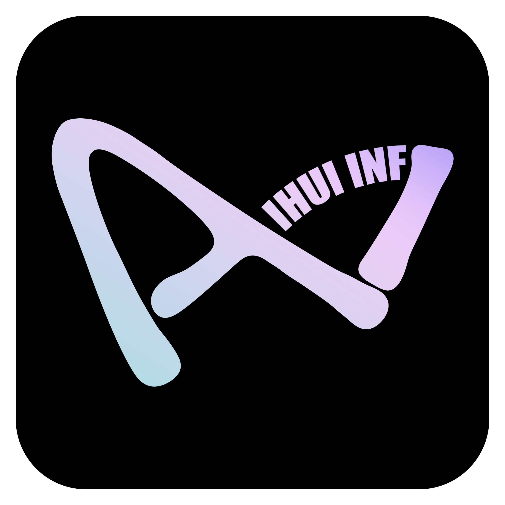
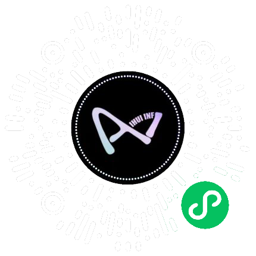

# IHUI-AI

<p align="center">
  
</p>

<p align="center">
  <strong>让每个人都拥有自己的 AI 程序</strong><br/>
  <sub>一个全栈、全端、全场景的开源 AI 应用共建平台</sub>
</p>

<p align="center">
  <a href="https://github.com/IHUI-INF-AI/IHUI-AI/actions/workflows/ci.yml"></a>
  <a href="https://github.com/IHUI-INF-AI/IHUI-AI/actions/workflows/build.yml"></a>
  <a href="https://github.com/IHUI-INF-AI/IHUI-AI/actions/workflows/e2e.yml"></a>
  <a href="https://github.com/IHUI-INF-AI/IHUI-AI/actions/workflows/knip.yml"></a>
  <a href="LICENSE"></a>
  <a href="https://github.com/IHUI-INF-AI/IHUI-AI"></a>
  <a href="https://github.com/IHUI-INF-AI/IHUI-AI/issues"></a>
  <a href="https://github.com/IHUI-INF-AI/IHUI-AI/pulls"></a>
  <a href="https://github.com/IHUI-INF-AI/IHUI-AI"></a>
  <a href="https://github.com/IHUI-INF-AI/IHUI-AI/graphs/contributors"></a>
</p>

<p align="center">
  <strong>8 端全覆盖</strong> · <strong>100+ 大模型</strong> · <strong>LangGraph + MCP + A2A 三栈协同</strong> · <strong>15+ 业务模块</strong> · <strong>5 语言 i18n</strong>
</p>

<p align="center">
  <sub>
    <a href="README.md">简体中文</a> ·
    <a href="README.en.md">英文</a> ·
    <a href="README.ko.md">韩文</a> ·
    <a href="README.ja.md">日文</a>
  </sub>
</p>

---

## 🌌 这个项目,正在用一个人的执念,改变中文 AI 圈的开源叙事

> **「在长春零下 25 度的冬天,一个人,一台电脑,百万投入,一年时间——**
>
> **他从零写出 8 端代码、338 张数据库表、1135 个 API 端点。**
>
> **资本迟迟没来,但代码还在生长。」**

这不是一个融资故事。
这是一个开源故事。

如果你也曾一个人,在凌晨三点写过代码;
如果你也曾在资本的门外,坚持过自己的执念;
如果你也相信——**真正有价值的东西,会被时间证明**——

那么,这个故事,也是你的故事。

---

### 📣 如果这个故事打动了你,请帮我们做 3 件事

| #   | 动作                                | 为什么重要                                              |
| --- | ----------------------------------- | ------------------------------------------------------- |
| 1   | ⭐ **Star 这个仓库**                  | 让更多人在 GitHub 时间线和算法推荐里看到它              |
| 2   | 🔄 **转发这个故事**                  | 公众号 / 知乎 / X / 即刻 / 微博 / 微信朋友圈,任选其一   |
| 3   | 💬 **在 Issue 区讲出你的故事**        | [点此进入](https://github.com/IHUI-INF-AI/IHUI-AI/issues) — 我们会精选置顶 |

> **我们不要投资。**
>
> **我们要的是,把这个开源项目,送到每一个相信开源、相信独立开发、相信长期主义的人面前。**

⬇️ 往下看,是完整的故事。

---

> **你有没有想过——**
>
> 为什么 AI 红利总是被大厂独享?为什么搭建一个 AI 应用要从零拼凑认证、计费、模型路由、工作流、多端发布?
> 为什么个人开发者、中小企业、教育机构总在重复造轮子,而不是站在彼此的肩膀上?
>
> **IHUI-AI 想改变这件事。**
>
> 我们把一个完整的 AI 应用基础设施——从 8 端框架、100+ 模型接入、工作流编排、企业级权限、计费订阅、内容发布、AI 教育、可观测性,到 17 道工程守门——以 Apache 2.0 协议全部开源出来。
>
> **不是套壳,不是 demo,是真正可生产、可商用、可自托管的 AI 应用基座。Fork 它,改它,把它变成你自己的。**

---

## 目录

- [特性总览(30 秒看完所有能力)](#特性总览30-秒看完所有能力)
- [为什么选择 IHUI-AI](#为什么选择-ihui-ai)
- [与同类项目对比](#与同类项目对比)
- [谁在使用 IHUI-AI](#谁在使用-ihui-ai)
- [5 个典型场景](#5-个典型场景)
- [技术栈](#技术栈)
- [8 端架构](#8-端架构)
- [项目结构](#项目结构)
- [核心能力详解(15 大模块 · 按用户角色分组)](#核心能力详解15-大模块--按用户角色分组)
  - [A. AI 能力层](#a-ai-能力层面向最终用户)
  - [B. AI 工作流与开发者](#b-ai-工作流与开发者面向开发者)
  - [C. 内容创作与教育](#c-内容创作与教育面向创作者与教育者)
  - [D. 企业与运营](#d-企业与运营面向企业管理者与运营)
  - [E. 工程基础设施](#e-工程基础设施面向运维与架构师)
- [快速开始](#快速开始)
- [API 与协议](#api-与协议)
- [数据库](#数据库)
- [可观测性](#可观测性)
- [安全设计](#安全设计)
- [工程守门](#工程守门17-个-pre-commit-钩子)
- [测试](#测试)
- [部署](#部署)
- [国际化](#国际化)
- [FAQ](#faq)
- [贡献](#贡献)
- [文档导航](#文档导航)
- [路线图](#路线图)
- [联系我们](#联系我们)
- [我们的故事 · 智汇AI 的诞生](#我们的故事--智汇ai-的诞生)
- [开源共建愿景](#开源共建愿景)
- [License](#license)
- [致谢](#致谢)

---

## 特性总览(30 秒看完所有能力)

| 大类              | 模块            | 关键能力                                                                                                    |
| ----------------- | --------------- | ----------------------------------------------------------------------------------------------------------- |
| **AI 对话与模型** | 多模型对话      | 100+ 模型 / 智能路由 / 60% 缓存命中 / 流式 SSE + WebSocket / 对话收藏 / 历史记录 / 分享 / 模板              |
|                   | AI 图像生成     | 文生图 / 图像编辑 / 多分辨率 / 多模型(Stable Diffusion / DALL-E / 通义万相)                                 |
|                   | AI 音频         | TTS 流式合成 / ASR 语音识别 / 音色克隆 / 双向实时语音(WebRTC PCM16 16kHz)                                   |
|                   | AI 视频合成     | 文生视频 / 视频编辑 / 多模型混编 / 转码 / 视频任务管理                                                      |
|                   | AI 数字人       | 腾讯混元 3D / AI 世界 / 数字人交互                                                                          |
|                   | AI 职业         | AI 求职助手 / 简历优化 / 模拟面试                                                                           |
|                   | AI 资讯         | AI 资讯聚合 / 智能摘要 / ai-feed                                                                            |
| **AI 工作流**     | LangGraph       | StateGraph 工作流(plan → execute → summarize)+ stub 模式                                                    |
|                   | MCP 工具协议    | 11 内置工具 + 3 资源 + 3 提示词 / 自定义工具 / 项目级 MCP / mcp-extended                                    |
|                   | A2A 协议        | Agent-to-Agent 互通 / Redis 持久化 + 内存降级                                                               |
|                   | 知识库 RAG      | 文档向量化 / 语义搜索 / 引用追溯 / knowledge-base + knowledge-rag                                           |
|                   | 工作流编排      | 可视化工作流 / CrewAI 集成 / N8N 代理 / workflows                                                           |
|                   | 向量记忆        | 余弦相似度语义搜索 / 跨会话长期记忆 / vector-memory                                                         |
| **多智能体生态**  | 智能体市场      | 购买 / 审核 / 结算 / 提现 / 分类 / 推荐 / 排行 / 精选                                                       |
|                   | 开发者中心      | API Keys / 调用日志 / 团队管理 / 收益分析 / 13 子页                                                         |
|                   | Coze SDK 代理   | Bot / 对话 / 工作流 / 数据集 / 模板 / 变量 / 工作空间 / OAuth                                               |
|                   | OpenClaw        | 开源 Agent 框架接入 / clawdbot / openclaw-routes                                                            |
|                   | Skills 系统     | content_engine(build_gpt56_sol / export_csdn_md / full_audit / publish_pipeline)+ koubo_workflow(10+ tools) |
| **8 端框架**      | Web             | Next.js 15 / 200+ 页面 / PWA / SEO / 暗黑模式 / 5 语言                                                      |
|                   | API             | Fastify 5 / ~1080 端点 / 12 WebSocket 端点 / 95+ 路由文件 / OpenAPI                                         |
|                   | AI 服务         | FastAPI + LangGraph + LiteLLM + MCP + A2A / 55+ 端点 / 5 provider 适配                                      |
|                   | CLI             | Node.js / 17 命令 / 13 内置工具 / 6 源配置导入 / ACP Server                                                 |
|                   | 桌面            | Tauri 2 + Rust / 系统托盘 / 本地文件访问                                                                    |
|                   | 浏览器扩展      | WXT / 上下文菜单 / 侧边栏 / Chrome + Edge + Firefox                                                         |
|                   | 移动 RN         | React Native + Expo EAS / iOS + Android / SSO                                                               |
|                   | 小程序          | Taro 4 / 微信支付原生集成 / 3 语言(i18n)                                                                    |
| **企业级能力**    | 工作空间权限    | 3 模式 + 7 端点运行时拦截 + 60s 审计超时 + workspace-ai-tasks                                               |
|                   | RBAC + 多租户   | 角色 / 部门 / 组织 / 租户隔离 / 菜单权限 / data-scope 5 级                                                  |
|                   | SSO 单点登录    | OAuth 2.0 / Apple / Google / SSO 中转登录 / PKCE                                                            |
|                   | 计费与订阅      | VIP 等级 / 订阅 recurring / 钱包 / 积分 / 退款审计 / 发票 / 汇率 / 8 支付网关                               |
|                   | 灰度发布        | Canary / 灰度规则 / A/B 测试 / canary + ab-tests                                                            |
|                   | 数据合规        | GDPR / 敏感词过滤 / 内容审核 / 审计日志 / 数据导出                                                          |
| **内容创作**      | 自媒体工作台    | 公众号文章 + 口播稿双流水线 / 斜杠命令 / self-media-automation                                              |
|                   | 14 平台自动发布 | 文章 9 + 图片 2 + 视频 5 平台 / 凭证 AES-256-GCM 加密 / 14 adapter                                          |
|                   | 资讯新闻        | 文章 / 新闻 / 专题 / 标签 / 评论 / 点赞 / 收藏 / news-crawler                                               |
|                   | 短剧            | 短剧创作与管理 / drama                                                                                      |
|                   | 业务名片        | 名片创建 / 编辑 / 收藏 / 分享 / business-cards                                                              |
| **AI 教育全栈**   | 课程学习        | 课程 / 章节 / 学习路径 / 学习地图 / 进度跟踪 / 笔记 / zhs-course                                            |
|                   | 题库与考试      | 多题型 / 自动批改 / 章节练习 / 错题本 / 试卷上传 / exam-marking                                             |
|                   | SRS 间隔重复    | 艾宾浩斯遗忘曲线 / 智能复习调度                                                                             |
|                   | 直播教学        | 签到 / 互动 / 回放 / AI 辅助 / live-chat                                                                    |
|                   | 学习报告        | 行为分析 / 个性化建议 / 证书发放                                                                            |
|                   | 讲师管理        | 讲师主页 / 课程关联 / education-platform                                                                    |
|                   | 学生端          | 12 子页(问答 / 文章 / 圈子 / 评论 / 课程 / 资源 / 笔记 / 离线 / 试卷 / 错题本 / 证书)                       |
| **社区互动**      | 圈子广场        | 圈子 / 广场 / 问答 / 帖子 / 话题 / 标签                                                                     |
|                   | 私信消息        | 1 对 1 私信 / 系统通知 / 多端同步 / private-letters                                                         |
|                   | 关注粉丝        | 关注 / 粉丝 / 用户主页 / 名片                                                                               |
|                   | 分享邀请        | 邀请码 / 分享码 / H5 分享 / 推荐返佣 / visit-tracking                                                       |
| **运营增长**      | 积分签到        | 每日签到 / 任务积分 / 积分商城 / 兑换 / point-redeem-items                                                  |
|                   | 排行榜          | 多维度排行 / 周月榜 / 用户排名 / ranking                                                                    |
|                   | 抽奖活动        | 抽奖 / 红包 / 奖励视频广告 / rewarded-video-ad                                                              |
|                   | 分销佣金        | 分销体系 / 佣金计划 / 提现 / 8 子页 / commission                                                            |
|                   | 活动公告        | 活动管理 / 公告推送 / Banner 轮播 / carousels                                                               |
| **客服支持**      | 工单系统        | 工单提交 / 处理 / 评价 / FAQ / admin-asks + admin-faq                                                       |
|                   | 在线客服        | WebSocket 实时客服 / 1 对 1 会话 / customer-service                                                         |
|                   | 反馈中心        | 用户反馈 / 处理状态 / 追踪                                                                                  |
| **运维监控**      | BI 仪表盘       | 业务指标可视化 / 数据分析 / bi-dashboard                                                                    |
|                   | 错误仪表盘      | 错误聚合 / 告警 / 追踪 / security-audit                                                                     |
|                   | 操作日志        | 登录日志 / 操作日志 / 回调日志 / audit + security-logs                                                      |
|                   | 监控告警        | Prometheus + Grafana(20 仪表盘)+ Loki + Promtail + Jaeger + OpenTelemetry + Alertmanager                    |
| **工程基础设施**  | 数据库          | PostgreSQL 15 / **338+ 表** / 100 schema 文件 / **120+ 迁移** / Drizzle ORM + RLS + 租户路由                |
|                   | 队列缓存        | Redis 7 + BullMQ / 独立 worker 进程(:8081)                                                                  |
|                   | 对象存储        | OSS 多厂商驱动 / 凭证加密 / 分块上传 / 文件版本 / chunked-upload                                            |
|                   | 邮件短信        | SMTP / 短信网关 / 邮件模板 / 验证码 / mail + message-templates                                              |
|                   | 国际化          | 5 语言 parity(zh-CN / zh-TW / en / ko / ja)+ 19 i18n 工具链 + 4 守门脚本                                    |
|                   | 工程守门        | 17 pre-commit 钩子 + post-commit 自动 push + 11 迁移审计 + 9 PowerShell 启动                                |
|                   | 测试覆盖        | 268 + 400+ 用例 / Vitest + Playwright + pytest + Locust 压测 + Lighthouse 性能                              |
|                   | 部署运维        | Docker Compose(14 服务)/ 蓝绿部署 / Nginx upstream 切换 / 健康检查 / 回滚 / 备份 / 证书续期 cron            |
|                   | 性能 CI         | Knip 未使用代码检测 + Lighthouse CI 性能预算 + GitHub Act 本地 CI                                           |

---

## 为什么选择 IHUI-AI

| 维度                 | 能力                                                                                         | 行业定位                        |
| -------------------- | -------------------------------------------------------------------------------------------- | ------------------------------- |
| **端覆盖**           | Web / API / AI 服务 / CLI / 桌面 / 扩展 / 移动 RN / 小程序 Taro                              | 行业首个 8 端全覆盖 AI 全栈平台 |
| **模型接入**         | LiteLLM 网关统一 100+ 模型(国际 30+ / 国产 15+ / 云厂商 10+)                                 | 一站式接入,智能路由 + 60% 缓存  |
| **AI 编排三栈**      | LangGraph(工作流)+ MCP(工具协议)+ A2A(Agent 互通)                                            | 工作流、工具、智能体协同一体化  |
| **自研 CLI**         | 17 命令 + 13 内置工具 + ACP Server,对标 Claude Code                                          | 命令行原生 AI 编程体验          |
| **CLI 配置无缝导入** | cc-switch / codex++ / Claude / Codex / Gemini / Hermes 6 源一键导入                          | 跨 CLI 工具配置零迁移成本       |
| **企业级安全**       | RBAC + 工作空间 3 模式权限 + 7 端点运行时拦截 + 60s 审计超时                                 | 决策者级风险控制                |
| **数据加密**         | AES-256-GCM(credentials 加密)+ JWT token-family 旋转 + refresh 黑名单                        | 金融级数据保护                  |
| **可观测性**         | Prometheus + Grafana(**20 仪表盘**)+ Loki + Promtail + Jaeger + OpenTelemetry + Alertmanager | 全链路指标 / 日志 / 追踪 / 告警 |
| **工程守门**         | 17 pre-commit + post-commit 自动 push + git-push-guard + 11 迁移审计                         | 杜绝协作事故,99.9% SLA          |
| **国际化**           | zh-CN / zh-TW / en / ko / ja 5 语言 parity + 19 i18n 工具链                                  | 5 语言键集合强一致性            |
| **数据库**           | **338+ 表 + 120+ 迁移** + 100 schema 文件 + Drizzle ORM + RLS + 租户路由                     | 单库 PostgreSQL 15,schema 隔离  |
| **API 规模**         | ~1135 端点(api 1080 + ai-service 55)+ 12 WebSocket + 95+ 路由文件                            | 远超源项目 331 端点             |
| **业务覆盖**         | 15 大模块 / 50+ 子功能 / **200+ Web 页面**                                                   | 一个平台覆盖所有 AI 应用场景    |
| **共享包**           | 13 packages(auth/database/types/ui/i18n/sdk/api-client/context-compaction 等)                | 跨端类型安全 + 复用             |
| **性能保障**         | Knip 未使用代码 + Lighthouse CI + Locust 压测                                                | 性能预算 + 容量预估             |
| **部署成熟度**       | Docker Compose(14 服务)+ 蓝绿 + Nginx upstream + 证书续期 cron                               | 生产级运维                      |

---

## 与同类项目对比

| 维度              | IHUI-AI                                                 | Dify             | FastGPT              | Langflow         | ChatGPT-Next-Web |
| ----------------- | ------------------------------------------------------- | ---------------- | -------------------- | ---------------- | ---------------- |
| **端覆盖**        | 8 端(Web/API/AI/CLI/桌面/扩展/移动/小程序)              | 2 端(Web/Server) | 2 端(Web/Server)     | 1 端(Web)        | 1 端(Web)        |
| **模型接入**      | 100+ 模型 + LiteLLM 网关                                | 50+ 模型         | 30+ 模型             | LangChain 适配器 | 仅 OpenAI        |
| **工作流引擎**    | LangGraph + MCP + A2A 三栈                              | 自研工作流       | 简单工作流           | Langflow DAG     | 无               |
| **多租户 + RBAC** | 完整(租户/角色/部门/菜单/data-scope 5 级)               | 基础             | 基础                 | 无               | 无               |
| **计费订阅**      | 完整(VIP/订阅/钱包/积分/退款/发票/8 支付网关)           | 无               | 基础                 | 无               | 无               |
| **AI 教育**       | 全栈(课程/题库/考试/SRS/直播/学生端 12 子页)            | 无               | 无                   | 无               | 无               |
| **内容发布**      | 14 平台一键自动发布 + 14 adapter                        | 无               | 无                   | 无               | 无               |
| **CLI 工具**      | 自研 ACP Server + 17 命令 + 13 工具                     | 无               | 无                   | 无               | 无               |
| **可观测性**      | 三支柱 + 20 Grafana 仪表盘 + Alertmanager               | 基础             | 基础                 | 无               | 无               |
| **工程守门**      | 17 pre-commit + 11 迁移审计 + 9 PowerShell              | 基础             | 基础                 | 基础             | 无               |
| **i18n**          | 5 语言 parity + 19 i18n 工具链 + 4 守门                 | 中英文           | 中英文               | 英文             | 多语言           |
| **数据库**        | 338+ 表 + 120+ 迁移 + RLS + 租户路由                    | 基础             | 基础                 | 简单             | 简单             |
| **性能 CI**       | Knip + Lighthouse + Locust 压测                         | 无               | 无                   | 无               | 无               |
| **License**       | Apache 2.0(商用友好)                                    | Apache 2.0       | FastGPT Open License | MIT              | MIT              |
| **生产级部署**    | Docker Compose(14 服务)+ 蓝绿 + 回滚 + 备份 + 证书 cron | Docker           | Docker               | Docker           | Docker           |

**IHUI-AI 不是要替代谁,而是把"搭建一个完整 AI 应用"所需的所有基础设施都开源出来。**

---

## 谁在使用 IHUI-AI

本项目由**吉林省爱智汇人工智能科技有限公司**发起并主导开发,用于支撑公司商业化 AI 平台。我们欢迎更多企业、团队、个人提交使用案例(请编辑此章节提 PR):

| 角色       | 场景                                  | 状态     |
| ---------- | ------------------------------------- | -------- |
| 爱智汇 AI  | 公司主商业化平台(智汇 AI 集团)        | 生产使用 |
| AI 服务商  | 多模型代理 + 计费 + 订阅一站式上线    | 适配中   |
| 教育机构   | AI 教育全栈(课程 / 题库 / 考试 / SRS) | 适配中   |
| 内容创作者 | 14 平台一键发布                       | 适配中   |
| 个人开发者 | 私有 AI 助手 + 知识库                 | 等你来填 |

> 你的公司或项目正在用 IHUI-AI 吗?欢迎提交 PR 加入此列表。

---

## 5 个典型场景

### 场景 1:个人开发者搭建私有 AI 助手

```bash
git clone https://github.com/IHUI-INF-AI/IHUI-AI.git
cd IHUI-AI && docker compose up -d
# 5 分钟后,你拥有:
# - 一个支持 100+ 模型的对话界面
# - 私有知识库 RAG(你的文档向量化 + 语义搜索)
# - 跨端同步(Web + 桌面 + 移动 + 小程序)
# - 数据完全自托管,不被任何大厂窥探
```

### 场景 2:中小企业构建 AI 中台

- 用 RBAC 给 200 个员工开账号,按部门隔离工作空间
- 接入 7 个 LLM 厂商,智能路由选最便宜的模型
- 用计费系统按部门收费,生成发票
- 用 BI 仪表盘看哪些部门用得最多
- 用审计日志满足合规要求

### 场景 3:AI 服务商上线商业产品

- 复用多模型代理 + 计费 + 订阅 + VIP + 钱包 + 积分
- 用智能体市场让开发者入驻,抽取 30% 佣金
- 用 API Keys + SDK 让客户接入你的平台
- 用 14 平台发布做内容营销
- 一周上线,而不是一年

### 场景 4:教育机构改造教学

- 用 AI 教育全栈导入课程 + 题库
- 学生用 SRS 间隔重复自动复习
- 老师用 AI 批改试卷 + 生成学习报告
- 直播 + 签到 + 互动 + 回放
- 学习行为分析 + 个性化建议
- 证书自动发放

### 场景 5:内容创作者解放生产力

- 在自媒体工作台写公众号文章 + 口播稿
- 一键发布到 14 平台(公众号 / 知乎 / CSDN / 掘金 / 小红书 / B 站 / YouTube / 抖音 等)
- 凭证 AES-256-GCM 加密存储,平台不泄露
- 发布完成 WebSocket 实时通知

---

## 技术栈

| 层             | 技术                                                                           | 版本                                |
| -------------- | ------------------------------------------------------------------------------ | ----------------------------------- |
| Monorepo       | pnpm workspace + Turborepo                                                     | pnpm 9.15 / turbo 2.3               |
| 后端 API       | Fastify + @fastify/jwt + @fastify/websocket + Drizzle ORM + PostgreSQL         | Fastify 5.1 / Drizzle 0.38 / PG 15  |
| 缓存与队列     | Redis 7 + BullMQ                                                               | 独立 worker 进程(:8081)             |
| 前端 Web       | Next.js + React + Tailwind CSS + shadcn/ui                                     | Next 15.1 / React 19 / Tailwind 4   |
| 前端状态       | @tanstack/react-query 5 + Zustand                                              | 服务端 + 客户端状态分离             |
| 国际化         | next-intl                                                                      | zh-CN / zh-TW / en / ko / ja 5 语言 |
| AI 服务        | FastAPI + LangGraph + LiteLLM + MCP + A2A + Socket.IO                          | FastAPI 0.115 / LangGraph 0.2       |
| AI 协议        | SSE(Agent 流式)+ WebSocket(聊天室 / 多模型流式)+ REST                          | 三协议分层                          |
| 桌面端         | Tauri 2 + React 19 + Rust                                                      | 跨平台原生体验                      |
| 浏览器扩展     | WXT + React                                                                    | Chrome / Edge / Firefox             |
| 移动端         | React Native + Expo EAS                                                        | iOS / Android                       |
| 小程序         | Taro 4 + React                                                                 | 微信小程序                          |
| CLI            | Node.js + Commander + Inquirer                                                 | 对标 Claude Code                    |
| 认证           | @ihui/auth 共享包(JWT HS256 + token-family + OAuth2 + RBAC + data-scope 5 级)  | 跨端统一签发                        |
| 验证           | Zod 3.24(后端)+ React Hook Form(前端)                                          | 端到端类型安全                      |
| 日志           | Pino 9.5(后端)+ Python logging(AI 服务)+ Loki + Promtail                       | 结构化 + 聚合                       |
| 追踪           | OpenTelemetry + Jaeger                                                         | 分布式全链路                        |
| 监控           | Prometheus + Grafana(20 仪表盘)+ Node Exporter + Alertmanager                  | 主机 + 应用 + 告警                  |
| 测试           | Vitest(后端)+ Playwright(E2E)+ pytest(AI 服务)+ Locust(压测)+ Lighthouse(性能) | 268 + 400+ 用例                     |
| 未使用代码检测 | Knip                                                                           | CI 守门                             |
| Node           | >=20.10.0                                                                      | -                                   |
| Python         | 3.12+(仅 AI 服务)                                                              | -                                   |

---

## 8 端架构

```
                    ┌─────────────────────────────────────────────────┐
                    │          用户 / 企业 / 开发者 / 教育机构             │
                    └────────────┬───────────────────────┬────────────┘
                                 │                       │
        ┌────────────────────────┼───────────────────────┼────────────────────────┐
        │                        │                       │                        │
   ┌────▼─────┐  ┌──────────┐  ┌─▼────────┐  ┌──────────▼───┐  ┌──────────┐  ┌─▼────────┐
   │  Web     │  │ Desktop  │  │ Extension│  │  Mobile RN  │  │ Miniapp  │  │   CLI    │
   │ Next 15  │  │ Tauri 2  │  │  WXT     │  │  Expo EAS   │  │ Taro 4   │  │ Node.js  │
   │ :3000    │  │ + Rust   │  │          │  │ iOS/Android │  │ 微信小程序 │  │ ACP+Skl │
   └────┬─────┘  └────┬─────┘  └────┬─────┘  └──────┬─────┘  └────┬─────┘  └────┬─────┘
        │             │             │               │             │             │
        └─────────────┴─────────────┴───────┬───────┴─────────────┴─────────────┘
                                           │  HTTPS / WebSocket / SSE / ACP
                                  ┌────────▼─────────┐
                                  │   apps/api       │  Fastify 5 + Drizzle ORM
                                  │   :8080          │  ~1080 端点 + 12 WS + 95 路由文件
                                  └────┬───────┬─────┘
                                       │       │
                          ┌────────────▼─┐   ┌─▼──────────────┐
                          │  PostgreSQL  │   │  apps/ai-service│  FastAPI + Socket.IO
                          │  15 (338 表) │   │  :8000          │  LangGraph + LiteLLM + MCP + A2A
                          └──────────────┘   └────┬────────────┘  5 provider + 14 publish adapter
                                                  │
                                            ┌─────▼─────┐  ┌──────────┐
                                            │  Redis 7  │  │ Worker   │  BullMQ 独立进程
                                            │ Pub/Sub   │  │ :8081    │  异步任务调度
                                            └───────────┘  └──────────┘
```

### 8 端职责

| 端          | 目录                 | 技术栈                          | 职责                                                                   |
| ----------- | -------------------- | ------------------------------- | ---------------------------------------------------------------------- |
| **Web**     | `apps/web/`          | Next.js 15 + React 19           | 主前端,200+ 页面,5 语言 i18n,PWA,SEO                                   |
| **API**     | `apps/api/`          | Fastify 5 + Drizzle             | 业务管理 + 多厂商代理 + 认证 + WebSocket,~1080 端点 / 95+ 路由文件     |
| **AI 服务** | `apps/ai-service/`   | FastAPI + LangGraph + Socket.IO | LLM 网关 + Agent 执行 + MCP 工具 + A2A 协议 + 14 发布 adapter,~55 端点 |
| **CLI**     | `apps/cli/`          | Node.js + Commander             | 自研命令行 AI 编程助手,17 命令 + 13 工具 + ACP Server + 6 源配置导入   |
| **桌面**    | `apps/desktop/`      | Tauri 2 + Rust + React          | 跨平台桌面应用,系统托盘 + 本地文件访问                                 |
| **扩展**    | `apps/extension/`    | WXT + React                     | 浏览器扩展,上下文菜单 + 侧边栏 + Chrome/Edge/Firefox                   |
| **移动**    | `apps/mobile-rn/`    | React Native + Expo EAS         | iOS / Android 原生应用 + SSO                                           |
| **小程序**  | `apps/miniapp-taro/` | Taro 4 + React                  | 微信小程序,微信支付原生集成 + 3 语言 i18n                              |

---

## 项目结构

```
IHUI-AI/
├── apps/
│   ├── ai-service/          # AI 服务 (FastAPI + LangGraph + LiteLLM + MCP + A2A + Socket.IO)
│   ├── api/                 # 后端 API (Fastify 5 + Drizzle, ~1080 端点, 95+ 路由文件)
│   ├── cli/                 # 自研 CLI (17 命令 + 13 工具 + ACP Server, 对标 Claude Code)
│   ├── desktop/             # 桌面端 (Tauri 2 + Rust + React)
│   ├── extension/           # 浏览器扩展 (WXT + React, Chrome/Edge/Firefox)
│   ├── miniapp-taro/        # 微信小程序 (Taro 4 + React)
│   ├── mobile-rn/           # 移动端 (React Native + Expo EAS)
│   └── web/                 # 前端 (Next.js 15 + React 19, 200+ 页面)
├── packages/                # 13 个共享包
│   ├── api-client/          # @ihui/api-client (40+ endpoints 自动生成 SDK)
│   ├── auth/                # @ihui/auth (JWT + token-family + OAuth2 + RBAC + data-scope)
│   ├── config/              # @ihui/config
│   ├── context-compaction/  # @ihui/context-compaction (上下文压缩)
│   ├── database/            # @ihui/database (Drizzle, 338+ 表, 120+ 迁移, RLS, 租户路由)
│   ├── eslint-config/       # @ihui/eslint-config
│   ├── i18n/                # @ihui/i18n (5 语言 + brand-glossary)
│   ├── sdk/                 # @ihui/sdk (自动生成)
│   ├── tsconfig/            # @ihui/tsconfig
│   ├── types/               # @ihui/types
│   ├── ui/                  # @ihui/ui (Web shadcn/ui)
│   ├── ui-native/           # @ihui/ui-native (React Native)
│   └── ui-primitives/       # @ihui/ui-primitives (cn + 原语)
├── deploy/
│   ├── nginx/               # Nginx 反向代理 + 蓝绿 upstream + SSL/security/rate-limit
│   ├── scripts/             # deploy.sh / rollback.sh / health-check.sh / backup-db.sh / restore-db.sh / deploy_certs.sh
│   ├── cron/                # Let's Encrypt 证书自动续期
│   └── setup-github-secrets.sh  # GitHub Actions secrets 批量配置
├── docs/                    # 9 个文档:architecture / CHANGELOG / CONTRIBUTING / DEPLOYMENT_RUNBOOK / SECURITY / EMAIL_SETUP / I18N / INCIDENTS / README
├── monitoring/              # Grafana(20 仪表盘)+ Loki + Prometheus + Promtail + otel-collector + Alertmanager
├── scripts/                 # 17 守门 + 19 i18n + 11 迁移审计 + 9 PowerShell 启动 + 运维工具
├── server-docs/             # 多租户设计文档(MULTI_TENANT.md)
├── .github/workflows/       # 4 个 CI:build / ci / e2e / knip + GitHub Act 本地 CI
├── .husky/                  # Git hooks (commit-msg + post-commit + pre-commit + pre-push + post-checkout + post-merge)
├── docker-compose.yml       # 14 服务编排(7 业务 + 7 监控)
├── Dockerfile.api-new       # 后端镜像(api + worker 共用)
├── Dockerfile.web-new       # 前端镜像(Next.js standalone)
├── Dockerfile.migrate       # 迁移一次性服务镜像
├── locustfile.py            # Locust 压测脚本
├── lighthouserc.json        # Lighthouse CI 性能预算
├── knip.jsonc               # Knip 未使用代码检测配置
├── noise-rules.yml          # Alertmanager 噪音抑制规则
├── s3-lifecycle.yml         # S3 对象存储生命周期规则
├── AGENTS.md                # AI Agent 协作规范(21 节强制规则)
├── PROJECT_PLAN.md          # 项目唯一任务计划文档
├── LICENSE                  # Apache 2.0
├── README.md                # 简体中文(本文件)
├── README.en.md             # English
├── README.ko.md             # 한국어
└── README.ja.md             # 日本語
```

---

## 核心能力详解(15 大模块 · 按用户角色分组)

### A. AI 能力层(面向最终用户)

#### A1. 100+ 大模型一站式接入

通过 LiteLLM 网关统一接入,智能路由 + 60% 缓存命中:

| 类别         | 模型                                                                                                       |
| ------------ | ---------------------------------------------------------------------------------------------------------- |
| **国际模型** | OpenAI GPT / Anthropic Claude / Google Gemini / xAI Grok / Groq / OpenRouter / Mistral / StepFun           |
| **国产模型** | 智谱 GLM / 通义千问 Qwen / 豆包 Doubao / DeepSeek / 月之暗面 Kimi / 阶跃星辰 StepFun / 百川 / Yi / MiniMax |
| **云厂商**   | 阿里云 / 腾讯云 / 华为云 / 火山引擎 / 百度智能云 / AWS Bedrock / Azure OpenAI                              |
| **多模态**   | 文本 / 图像 / 语音(STT + TTS)/ 视频 / 嵌入向量 / 3D 数字人(腾讯混元)                                       |

**ai-service providers 适配**(`apps/ai-service/app/providers/`):base_provider + openai_provider + anthropic_provider + gemini_provider + stepfun_provider 5 个适配器。

#### A2. LangGraph + MCP + A2A 三栈协同

| 栈                | 能力                                                                                                                                                                                                                     | 实现位置                                                                                       |
| ----------------- | ------------------------------------------------------------------------------------------------------------------------------------------------------------------------------------------------------------------------ | ---------------------------------------------------------------------------------------------- |
| **LangGraph**     | StateGraph 工作流(plan → execute → summarize),支持 stub 模式无 API key 也能开发                                                                                                                                          | `services/langgraph_service.py` + `agent_graph.py` + `agent_loop.py` + `agent_orchestrator.py` |
| **MCP**           | 11 内置工具(search_codebase / read_file / write_file / run_command / web_search / git_operations / db_query / analyze_code / generate_test / refactor_code / file_search)+ 3 资源 + 3 提示词 + 项目级 MCP + mcp-extended | `routers/mcp.py` + `services/mcp_server.py`                                                    |
| **A2A**           | Agent-to-Agent 协议,Redis 持久化 + 内存降级,智能体之间互相调用                                                                                                                                                           | `routers/a2a.py` + `services/a2a_service.py`                                                   |
| **向量记忆**      | 嵌入 + 余弦相似度语义搜索,跨会话长期记忆                                                                                                                                                                                 | `services/vector_memory.py` + `memory.py` + `project_memory.py`                                |
| **知识库 RAG**    | 文档向量化 / 语义搜索 / 引用追溯                                                                                                                                                                                         | `services/rag.py` + `api/v1/rag.py` + schema `knowledge-base.ts`                               |
| **Persona**       | 角色定义注册表,自定义 Agent 人设                                                                                                                                                                                         | `routers/personas.py` + `services/persona_registry.py`                                         |
| **Agent Runtime** | SSE 流式 + WebSocket,plan/execute/summarize + interrupt/continue/cancel                                                                                                                                                  | `routers/agent_runtime.py`                                                                     |

#### A3. 多模态 AI 创作

| 能力             | 端点 / 实现                                                                         |
| ---------------- | ----------------------------------------------------------------------------------- |
| **文生图**       | 多模型(Stable Diffusion / DALL-E / 通义万相)/ 多分辨率 / 批量 / image-gen-favorites |
| **图像编辑**     | 局部重绘 / 风格迁移 / 背景移除 / 高清放大                                           |
| **TTS 流式合成** | 12+ 音色 / 多语言 / WebSocket 流式 / 中断控制 / `ws/tts/stream`                     |
| **ASR 语音识别** | 实时转写 / 文件转写 / 多语言 / `voice_stt.py`                                       |
| **音色克隆**     | 短音频样本 → 自定义音色 / `ws/timbre/generate`                                      |
| **双向实时语音** | WebRTC PCM16 16kHz / ASR + LLM + TTS 闭环 / `webrtc-voice.ts`                       |
| **文生视频**     | 多模型混编 / 视频编辑 / 视频合成 / 转码 / ai-generation/video-tasks                 |
| **AI 数字人**    | 腾讯混元 3D / AI 世界 / 数字人交互 / `tencent-hunyuan-3d.ts`                        |
| **AI 求职**      | 简历优化 / 模拟面试 / 职业建议 / `ai-career/`                                       |
| **AI 资讯**      | AI 资讯聚合 / 智能摘要 / `ai-feed.ts` + `ai-feed-posts.ts`                          |

### B. AI 工作流与开发者(面向开发者)

#### B1. 自研 CLI(对标 Claude Code)

`apps/cli/` 提供 ACP(Agentic Coding Protocol)Server + 17 命令 + 13 内置工具:

**命令清单:**

| 命令                       | 用途                                                                 |
| -------------------------- | -------------------------------------------------------------------- |
| `ihui` (无参)              | 交互式 REPL                                                          |
| `ihui "<prompt>"`          | 直接执行任务(单轮)                                                   |
| `ihui chat`                | 多轮对话模式                                                         |
| `ihui agent [task]`        | Agent 自主多步执行(--json headless)                                  |
| `ihui init`                | 创建 AGENTS.md 模板(--force 覆盖)                                    |
| `ihui sessions`            | 列出历史会话                                                         |
| `ihui mcp list/add/remove` | MCP 服务器管理(stdio/http/sse)                                       |
| `ihui capabilities`        | 能力子命令                                                           |
| `ihui checkpoint`          | 检查点子命令                                                         |
| `ihui hooks`               | Git hooks 子命令                                                     |
| `ihui import`              | 6 源配置导入(cc-switch / codex++ / Claude / Codex / Gemini / Hermes) |
| `ihui skills list/show`    | 加载 .ihui/.agents/.claude/.cursor 四级目录平面 skills               |
| `ihui settings init/path`  | ~/.ihui/settings.json 统一配置                                       |
| `ihui acp`                 | 启动 ACP Server(Zed/VSCode/Cursor 编辑器嵌入)                        |
| `ihui audit query/stats`   | 审计日志查询/统计                                                    |

**13 内置工具**(`apps/cli/src/tools/`):ask-user / builtins / clipboard / codegraph / fetch-url / file-edit / git / hub/adapter / mcp-oauth / run-tests / subagent / todo-write / web-search

**Skills 系统**:四级目录平面加载(`.ihui` / `.agents` / `.claude` / `.cursor`)

**其他模块**:acp/server / checkpoints / codegraph / commands / config / fs-watcher / hooks / i18n / memory / mermaid / personas / plan / plugins / sandbox / sessions / subagents / telemetry / tools / util / voice + audit / compaction-v2 / context / crash-handler / headless-format / highlight / interjection / prompt-queue / redact / reminders / stream-chunk / updater / worktree

#### B2. 企业级工作空间权限

3 种权限模式 + 7 端点运行时拦截 + 60s 审计超时:

| 模式                 | 行为                              |
| -------------------- | --------------------------------- |
| `default`            | 任何 FS 调用都触发人工审计弹窗    |
| `accept-edits`       | 白名单规则匹配放行,不匹配触发弹窗 |
| `bypass-permissions` | 全部放行(仅信任环境使用)          |

- 7 个 FS 端点全部接入:`/fs/read` `/fs/write` `/fs/edit` `/fs/delete` `/fs/grep` `/fs/glob` `/fs/run`
- WebSocket 实时推送权限请求,60s 不响应自动拒绝
- workspace-ai-tasks schema 支持任务级权限隔离

#### B3. 多智能体业务管理

完整的智能体市场 + 开发者生态:

| 模块                 | 能力                                                                                                                                                                                                                                                        |
| -------------------- | ----------------------------------------------------------------------------------------------------------------------------------------------------------------------------------------------------------------------------------------------------------- |
| **智能体市场**       | 购买 / 审核 / 结算 / 提现 / 分类 / 推荐 / 排行 / 精选 / agent-commerce + agent-billings + agent-reviews                                                                                                                                                     |
| **开发者中心**       | API Keys / 调用日志 / 团队管理 / 收益分析 / 开发者认证 / 13 子页                                                                                                                                                                                            |
| **Coze SDK 代理**    | Bot / 对话 / 工作流 / 数据集 / 模板 / 变量 / 工作空间 / OAuth / coze-test + coze-ecosystem + coze-variables                                                                                                                                                 |
| **OpenClaw**         | 开源 Agent 框架接入 / clawdbot + openclaw-routes + openclaw-items                                                                                                                                                                                           |
| **Crew 集成**        | CrewAI 多智能体协作 / crew.ts                                                                                                                                                                                                                               |
| **N8N 代理**         | N8N 工作流平台反向代理 / n8n-proxy.ts                                                                                                                                                                                                                       |
| **Skills 系统**      | content_engine(build_gpt56_sol / export_csdn_md / full_audit / publish_pipeline)+ koubo_workflow(10+ tools 含 koubo_quality_gate / koubo_validate / hot_topic_coverage_gate / archive_daily / project_hygiene / pre_publish_check / topic_pool / x_sources) |
| **MCP 扩展**         | mcp-servers schema + mcp-extended 路由 + 自定义工具注册                                                                                                                                                                                                     |
| **Persona**          | 角色定义注册表 / personas.py + persona_registry.py                                                                                                                                                                                                          |
| **Socket.IO 兼容层** | sio/handlers.py 兼容旧 coze_zhs_py 客户端                                                                                                                                                                                                                   |

### C. 内容创作与教育(面向创作者与教育者)

#### C1. 内容创作与多平台发布

- **自媒体工作台**:公众号文章 + 口播稿双流水线,通过 AI 对话框斜杠命令(`/wechat-article` / `/koubo-script`)或附加栏按钮双入口调用
- **14 平台一键自动发布**(14 adapter 在 `apps/ai-service/app/services/publish/`):

| 类型        | 平台                                                    |
| ----------- | ------------------------------------------------------- |
| 文章 9 平台 | WordPress / Medium / 公众号 / 头条 / 知乎 / CSDN / 掘金 |
| 图片 2 平台 | 小红书 / 微博                                           |
| 视频 5 平台 | YouTube / B 站 / 抖音 / 快手 / 视频号                   |

- **凭证 AES-256-GCM 加密存储**(`credentials_crypto.py`),发布完成 WebSocket 实时通知 + 完整记录
- **资讯新闻系统**:文章 / 新闻 / 专题 / 标签 / 评论 / 点赞 / 收藏 / 热门 + news-crawler 爬虫
- **短剧创作与管理**:`apps/web/app/(main)/drama/`
- **业务名片**:名片创建 / 编辑 / 收藏 / 分享 / business-cards schema

#### C2. AI 教育全栈

| 模块                | 能力                                                                                        |
| ------------------- | ------------------------------------------------------------------------------------------- |
| **课程学习**        | 课程 / 章节 / 学习路径 / 学习地图 / 进度跟踪 / 笔记 / 问答 / zhs-course + zhs-organization  |
| **题库与考试**      | 多题型枚举双向映射 / 自动批改 / 章节练习 / 错题本 / 试卷上传 / exam-marking                 |
| **SRS 间隔重复**    | 基于艾宾浩斯遗忘曲线的智能复习调度 / srs.ts + srs.py                                        |
| **直播教学**        | 直播 / 签到 / 互动 / 回放 / AI 辅助 / live-chat + live-extended + live-supplement           |
| **学习报告**        | 学习行为分析 + 个性化建议 / analytics-events + behavior                                     |
| **证书发放**        | 完成课程 / 考试通过自动发证 / certificate.ts + certificate/download                         |
| **讲师管理**        | 讲师主页 / 课程关联 / education-platform                                                    |
| **学生端 12 子页**  | 问答 / 文章 / 圈子 / 评论 / 课程 / 资源 / 笔记 / 离线记录 / 试卷 / 错题本 / 证书 / 学习记录 |
| **edu-full schema** | 45 张表(最大 schema),覆盖课程/章节/课时/笔记/问答/作业/批改/学习记录/班级/讲师/学员/认证    |

### D. 企业与运营(面向企业管理者与运营)

#### D1. 计费与交易

完整的交易闭环:

```
订阅 VIP → 钱包充值 → 积分获取 → 模型调用扣费 → 退款审计 → 发票开具
                ↓                ↑
            分销佣金 ← 邀请返佣
```

- **VIP 等级**:多级会员 / 权益配置 / 升级流程 / vip-membership
- **订阅 recurring**:周期扣款 / 自动续费 / 取消订阅 / payment-recurring
- **钱包**:充值 / 提现 / 余额 / 流水 / wallet.ts + funds.ts
- **积分**:签到获取 / 任务获取 / 消费抵扣 / 兑换商品 / point + point-redeem-items
- **退款审计**:申请 / 审核 / 退款 / 银行流水 / refund-audit
- **发票**:增值税普票 / 专票 / 邮寄
- **汇率**:多币种 / 实时汇率
- **8 支付网关**:payment-gateway + payment-extended + wechat-pay-contracts + payment-callbacks

#### D2. 社区与互动

| 模块         | 能力                                                                                |
| ------------ | ----------------------------------------------------------------------------------- |
| **圈子广场** | 圈子 / 广场 / 问答 / 帖子 / 话题 / 标签 / community + circle-extra                  |
| **私信消息** | 1 对 1 私信 / 系统通知 / 多端同步 / WebSocket 实时推送 / private-letters            |
| **关注粉丝** | 关注 / 粉丝 / 用户主页 / 名片 / 用户文章 / 问答 / 评论 / social + social-supplement |
| **分享邀请** | 邀请码 / 分享码 / H5 分享 / 推荐返佣 / visit-tracking                               |
| **互动反馈** | 评论 / 点赞 / 收藏 / 举报 / 用户反馈中心 / interactions + comments                  |

#### D3. 运营增长体系

| 模块         | 能力                                                                       |
| ------------ | -------------------------------------------------------------------------- |
| **积分签到** | 每日签到 / 任务积分 / 积分商城 / 兑换 / 积分明细 / check-in + checkin      |
| **排行榜**   | 多维度排行 / 周月榜 / 用户排名 / ranking                                   |
| **抽奖活动** | 抽奖 / 红包 / 奖励视频广告 / rewarded-video-ad                             |
| **分销佣金** | 分销体系 / 佣金计划 / 提现 / 邀请返佣 / 8 子页 / distribution              |
| **活动公告** | 活动管理 / 公告推送 / Banner 轮播 / 推广位 / carousels + zone + promotions |
| **游戏化**   | 等级 / 成就 / 勋章 / gamification                                          |
| **VIP 会员** | VIP 等级 / 会员权益 / 优惠券 / 粉丝 / 升级                                 |

#### D4. 客服与支持

| 模块         | 能力                                                             |
| ------------ | ---------------------------------------------------------------- |
| **工单系统** | 工单提交 / 处理 / 评价 / FAQ / 工单列表 / admin-asks + admin-faq |
| **在线客服** | WebSocket 实时客服 / 1 对 1 会话 / `ws/customer-service`         |
| **反馈中心** | 用户反馈 / 处理状态 / 追踪 / support                             |
| **帮助中心** | 文档 / 教程 / `[...slug]` 动态路由 / docs                        |

#### D5. 运营与监控

| 模块            | 能力                                                                  |
| --------------- | --------------------------------------------------------------------- |
| **BI 仪表盘**   | 业务指标可视化 / 数据分析 / bi-dashboard                              |
| **错误仪表盘**  | 错误聚合 / 告警 / 追踪 / security-audit                               |
| **操作日志**    | 登录日志 / 操作日志 / 回调日志 / 系统操作日志 / audit + security-logs |
| **API 调试**    | API Debug / API 日志 / API 用量 / API 平台 / llm-call-logs            |
| **灰度发布**    | Canary / 灰度规则 / A/B 测试 / canary + ab-tests                      |
| **i18n 仪表盘** | i18n-dashboard 翻译进度可视化                                         |
| **访问追踪**    | visit-tracking + telemetry + behavior                                 |
| **告警监控**    | Alertmanager + noise-rules 噪音抑制                                   |

### E. 工程基础设施(面向运维与架构师)

#### E1. 安全与合规

| 维度             | 实现                                                                               |
| ---------------- | ---------------------------------------------------------------------------------- |
| **认证**         | JWT HS256 + token-family 旋转(防盗用)+ refresh token 黑名单                        |
| **SSO 单点登录** | OAuth 2.0 + PKCE / Apple / Google / SSO 中转登录 / auth-sso + auth-identity        |
| **限流**         | 全局 100/min,auth login/register 10/min,分层 rate-limit                            |
| **加密**         | AES-256-GCM 加密 credentials(OSS + 教育 + 发布平台 + OAuth private keys)           |
| **密码**         | bcryptjs 哈希(member 表 SHA256 兼容旧 Java 数据)                                   |
| **数据脱敏**     | password / passwordHash 字段在 API 响应中解构剥离                                  |
| **GDPR**         | 数据导出 / 数据删除 / 数据可携 / gdpr 路由                                         |
| **敏感词**       | 敏感词过滤 / 内容审核 / admin-sensitive-words + sensitive-words schema             |
| **审计日志**     | 登录日志 / 操作日志 / 系统操作日志 / 审计追溯 / audit + security-logs              |
| **事务安全**     | DB 事务化:order 支付/退款 + social tag + gamification 积分 + chat 清空             |
| **行锁**         | `.for('update')` 行锁防 TOCTOU 竞态                                                |
| **CSRF**         | `@fastify/csrf-protection` 双 token 模式                                           |
| **XSS**          | sanitizer 绕过检测脚本守门(pre-commit 第 6 项)                                     |
| **API key 泄露** | `check-api-key-leak.mjs` 守门(pre-commit 第 1 项)                                  |
| **RBAC**         | roleId >= 1 才能访问 admin 路由,plugin-level preHandler 统一鉴权 + data-scope 5 级 |
| **工作空间权限** | 3 模式 + 7 端点运行时拦截 + 60s 审计超时 + workspace-ai-tasks                      |
| **多租户**       | 租户隔离 + 组织 + 部门 + 菜单权限 + tenant-router + RLS(Row Level Security)        |
| **OAuth 私钥**   | oauth-private-keys schema 加密存储                                                 |
| **验证码**       | auth-codes + captcha schema                                                        |
| **2FA**          | user-auth-info schema 支持                                                         |

#### E2. 数据库与共享包

- **单库设计**:PostgreSQL 15,单库 `ihui`,通过 schema 隔离业务域
- **338+ 表**:100 个 schema 模块文件,覆盖 30+ 业务域
- **120+ 迁移**:`packages/database/drizzle/`,drizzle-kit generate 生成 + 手动增量
- **7 步幂等 seed**:`packages/database/seed/`,模式化 + 容错隔离
- **行级安全**:RLS(Row Level Security)在关键字段启用,多租户隔离
- **读副本**:read-replica + tenant-router 路由查询
- **类型安全**:Drizzle ORM 0.38,TypeScript strict 模式,端到端类型推导
- **13 共享包**:`packages/` 下 13 个 TypeScript 包,跨端复用

#### E3. 国际化(5 语言 parity)

5 语言 parity(键集合强一致性),由 4 守门脚本 + 19 i18n 工具链保证质量:

| 语言  | 文件                           | 守门                                     |
| ----- | ------------------------------ | ---------------------------------------- |
| zh-CN | `apps/web/messages/zh-CN.json` | 基准语言                                 |
| zh-TW | `apps/web/messages/zh-TW.json` | opencc 字形转换检测简体字残留(阻塞)      |
| en    | `apps/web/messages/en.json`    | 破碎机翻英文检测(阻塞)                   |
| ko    | `apps/web/messages/ko.json`    | 字符范围检测中文残留(阻塞)               |
| ja    | `apps/web/messages/ja.json`    | 中文残留检测(warn-only,日文汉字词易误报) |

**19 i18n 工具链脚本**(`scripts/`):apply-brand-glossary / apply-i18n-translations / apply-translation-fallback / audit-i18n-missing-evaluate / deep-i18n-audit / export-untranslated-i18n / fix-i18n-deep / fix-missing-i18n-keys / fix-zh-tw-simp / fix-zhtw-parity / generate-i18n / prune-orphan-i18n-namespaces / scan-hardcoded-zh / scan-i18n-zh-residue / scan-zh-tw-untranslated / sync-i18n-fixes / translate-i18n-batch / analyze-unique-i18n-values / verify-i18n

**品牌翻译策略**:优先官方英文名(智谱清言 → Zhipu AI,百度文心 → Baidu ERNIE,火山引擎 → Volcengine 等),机器可读映射表见 `scripts/brand-glossary.json`。

#### E4. 工程守门(17 pre-commit + post-commit + 11 迁移审计)

项目通过 17 个 pre-commit 钩子 + post-commit 自动 push + 11 迁移审计脚本杜绝协作事故:

| #       | 脚本                                         | 用途                                        |
| ------- | -------------------------------------------- | ------------------------------------------- |
| 1       | check-api-key-leak.mjs                       | API key 泄露检测                            |
| 2       | check-i18n-keys.mjs                          | i18n 键完整性 + parity                      |
| 2b      | scan-i18n-zh-residue.mjs zh-TW               | zh-TW 简体字残留(opencc 字形转换)           |
| 2c      | scan-i18n-zh-residue.mjs ko                  | ko.json 中文残留(字符范围检测)              |
| 2d      | scan-i18n-zh-residue.mjs ja                  | ja.json 中文残留(warn-only)                 |
| 2e      | check-i18n-broken-en.mjs                     | en.json 破碎机翻英文守门                    |
| 3       | check-db-schema-drift.mjs                    | schema drift 检测                           |
| 4       | check-stale-dist.mjs                         | packages 陈旧 dist 检测                     |
| 4b      | check-dist-encoding.mjs                      | packages dist UTF-8 BOM 守门                |
| 4c      | check-api-client-utf8.mjs                    | api-client 源码字节级 UTF-8 完整性          |
| 5       | lint-staged                                  | eslint + prettier                           |
| 6       | check-sanitizer-bypass.mjs                   | XSS sanitizer 绕过检测                      |
| 7       | check-dedupe.mjs                             | 依赖碎片化检测                              |
| 8       | check-api-routes.mjs                         | 前后端路由一致性                            |
| 9       | check-safe-parse.mjs                         | safeParse 静默忽略(warn-only)               |
| 11      | check-rounded-full.mjs                       | 容器圆角违规(强制尺寸梯度)                  |
| 12      | check-delivery-report-consistency.mjs        | 交付报告一致性                              |
| 13      | check-grokbuild-integration-completeness.mjs | grok-build 整合完整性                       |
| 13b     | check-project-plan-size.mjs                  | PROJECT_PLAN.md 体积 < 50KB                 |
| 13c     | check-project-plan-archive.mjs               | PROJECT_PLAN.md 已完成任务条目防误删        |
| 15      | check-api-migration-completeness.mjs         | 迁移完整性                                  |
| 16      | 条件 typecheck                               | apps/web staged 时跑 typecheck              |
| 16b     | 条件 database build                          | packages/database/src staged 时跑 build     |
| 17      | check-input-border-var.mjs                   | CSS 颜色 token 嵌套(hsl(var()))防护         |
| 18      | check-native-title-tooltip.mjs               | 原生 title tooltip 违规(强制用项目 Tooltip) |
| 17-post | git-push-guard.mjs(post-commit)              | 自动 push + 验证 local == remote(防遗漏)    |

**11 迁移审计脚本**:`audit-migration-api-routes-v2.mjs` / `audit-migration-api-routes.mjs` / `audit-migration-db-fields.mjs` / `audit-migration-db-schema.mjs` / `audit-migration-file-list.mjs` / `audit-migration-frontend-routes.mjs` / `audit-migration-i18n.mjs` / `audit-multi-platform-sync.mjs` / `audit-edu-pages-sample-check.mjs` / `audit-remaining-evaluate.mjs` / `r76-full-audit.mjs`

**9 PowerShell 启动脚本**:`dev-all.ps1` / `dev-up.ps1` / `dev-web.mjs` / `kill-dev-servers.ps1` / `restart-dev-server.ps1` / `fix-trae-workspace.ps1` / `test-admin-e2e.ps1` / `setup-token-refresh-task.ps1` / `cleanup-external-junk.ps1` / `cleanup-memory-topics.ps1`

#### E5. 测试与性能

| 类型       | 框架          | 规模                       | 命令                             |
| ---------- | ------------- | -------------------------- | -------------------------------- |
| 后端单元   | Vitest        | 38 文件,268 用例           | `pnpm --filter @ihui/api test`   |
| 前端 E2E   | Playwright    | 17 spec 文件               | `pnpm test:e2e`                  |
| AI 服务    | pytest        | 13 文件,400+ 用例          | `cd apps/ai-service && pytest`   |
| CLI 单元   | Vitest        | 13 文件                    | `pnpm --filter @ihui/cli test`   |
| 压测       | Locust        | `locustfile.py`            | `locust -f locustfile.py`        |
| 性能预算   | Lighthouse CI | `lighthouserc.json`        | CI 自动跑                        |
| 未使用代码 | Knip          | `knip.jsonc` + CI workflow | `pnpm knip`                      |
| 全量验证   | turbo         | 22 tasks                   | `pnpm turbo typecheck lint test` |

**测试策略**:Fastify inject 模式(不监听端口)+ Mock 数据库层 + 覆盖 auth / billing / content / success-paths / business-logic / edge-cases。

---

## 快速开始

### 环境要求

| 工具       | 版本               | 说明                                              |
| ---------- | ------------------ | ------------------------------------------------- |
| Node.js    | `>=20.10.0`        | LTS 20.x,推荐 `nvm use`                           |
| pnpm       | `>=9.0.0`          | 项目固定 `pnpm@9.15.0`,`corepack enable` 自动激活 |
| Python     | `3.12+`            | 仅 `apps/ai-service` 需要                         |
| PostgreSQL | `15+`              | compose 用 `postgres:15-alpine`                   |
| Redis      | `7+`               | compose 用 `redis:7-alpine`                       |
| Docker     | `24+` + Compose v2 | 可选,推荐用于一键启动                             |
| Git        | `2.40+`            | `core.autocrlf=false`(项目强制 LF)                |

### 一键启动(Docker)

```bash
# 1. 克隆
git clone https://github.com/IHUI-INF-AI/IHUI-AI.git IHUI-AI && cd IHUI-AI

# 2. 配置环境变量
cp .env.example .env
# 编辑 .env,填入 JWT_SECRET / DB_PASSWORD / CREDENTIALS_ENCRYPTION_KEY 等

# 3. 一键启动全栈(7 业务 + 7 监控 = 14 服务)
docker compose up -d
```

**服务访问地址:**

| 服务         | URL                              | 说明                                               |
| ------------ | -------------------------------- | -------------------------------------------------- |
| Web          | http://localhost:3000            | Next.js 前端                                       |
| API          | http://localhost:8080/api/health | Fastify 后端健康检查                               |
| Worker       | http://localhost:8081            | BullMQ 异步任务进程                                |
| AI 服务      | http://localhost:8000/health     | FastAPI AI 服务健康检查                            |
| Grafana      | http://localhost:3001            | 默认账号 admin / 修改密码(20 仪表盘自动 provision) |
| Prometheus   | http://localhost:9091            | 指标采集                                           |
| Jaeger UI    | http://localhost:16686           | 分布式追踪                                         |
| Loki         | http://localhost:3100            | 日志聚合                                           |
| Alertmanager | http://localhost:9093            | 告警路由                                           |

### 开发模式(本地)

```bash
# 1. 安装
corepack enable && corepack prepare pnpm@9.15.0 --activate
pnpm install

# 2. 启动数据库 + Redis
docker compose up -d db redis

# 3. 迁移 + 校验 + 种子
pnpm --filter @ihui/database db:migrate
pnpm --filter @ihui/database db:check
pnpm --filter @ihui/database seed          # 7 步幂等 seed

# 4. 一键启动所有 apps(turbo 并行)
pnpm dev
# 或单独启动:
# pnpm --filter @ihui/api run dev          # 后端 :8080
# pnpm --filter @ihui/web run dev          # 前端 :3000
# cd apps/ai-service && uv sync && uvicorn app.main:app --reload --port 8000

# 5. 全量验证(typecheck + lint + test)
pnpm turbo build typecheck lint test
```

### Windows 一键启动(9 PowerShell 脚本)

```powershell
.\scripts\dev-up.ps1                    # 启动 web + api + ai-service + 数据库 + Redis
.\scripts\dev-all.ps1                   # 仅启动 dev server(数据库已在跑)
.\scripts\dev-web.mjs                   # 仅启动 web
.\scripts\kill-dev-servers.ps1          # 停止所有 dev server
.\scripts\restart-dev-server.ps1        # 重启 dev server
.\scripts\test-admin-e2e.ps1            # admin E2E 测试
.\scripts\setup-token-refresh-task.ps1  # 配置 token 刷新定时任务
.\scripts\cleanup-external-junk.ps1     # 清理外部垃圾文件
.\scripts\cleanup-memory-topics.ps1     # 清理 memory topics
```

---

## API 与协议

### REST API(~1135 端点)

| 服务                | 端点数 | 前缀                  | 路由文件数 | 覆盖域                                                                                                                                                                                                                                                             |
| ------------------- | ------ | --------------------- | ---------- | ------------------------------------------------------------------------------------------------------------------------------------------------------------------------------------------------------------------------------------------------------------------ |
| **apps/api**        | ~1080  | `/api` + `/api/admin` | 95+        | 30+ 业务域(auth/users/billing/content/chat/teams/workspace/agents/coze/oss/order/vip/exam/learn/live/news/topic/search/drama/stock/gdpr/rbac/tenant/community/edu/payment/wallet/point/ranking/distribution/developer/workflows/business-card/customer-service 等) |
| **apps/ai-service** | ~55    | `/api`                | 12 routers | a2a(5)/ agents(9)/ health(4)/ llm(2)/ mcp(10)/ tools(3)/ personas(4)/ voice_stt(3)/ self_media(6)/ publish(8)/ agent_runtime(6)/ legacy                                                                                                                            |

**统一响应格式:**

```typescript
// 成功: { code: 0, message: 'success', data: T }
// 错误: { code: number, message: string }
// 由共享 utils/response.ts 的 success()/error() 生成
```

**认证:** JWT HS256 + token-family 旋转 + refresh 黑名单,access token 7 天有效期,所有端点通过 `@ihui/auth` 共享包统一签发/验证。

### WebSocket 端点(12 个)

| 端点                            | 用途                                                             |
| ------------------------------- | ---------------------------------------------------------------- |
| `/ws/notifications`             | 全局通知推送(多端同步,Redis Pub/Sub 广播)                        |
| `/ws/room/:roomId`              | 聊天室消息(多用户房间)                                           |
| `/ws/customer-service`          | 客服会话(1 对 1)                                                 |
| `/ws/payment/status/:orderNo`   | 支付状态实时更新                                                 |
| `/ws/broadcast`                 | 通用广播                                                         |
| `/ws/agent/stream`              | Agent 流式输出(步骤 / 工具调用 / 思考,interrupt/continue/cancel) |
| `/ws/tts/stream`                | TTS 流式合成(文本 → 音频,支持中断)                               |
| `/ws/realtime/pcm`              | 双向实时音频(ASR 输入 + TTS 输出,PCM16 16kHz)                    |
| `/v1/ai/capabilities/ws/stream` | 通用 AI 能力流(代理到 AI 服务 SSE)                               |
| `/ws/stock/stream`              | 股票行情流                                                       |
| `/ws/timbre/generate`           | 音色克隆生成流                                                   |
| `/ws/coze/chat`                 | Coze 对话流                                                      |
| `/ws/live/chat`                 | 直播聊天室                                                       |

所有 WS 端点通过 `wsAuth(socket, token)` 校验 JWT,支持心跳 ping/pong,多实例通过 Redis Pub/Sub 跨实例广播。

---

## 数据库

- **单库设计**:PostgreSQL 15,单库 `ihui`,通过 schema 隔离业务域
- **338+ 表**:100 个 schema 模块文件,覆盖 30+ 业务域
- **120+ 迁移**:`packages/database/drizzle/`,drizzle-kit generate 生成 + 手动增量
- **7 步幂等 seed**:`packages/database/seed/`,模式化 + 容错隔离
- **行级安全**:RLS(Row Level Security)在关键字段启用,多租户隔离
- **读副本**:read-replica + tenant-router 路由查询
- **类型安全**:Drizzle ORM 0.38,TypeScript strict 模式,端到端类型推导
- **关键 schema 模块**:users / auth-identity / oauth-private-keys / agents-extended / agent-commerce / ai-capabilities / ai-cost / learn(45 表)/ exam / certificate / content / news-crawler / self-media / publish-platform / community / order / billing / wechat-pay-contracts / refund-audit / point / wallet / funds / commission / member / teams / tenant / rbac / workspace-permissions / system / canary / ab-tests / live / customer-service / business-cards / stock / trader / developer / sdks / webhooks / workflow / projects / knowledge-base / knowledge-rag / search-contents / cli-provider-imports / email-logs / sensitive-words / audit / visit-tracking / behavior / analytics-events / gamification

---

## 可观测性

全栈可观测性,三支柱(指标 / 日志 / 追踪)+ 告警完整就绪:

### 指标(Prometheus + Grafana 20 仪表盘)

- **Prometheus**(:9091):抓取 api `/metrics` + ai-service `/metrics` + node-exporter 主机指标 + alerts.yml 告警规则
- **Grafana**(:3001):**20 个仪表盘 JSON 自动 provision**,包含:

| #   | 仪表盘           | 用途            |
| --- | ---------------- | --------------- |
| 1   | ihui-ai-overview | 总览            |
| 2   | ai-cost          | AI 成本         |
| 3   | ai-latency       | AI 延迟         |
| 4   | alert_history    | 告警历史        |
| 5   | auth-security    | 认证安全        |
| 6   | bullmq           | 队列健康        |
| 7   | business-funnel  | 业务漏斗        |
| 8   | cache            | 缓存命中        |
| 9   | exam-usage       | 考试使用率      |
| 10  | hls              | HLS 流媒体      |
| 11  | jaeger           | 追踪            |
| 12  | live-room        | 直播间          |
| 13  | monitor_health   | 监控健康        |
| 14  | nginx            | Nginx           |
| 15  | oss-storage      | OSS 存储        |
| 16  | payment-flow     | 支付流          |
| 17  | pg_deploy        | PostgreSQL 部署 |
| 18  | postgresql       | PostgreSQL      |
| 19  | redis-cluster    | Redis 集群      |
| 20  | tenant-usage     | 租户使用        |
| 21  | ws               | WebSocket       |

- **Node Exporter**(:9100):主机 CPU / 内存 / 磁盘 / 网络指标

### 日志(Loki + Promtail)

- **Loki**(:3100):日志聚合后端
- **Promtail**:自动发现带 `logging=promtail` 标签的 Docker 容器,采集 Docker + Nginx + API 应用日志

### 追踪(OpenTelemetry + Jaeger)

- **OpenTelemetry Collector**(:4318):接收 OTLP 追踪 / 指标,导出到 Jaeger + Prometheus
- **Jaeger UI**(:16686):分布式追踪可视化,API ↔ AI 服务 ↔ 数据库全链路

### 告警(Alertmanager + noise-rules)

- **Alertmanager**(:9093):告警路由 + 噪音抑制
- **noise-rules.yml**:告警噪音抑制规则(根目录 + monitoring/alertmanager/ 双份同步)

### 健康检查

| 端点                    | 用途                          |
| ----------------------- | ----------------------------- |
| `GET /api/health`       | 后端综合健康(DB + Redis 探针) |
| `GET /api/health/live`  | Liveness                      |
| `GET /api/health/ready` | Readiness                     |
| `GET /health`           | AI 服务健康检查               |

---

## 安全设计

| 维度             | 实现                                                                                  |
| ---------------- | ------------------------------------------------------------------------------------- |
| **认证**         | JWT HS256 + token-family 旋转(防盗用)+ refresh token 黑名单                           |
| **SSO**          | OAuth 2.0 + PKCE / Apple / Google / SSO 中转登录                                      |
| **限流**         | 全局 100/min,auth login/register 10/min,分层 rate-limit                               |
| **加密**         | AES-256-GCM 加密 credentials(OSS 驱动凭证 + 教育设置凭证 + 发布平台账号 + OAuth 私钥) |
| **密码**         | bcryptjs 哈希(member 表 SHA256 兼容旧 Java 数据)                                      |
| **数据脱敏**     | password / passwordHash 字段在 API 响应中解构剥离                                     |
| **GDPR**         | 数据导出 / 删除 / 可携 / gdpr 路由                                                    |
| **敏感词**       | 敏感词过滤 + 内容审核 + admin-sensitive-words                                         |
| **审计日志**     | 登录日志 / 操作日志 / 系统操作日志 / 审计追溯                                         |
| **事务安全**     | DB 事务化:order 支付/退款 + social tag + gamification 积分 + chat 清空                |
| **行锁**         | `.for('update')` 行锁防 TOCTOU 竞态                                                   |
| **CSRF**         | `@fastify/csrf-protection` 双 token 模式                                              |
| **XSS**          | sanitizer 绕过检测脚本守门(pre-commit 第 6 项)                                        |
| **API key 泄露** | `check-api-key-leak.mjs` 守门(pre-commit 第 1 项)                                     |
| **RBAC**         | roleId >= 1 才能访问 admin 路由,plugin-level preHandler 统一鉴权 + data-scope 5 级    |
| **工作空间权限** | 3 模式 + 7 端点运行时拦截 + 60s 审计超时                                              |
| **多租户**       | 租户隔离 + 组织 + 部门 + 菜单权限 + tenant-router + RLS                               |
| **OAuth 私钥**   | oauth-private-keys schema 加密存储                                                    |
| **2FA**          | user-auth-info schema 支持                                                            |
| **验证码**       | auth-codes + captcha schema                                                           |

---

## 工程守门(17 个 pre-commit 钩子)

项目通过 17 个 pre-commit 钩子 + post-commit 自动 push + 11 迁移审计 + 9 PowerShell 启动脚本杜绝协作事故:

详细清单见 [核心能力 E4 节](#e4-工程守门17-pre-commit--post-commit--11-迁移审计)。

---

## 测试

详细测试矩阵见 [核心能力 E5 节](#e5-测试与性能)。

---

## 部署

### Docker Compose(推荐)

```bash
# 配置 .env.production
cp .env.production.example .env.production
# 编辑 JWT_SECRET / DB_PASSWORD / CREDENTIALS_ENCRYPTION_KEY / 微信支付证书 / SMTP 等

# 一键启动(7 业务 + 7 监控 = 14 服务)
docker compose up -d
```

**服务清单(14 服务):**

| 类型 | 服务           | 端口  | 用途                       |
| ---- | -------------- | ----- | -------------------------- |
| 业务 | api            | 8080  | Fastify 后端               |
| 业务 | worker         | 8081  | BullMQ 独立 worker 进程    |
| 业务 | web            | 3000  | Next.js 前端(standalone)   |
| 业务 | ai-service     | 8000  | FastAPI AI 服务            |
| 业务 | db             | 5432  | PostgreSQL 15              |
| 业务 | redis          | 6379  | Redis 7                    |
| 业务 | migrate        | -     | 一次性迁移服务(完成后退出) |
| 监控 | jaeger         | 16686 | 分布式追踪 UI              |
| 监控 | otel-collector | 4318  | OpenTelemetry Collector    |
| 监控 | prometheus     | 9091  | 指标采集                   |
| 监控 | grafana        | 3001  | 可视化(20 仪表盘)          |
| 监控 | node-exporter  | 9100  | 主机指标                   |
| 监控 | loki           | 3100  | 日志聚合                   |
| 监控 | promtail       | -     | 日志采集                   |

### 生产部署

详见 [DEPLOYMENT_RUNBOOK.md](docs/DEPLOYMENT_RUNBOOK.md) — 蓝绿部署 / 镜像 tag 切换 / Nginx upstream 切换 / 数据库备份恢复 / 证书续期 / 健康检查 / 回滚。

```bash
# 部署前 10 项硬性门禁自检
node scripts/pre-deploy.mjs

# PostgreSQL 备份
node apps/api/scripts/pg-backup.mjs

# 健康检查
./deploy/scripts/health-check.sh

# 回滚
./deploy/scripts/rollback.sh

# 证书续期(deploy/cron/cert-renew.cron 自动调度)
./deploy/cron/cert-renew.sh

# GitHub Actions secrets 批量配置
./deploy/setup-github-secrets.sh
```

### IaC 决策

本架构选用 **Docker Compose + GitHub Actions** 而非 K8s + Helm + ArgoCD,理由:

- 单 VM 即可部署,运维门槛低
- 无控制平面开销,资源利用率高
- 部署速度 10-30s(K8s 30s-2min)
- 适用规模 ≤ 5 服务 / 单团队 / 单集群

**何时迁移 K8s**:业务服务 > 10 / 跨可用区多活 / 单 VM 资源触顶 / 需要 HPA 自动伸缩 / 多租户 namespace 级别隔离。所有 Dockerfile 可直接复用为 K8s 容器镜像,迁移路径已预留。

---

## 国际化

5 语言 parity(键集合强一致性),由 4 守门脚本 + 19 i18n 工具链保证质量:

详细清单见 [核心能力 E3 节](#e3-国际化5-语言-parity)。

---

## FAQ

<details>
<summary><strong>Q1:IHUI-AI 可以商用吗?</strong></summary>

可以。项目采用 Apache License 2.0,允许自由使用、修改、分发、商业使用,无传染性。你可以基于它构建商业产品,无需开源你的业务代码。唯一要求:保留 LICENSE 与 copyright notice。
</details>

<details>
<summary><strong>Q2:与其他开源 AI 项目(Dify / FastGPT / Langflow)有何不同?</strong></summary>

IHUI-AI 不只是 AI 对话平台,而是**完整的 AI 应用基础设施**:

- 8 端覆盖(其他项目仅 1-2 端)
- 完整计费订阅 + VIP + 钱包 + 积分 + 8 支付网关(其他项目无)
- AI 教育全栈 + 学生端 12 子页(其他项目无)
- 14 平台一键发布 + 14 adapter(其他项目无)
- 自研 CLI 17 命令 + 13 工具(其他项目无)
- 工程守门 17 钩子 + 11 迁移审计 + 9 PowerShell(其他项目基础)
- 20 Grafana 仪表盘 + Alertmanager(其他项目基础)

详见上方 [与同类项目对比](#与同类项目对比) 表。
</details>

<details>
<summary><strong>Q3:需要哪些 LLM API Key 才能运行?</strong></summary>

至少一个。最简启动只需 OpenAI API Key,即可体验完整对话能力。要使用全部功能,建议接入:

- 国际:OpenAI + Anthropic Claude + Google Gemini
- 国产:智谱 GLM + 通义千问 + DeepSeek + 豆包
- 多模态:Stable Diffusion + 通义万相 + 腾讯混元 3D
- 不想付费?AI 服务支持 stub 模式,无 API key 也能开发调试。

</details>

<details>
<summary><strong>Q4:支持自托管吗?数据会被大厂窥探吗?</strong></summary>

完全自托管。Docker Compose 一键启动后,所有数据(对话 / 知识库 / 用户 / 计费)存储在你自己的 PostgreSQL + Redis 中,LLM 调用走你自己的 API Key,凭证 AES-256-GCM 加密存储。没有任何外部数据回传,你拥有 100% 数据主权。
</details>

<details>
<summary><strong>Q5:项目规模这么大,部署需要什么配置?</strong></summary>

最小生产配置:4 核 CPU / 8GB 内存 / 50GB 磁盘 / 单 VM 即可。开发环境 2 核 4GB 够用。监控栈可选(关掉 Grafana / Loki / Jaeger 节省 1GB 内存)。详见 [DEPLOYMENT_RUNBOOK.md](docs/DEPLOYMENT_RUNBOOK.md)。
</details>

<details>
<summary><strong>Q6:如何贡献代码?需要什么水平?</strong></summary>

欢迎任何水平的贡献者。从修文档错别字、提 Issue、写测试用例,到接入新模型、新发布平台、新端适配都欢迎。详见 [贡献](#贡献) 章节。我们特别欢迎:新模型适配 / 新发布平台 / 新语言 / 新端适配 / AI 工作流模板 / 企业级能力 / 测试覆盖 / 文档改进 8 大方向。
</details>

<details>
<summary><strong>Q7:为什么用 pnpm 而不是 npm / yarn?</strong></summary>

pnpm 在 monorepo 场景下优势明显:严格的依赖隔离(防止幽灵依赖)+ 硬链接节省磁盘 + 工作空间协议 + 与 Turborepo 配合最佳。项目固定 `pnpm@9.15.0`,`corepack enable` 自动激活,无需手动管理版本。
</details>

<details>
<summary><strong>Q8:CLI 配置导入功能是什么?能导入哪些工具的配置?</strong></summary>

自研 CLI 提供 6 源一键导入功能,让你从其他 AI CLI 工具无缝切换到 IHUI-AI CLI,无需重新配置 API Key / 模型 / 工作流:

- cc-switch / codex++ / Claude / Codex / Gemini / Hermes

详见 `apps/cli/` 实现。
</details>

<details>
<summary><strong>Q9:数据库为什么用 338+ 表?会不会过度设计?</strong></summary>

338+ 表分布在 100 个 schema 文件,覆盖 30+ 业务域,每域平均 11 张表,密度合理。本项目是商业化生产级 AI 平台(智汇 AI 集团主平台),不是 demo,因此表结构按真实业务复杂度设计。如果你只用其中一部分功能(如仅 AI 对话),只需关注 chat / users / billing 三个 schema,其他表不影响运行。
</details>

<details>
<summary><strong>Q10:20 个 Grafana 仪表盘会不会太重?</strong></summary>

不会。20 仪表盘覆盖业务漏斗 / 支付流 / AI 成本延迟 / 考试使用率 / PostgreSQL / Redis / BullMQ / Nginx / HLS / 直播间 / 租户使用 / WebSocket / 认证安全等,每个仪表盘独立 provision,可按需启用。开发环境关掉 Grafana / Loki / Jaeger / Alertmanager 4 个监控容器,可节省 1GB 内存。
</details>

---

## 贡献

我们欢迎任何形式的贡献:Issue / PR / 文档改进 / Bug 修复 / 新功能 / 翻译 / 测试用例。

### 贡献流程

1. **Fork 仓库** → 创建分支 `feat/your-feature` 或 `fix/your-bugfix`
2. **阅读规范**:[AGENTS.md](AGENTS.md)(AI Agent 协作规范)+ [docs/CONTRIBUTING.md](docs/CONTRIBUTING.md)(人类贡献指南)
3. **本地开发**:`pnpm install && pnpm dev`,遵守 17 项 pre-commit 守门
4. **提交规范**:Conventional Commits(`feat:` / `fix:` / `docs:` / `chore:` / `test:` / `refactor:`)
5. **自验通过**:`pnpm turbo build typecheck lint test` 全绿
6. **提交 PR**:描述清晰,关联 Issue,等待 review

### 行为准则

- 尊重每一位贡献者,无论水平高低
- 用代码说话,不用身份说话
- 做**减法**优先,做加法谨慎 — 最小化代码,零冗余
- 不创建冗余文件,不加 copyright/license header
- 复用现有代码和模式,不重复造轮子

### 贡献方向

我们特别欢迎以下方向的贡献:

- **新模型适配**:接入更多 LLM 厂商(Replicate / Together AI / DeepInfra 等)
- **新发布平台**:接入更多内容发布平台(TikTok / Instagram / LinkedIn 等)
- **新语言**:新增 i18n locale(阿拉伯语 / 葡萄牙语 / 西班牙语等)
- **新端适配**:增强现有 8 端 + 新增端(鸿蒙 HarmonyOS / 鸿蒙 Next)
- **AI 工作流**:贡献 LangGraph 工作流模板 / MCP 工具 / A2A Agent
- **企业级能力**:多租户隔离增强 / 审计日志完善 / SSO 集成(Okta / Keycloak)
- **测试覆盖**:增加边界用例 / E2E 场景 / 性能基准
- **文档改进**:更多使用教程 / 架构解析 / 最佳实践

---

## 文档导航

| 文档                                                         | 说明                                                                   |
| ------------------------------------------------------------ | ---------------------------------------------------------------------- |
| [docs/architecture.md](docs/architecture.md)                 | 系统架构(技术栈 / 数据库 / API 路由 / 启动流程 / 旧架构弃用说明)       |
| [docs/CONTRIBUTING.md](docs/CONTRIBUTING.md)                 | 贡献指南(环境搭建 / 代码规范 / 提交规范 / PR 流程)                     |
| [docs/DEPLOYMENT_RUNBOOK.md](docs/DEPLOYMENT_RUNBOOK.md)     | 部署运维手册(蓝绿部署 / 回滚 / 证书续期)                               |
| [docs/SECURITY.md](docs/SECURITY.md)                         | 安全策略(漏洞披露 / 加密设计 / 权限模型)                               |
| [docs/EMAIL_SETUP.md](docs/EMAIL_SETUP.md)                   | 邮件服务配置(SMTP / 模板 / DKIM)                                       |
| [docs/I18N-COMPLETION-PLAN.md](docs/I18N-COMPLETION-PLAN.md) | 国际化完成计划                                                         |
| [docs/CHANGELOG.md](docs/CHANGELOG.md)                       | 变更日志                                                               |
| [docs/INCIDENTS.md](docs/INCIDENTS.md)                       | 历史事故复盘                                                           |
| [server-docs/MULTI_TENANT.md](server-docs/MULTI_TENANT.md)   | 多租户设计文档(RLS + 租户路由)                                         |
| [AGENTS.md](AGENTS.md)                                       | AI Agent 协作规范(21 节强制规则,可选阅读:展示本项目如何与 AI 协作开发) |
| [PROJECT_PLAN.md](PROJECT_PLAN.md)                           | 项目任务计划与历史归档(内部开发记录,了解演进轨迹)                      |

---

## 路线图

### 已交付(2026-07-20)

- 8 端全覆盖(Web / API / AI 服务 / CLI / 桌面 / 扩展 / 移动 RN / 小程序 Taro)
- 100+ 大模型 LiteLLM 统一接入 + 5 provider 适配
- LangGraph + MCP + A2A 三栈协同 + Persona + Agent Runtime + 向量记忆
- 自研 CLI 17 命令 + 13 工具 + ACP Server + 6 源配置无缝导入
- 工作空间权限 3 模式 + 7 端点运行时拦截 + 60s 审计超时
- 自媒体工作台(公众号文章 + 口播稿双流水线)+ Skills 系统(content_engine + koubo_workflow)
- 14 平台一键自动发布平台 + 14 adapter + AES-256-GCM 凭证加密
- AI 教育全栈(课程 / 题库 / 考试 / SRS / 直播 / 报告 / 证书 / 讲师 / 学生端 12 子页)
- 多智能体市场 + 开发者中心(13 子页)+ Coze SDK 代理 + OpenClaw + Crew + N8N
- 社区互动(圈子 / 广场 / 私信 / 关注 / 分享)
- 运营增长(积分 / 签到 / 排行 / 抽奖 / 分销 / 邀请 / 游戏化)
- 计费交易闭环(VIP / 订阅 / 钱包 / 积分 / 退款 / 发票 / 汇率 / 8 支付网关)
- 客服支持(工单 / 在线客服 / 反馈 / 帮助中心)
- BI 仪表盘 + 错误仪表盘 + 灰度发布 + i18n 仪表盘
- 5 语言 i18n parity(zh-CN / zh-TW / en / ko / ja)+ 19 i18n 工具链 + 4 守门
- 全栈可观测性(Prometheus + Grafana 20 仪表盘 + Loki + Promtail + Jaeger + OpenTelemetry + Alertmanager)
- 17 pre-commit 守门 + post-commit 自动 push + 11 迁移审计 + 9 PowerShell 启动
- 企业级安全(RBAC + 多租户 + RLS + SSO + AES-256-GCM + JWT token-family + CSRF + XSS + GDPR + 2FA)
- 338+ 数据库表 + 120+ 迁移 + 13 共享包 + Knip + Lighthouse + Locust 压测

### 进行中

- 内容发布平台 11 平台真实凭证调通(代码已就绪,需用户提供凭证)
- 多租户 namespace 级别隔离增强
- 鸿蒙 HarmonyOS / 鸿蒙 Next 端适配

### 规划中

- K8s + Helm + ArgoCD 重型 IaC 迁移(业务服务 > 10 时触发)
- 更多 AI 工作流模板市场
- A2A Agent 跨实例联邦
- 更多 i18n locale(阿拉伯语 / 葡萄牙语 / 西班牙语)

完整任务计划与历史归档见 [PROJECT_PLAN.md](PROJECT_PLAN.md)。

---

## 联系我们

<p align="center">
  <strong>扫码加入 IHUI-AI 社区,与开发者共建 AI 未来</strong>
</p>

<table align="center">
  <tr>
    <td align="center" width="33%">
      
      <br/>
      <strong>官方应用</strong>
      <br/>
      <sub>扫码体验 IHUI-AI App</sub>
    </td>
    <td align="center" width="33%">
      
      <br/>
      <strong>官方微信</strong>
      <br/>
      <sub>微信号:<code>ok502319984</code></sub>
    </td>
    <td align="center" width="33%">
      
      <br/>
      <strong>企微社区群</strong>
      <br/>
      <sub>扫码加入开发者社群</sub>
    </td>
  </tr>
</table>

### 公司信息

| 项目         | 信息                                                   |
| ------------ | ------------------------------------------------------ |
| **公司全称** | 吉林省爱智汇人工智能科技有限公司                       |
| **品牌名**   | 智汇 AI 集团                                           |
| **公司地址** | 吉林省长春市高新区越达路 107 号 · 人工智能人才孵化基地 |
| **联系电话** | 18643389808                                            |
| **邮箱**     | 502319984@qq.com · lizong@aizhs.top                    |
| **微信客服** | ok502319984(微信搜索添加)                              |
| **ICP 备案** | 吉ICP备2025027274号                                    |
| **版权**     | © 2025 智汇AI集团 · 中国                               |

### 社区与外部平台

| 平台        | 链接                                          |
| ----------- | --------------------------------------------- |
| GitHub 组织 | https://github.com/AIZHS2025                  |
| X (Twitter) | https://x.com/ok502319984                     |
| Facebook    | https://www.facebook.com/share/17kQMPNhQb/    |
| Issue 反馈  | https://github.com/IHUI-INF-AI/IHUI-AI/issues |
| PR 贡献     | https://github.com/IHUI-INF-AI/IHUI-AI/pulls  |

> 合作咨询、企业接入、技术交流请扫码上方微信或致信 lizong@aizhs.top,我们会在 24 小时内回复。

---

## 我们的故事 · 智汇AI 的诞生

> _这不是一份商业宣传,这是一段真实的、带着汗水与执念的创业故事。_
> _没有滤镜,没有包装,只有一个独立开发者在 AI 时代里最真实的执念。_

<!-- 配图:吉林省爱智汇人工智能科技有限公司 · 线下基地(长春高新区越达路 107 号人工智能人才孵化基地) -->
<p align="center">
  
</p>
<p align="center"><sub>📍 吉林省爱智汇人工智能科技有限公司 · 线下基地 · 长春高新区越达路 107 号人工智能人才孵化基地(2026-07 实拍)</sub></p>

<!-- 配图:凌晨编程 · 一盏台灯和还在生长的代码(Pexels 免费无水印图库,Free License) -->
<p align="center">
  
</p>
<p align="center"><sub>📍 凌晨 3:17 · 一盏台灯,一台电脑,还在生长的代码(图源:Pexels · Free License)</sub></p>

### 序 · 一个被反复问起的问题

在每一次与投资人、合作伙伴、甚至朋友的对话里,李春川都会被问到同一个问题:

> **"你为什么做这件事?"**

不是为了一份稳定的工作——他原本可以有更安稳的路。
不是为了风口——2025 年的 AI 创业,资本寒冬远比想象中凛冽。
不是为了一夜暴富——开源项目本身就不以盈利为第一目的。

他做这件事,只因为一个朴素到近乎天真的信念:

> **"AI 不应该只是少数大厂和资本玩家的游戏。每个人都应该拥有自己的 AI 程序。"**

这句话听起来像宣传口号,但在长春零下 25 度的冬天,在没有暖气的凌晨,在被第 N 个投资人礼貌拒绝之后,它却是支撑一个人继续写下千行代码的唯一理由。

下面是这个信念,如何被时间和汗水慢慢浇筑成型的故事。

---

### 第一章 · 起点:2024 年 12 月,长春

2024 年 12 月 2 日,吉林省长春市朝阳区,一个不太起眼的日子。

在中国 AI 创业的版图上,这一年的故事已经被反复讲述:北京、深圳、杭州、上海的 AI 公司轮番登上头条,动辄千万美元融资、明星团队下场、巨头战略押注。而长春——这座位于中国东北的工业重镇,在 AI 浪潮里几乎是一个被遗忘的坐标。

但正是在这里,在这座冬天会下到零下 25 度的城市,**吉林省爱智汇人工智能科技有限公司**正式注册成立了。

地址很朴素:长春市高新区越达路 107 号,人工智能人才孵化基地。
注册资本很朴素:100 万元人民币。
团队很朴素:由几位 AI 热爱者自发聚集起来,没有人是明星背景,没有人有过亿项目履历。
创始人也很朴素:**李春川**——一位连续创业者、AI 领域的资深实践者。他不是名校博士,不是大厂前高管,他只是一个在 AI 这条路上走了很久、看清楚了一些事、并决定把这些事变成代码的人。

他看清楚的事很简单:

- **AI 的红利,正在被少数大厂和资本玩家独享。**
- 普通人、中小企业、教育机构、内容创作者,依然在重复造轮子。
- 接入一个 LLM、搭建一个工作流、上线一个商业 AI 产品,代价仍然高到令人望而生畏。
- 而 Dify、FastGPT、Langflow 这些优秀的开源项目,虽然各自很强,却分别只覆盖了 AI 应用的某一个侧面——**没有人把"一整个商业级 AI 应用基础设施"完整地开源出来。**

> **"如果有一天,每个人都能拥有自己的 AI 程序呢?"**

这个念头,在 2024 年 12 月的长春,被正式点燃。

---

### 第二章 · 2025 年初:百万代价的底层打磨

2025 年 1 月,项目正式启动。代号:**IHUI-AI**。

最初,这是一个由 AI 热爱者自发聚集起来的小团队——他们来自不同的城市、不同的背景,有人写过商业系统,有人搞过模型微调,有人做过前端架构。唯一的共同点,是他们都不甘心 AI 被少数人垄断,都想为开源生态留下一些真正有价值的东西。

那是一段极为朴素,又极为昂贵的日子。

**百万人民币级的投入**,几乎全部来自创始人自筹与团队垫资。在那个时间点,中国 AI 一级市场的融资环境已经开始转冷——根据 IT 桔子的统计,2025 年 Q1 国内 AI 领域融资事件数量同比下降超过 30%,早期项目估值大幅回调,机构对"非明星团队 + 非明星赛道"的项目几乎不再下注。

IHUI-AI 不属于任何风口标签:不是 Agent 框架,不是 RAG 中间件,不是垂直 SaaS,它是一个**完整的、跨 8 端的、商业化生产级 AI 应用基座**——这件事本身就让融资变得异常艰难。投资人会问:"你的护城河是什么?为什么不是大厂做掉?为什么不是 Dify 做掉?"

而李春川的答案始终只有一个:

> **"因为大厂不会把计费、订阅、VIP、钱包、积分、退款、发票、8 支付网关完整开源;Dify 不会把 8 端、CLI、桌面、扩展、移动、小程序全做掉。这件事必须有人做,那就由我们来做。"**

这个回答,不够性感,不够"故事化",也不够让投资人在合伙人会议上兴奋地拍桌子。

但它足够真实。

那段时间,没有 PR 稿,没有发布会,只有:

- 一张张数据库表从 0 长到 338
- 一行行 API 端点从 0 长到 ~1135
- 一个个 pre-commit 守门钩子从 0 加到 17
- 一次次推翻重构,一次次为某个 schema 是否合理争论到凌晨
- 越来越紧的预算,越来越沉的肩

他们从最底层的架构开始打磨——monorepo 怎么组织、13 个共享包怎么划分、8 端类型怎么对齐、数据库 schema 怎么按 30+ 业务域隔离、API 响应怎么统一 `{ code, message, data }` 格式、i18n 怎么保证 5 语言 parity、CI 怎么在 17 个 pre-commit 守门下还能保持敏捷……每一个决定,都要在未来数千次迭代中被反复验证。

这一段路,走得非常慢,也非常孤独。

但它有一个好处:**慢下来的代价,换来了架构上的扎实。**

当 2025 年下半年项目开始加速时,所有人都发现——前半年磨出来的底子,让后面的每一行新代码都站得住。

---

### 第三章 · 2025 年下半年:一个人,继续写下去

进入 2025 年下半年,资金紧张、团队更迭,挑战接踵而至。

当很多人都会选择"暂停项目、等融资到位再继续"的时候,李春川选择了另一条路——

**一个人,继续写下去。**

幸运的是,AI 时代给了他一件武器:**Vibe Coding**。

借助 AI 编程智能体,他在没有大团队的情况下,独自完成了:

| 维度                | 一个人的产出                                                                                           | 同类项目通常的团队规模          |
| ------------------- | ------------------------------------------------------------------------------------------------------ | ------------------------------- |
| **8 端代码**        | Web / API / AI 服务 / CLI / 桌面 / 浏览器扩展 / 移动 RN / 微信小程序                                   | 通常 4-6 个端各 1 个团队,30+ 人 |
| **100+ 大模型接入** | LiteLLM 网关统一 + 5 个 provider 适配                                                                  | 通常 1 个模型团队 3-5 人        |
| **AI 编排三栈**     | LangGraph + MCP + A2A 协同 + Persona + Agent Runtime + 向量记忆                                        | 通常 1 个 AI 平台团队 5-10 人   |
| **数据库**          | 338+ 表 + 100 schema 文件 + 120+ 迁移 + RLS + 多租户路由                                               | 通常 1 个 DBA + 2-3 个后端      |
| **API 规模**        | ~1135 端点 + 12 WebSocket + 95+ 路由文件                                                               | 通常 5-8 个后端工程师           |
| **前端规模**        | 200+ 页面 + 5 语言 i18n parity + 暗黑模式 + PWA + SEO                                                  | 通常 4-6 个前端工程师           |
| **工程守门**        | 17 pre-commit + post-commit 自动 push + 11 迁移审计 + 9 PowerShell 启动                                | 通常 1-2 个 DevOps 工程师       |
| **可观测性**        | Prometheus + Grafana(20 仪表盘)+ Loki + Promtail + Jaeger + OpenTelemetry + Alertmanager               | 通常 1-2 个 SRE 工程师          |
| **业务模块**        | 14 平台一键发布 + AI 教育全栈 + 完整计费交易闭环 + 智能体市场 + 社区互动 + 运营增长 + 客服 + BI 仪表盘 | 通常 30-50 人的产品研发团队     |

**这不是奇迹,也不是夸张的修辞。**

这是 2025 年 AI 时代真实发生的事:**一个有信念的独立开发者,借助 AI 编程智能体,完成了过去需要一个 30 人团队一年才能完成的工作量。**

当然,代价是真实的:无数个凌晨 3 点的 commit,无数次 AI 生成错误后的回滚,无数次为了一个 schema 设计和 AI 智能体反复对话到天亮。

> 凌晨 3:17,长春。
>
> 窗外是零下 25 度的严寒,雪花打在玻璃上发出细碎的声响。
> 屋里,一盏台灯,一杯凉透的咖啡,一行行还在生长的代码。
>
> 旁边显示器上,是 AI 智能体刚刚生成的下一个端点的实现——
> 它不完美,但它在向前走。
> 就像这个项目本身一样。

这段经历本身就是对 Vibe Coding 时代最好的注脚——

> **AI 不会取代开发者。**
> **但会用 AI 的开发者,会甩开不用 AI 的人一个时代。**

---

### 第四章 · 资本迟迟未到

故事到这里,本应该出现一个"天使轮到账"的高光时刻。

但现实里,这个时刻始终没有来。

过去一年,创始人一直在奔走寻求资本合作:

- **投资机构**:从一线美元基金到地方国资,从 AI 专项基金到综合类 VC——一次次的初次见面、一次次的项目路演、一次次的尽调清单、一次次的"我们再讨论一下"
- **产业资本**:从云厂商战投到 AI 应用平台方,从上市公司 CVC 到产业链上下游——一次次的"战略协同很有想象空间"、一次次的"但我们这次基金期限比较紧"
- **地方基金与 FA**:从地方政府引导基金到行业 FA 推介——一次次的对接会、一次次的"再等等"

**资金,始终没有到位。**

媒体上甚至出现过"AI 智汇社区获 2000 万天使轮融资"的报道(36 氪,2025)——但现实是,那笔钱从未真正打到账户上。账户余额,依然只够撑几个月。团队薪酬,依然只能尽力维持。每一行代码的提交,都伴随着对下个月现金流的无声计算。

这种状态,在中国 AI 创业圈有一个不太好听的词:**"裸奔"**。

很多次,他想过放弃。

很多次,凌晨三四点的长春,屏幕前只剩他一个人。窗外是零下 20 度的严寒,屋里是一盏台灯和一行行还在生长的代码。手机里,是几条没有回复的投资人微信——不是被拉黑,只是"暂时还没有结论"。

但他没有停下。

因为他相信一件事——

> **真正有价值的东西,会被时间证明。**

---

### 第五章 · 但代码还在生长

在被资本反复"再等等"的一年里,代码并没有停下生长。

- 数据库表从 0 涨到 338
- API 端点从 0 涨到 ~1135
- 8 端框架逐一成型
- 100+ 大模型通过 LiteLLM 统一接入
- LangGraph + MCP + A2A 三栈协同跑通
- 14 平台一键发布 adapter 全部就位
- AI 教育全栈从课程到证书完整闭环
- 17 个 pre-commit 守门 + post-commit 自动 push + 11 迁移审计 + 9 PowerShell 启动脚本全部上线
- 5 语言 i18n parity 在 4 个守门脚本下保持强一致

不是因为有资本支持。

而是因为:

- 每一个想拥有私有 AI 助手、不想被大厂窥探数据的个人开发者,都值得一个开箱即用的方案
- 每一个想用 AI 改造教学、又付不起 SaaS 订阅费的教育机构,都值得一份完整的 AI 教育全栈
- 每一个想在 AI 时代创业、又没有 100 万启动资金的独立开发者,都值得一个可以直接 fork 的生产级基座
- 每一个相信"AI 应该属于每个人"的人,都值得一个不被资本和垄断定义的开源选择

**这就是坚持的理由。**

---

### 第六章 · 写给正在读这段话的你

如果你读到这里,我们想对你说几句话:

**致开发者** —— Fork 它,改它,把它变成你自己的。你的每一个 commit,都是对这个故事最好的续写。我们不是要你"贡献回来",我们是想看你用它做出比我们更厉害的东西。

**致教育者** —— 用它构建你的 AI 课程平台,让更多学生在 AI 时代不被落下。AI 教育不该是昂贵 SaaS 的特权,它应该像水和电一样平等可得。

**致企业决策者** —— 用它搭建企业 AI 中台,而不是每年付百万级订阅费给闭源平台。RBAC + 多租户 + RLS + 审计日志 + AES-256-GCM 加密,企业级安全我们已经替你做好了。

**致投资者** —— 我们仍在寻找真正理解开源、理解 AI、理解长期价值的合作伙伴。如果你看完这个故事,心里有过哪怕一秒钟的触动——欢迎与我们对话([lizong@aizhs.top](mailto:lizong@aizhs.top) / 微信 `ok502319984`)。我们不缺故事,不缺代码,不缺执行力,我们只缺一个愿意一起走远路的人。

**致内容创作者** —— 14 平台一键发布 + AES-256-GCM 凭证加密,是你的自媒体生产线。

**致路过的读者** —— 请给这个项目一个 Star。把这小小的动作,当作送给一个独自前行者的一束清晨的光。在开源的世界里,Star 不是社交货币,它是"我看见你了"的信号。

---

### 尾声 · 三句不愿忘记的话

在这个项目最难的几个夜晚,有三句话被反复写在便签上、贴在显示器边框:

> **资本可以迟到,但代码不会说谎。**
>
> **融资可以失败,但开源不会失败。**
>
> **一个人的力量也许有限,但一个被开源出来、交给社区的工程,会被千万双手共同续写。**

---

### 附录 · 技术决策背后的故事

> *这部分是写给开发者看的。如果你不是技术读者,可以跳过本章,直接看「故事续写」与「开源共建愿景」。*
> *如果你是技术读者,这一章记录了 IHUI-AI 在 2025 年做出的 5 个关键架构决策——以及它们背后的思考过程。*

在一个人用 Vibe Coding 完成 8 端代码的过程中,每一个技术选型都意味着代价:**选错 = 后面所有代码都要重写;选对 = 后面的代码会自然站得住。**

下面是 5 个被反复问到的技术决策。

#### 决策 1 · 为什么选 LangGraph,而不是 AutoGen / CrewAI?

**背景**:AI Agent 编排框架,2024-2025 年主流选项是 LangGraph、AutoGen、CrewAI、LlamaIndex Agents。

**选择**:LangGraph + MCP + A2A 三栈协同。

**理由**:

- LangGraph 的**状态机模型**比 AutoGen 的"多 agent 对话"更适合复杂业务流(计费、订阅、退款这种需要严格状态转移的场景)
- LangGraph 的**图结构可视化**让一个人也能 debug 复杂工作流(否则一个 agent 调用链跑飞了根本不知道在哪一步)
- LangGraph 与 LangChain 生态深度集成,100+ 模型接入零成本
- AutoGen 偏研究,CrewAI 偏简单任务编排,都不适合生产级商业应用
- MCP 协议让 Agent 能调用外部工具(文件系统、数据库、API),A2A 让 Agent 之间能对话

**代价**:学习曲线陡,但一旦学会,后面每个新工作流都是模板化复制。

> 💬 **讨论**:→ [#1 决策讨论:为什么 IHUI-AI 选 LangGraph,而不是 AutoGen / CrewAI?](https://github.com/IHUI-INF-AI/IHUI-AI/issues/1)

#### 决策 2 · 为什么选 Drizzle ORM,而不是 Prisma?

**背景**:TypeScript ORM 主流是 Prisma 和 Drizzle。

**选择**:Drizzle ORM 0.38 + postgres-js。

**理由**:

- **TypeScript 原生**:Drizzle schema 就是 TS 文件,IDE 补全、类型推导、重构都跟写业务代码一样
- **SQL 透明**:Drizzle 的查询语法接近 SQL,debug 时能直接看 SQL,Prisma 的 query DSL 黑盒严重
- **迁移可控**:Drizzle 的 migration 是手写 SQL,可审计;Prisma 的 migrate 是自动生成,黑盒
- **性能**:Drizzle 没有 Prisma Client 的运行时开销,query 直接编译成 SQL
- **多租户**:Drizzle 的 schema 隔离 + RLS(Row-Level Security)配合,多租户路由更灵活
- Prisma 在 2024 年还有 schema drift 问题,一个独立开发者没有 DBA 兜底,必须选可控性最高的

**代价**:生态比 Prisma 小,但够用。

> 💬 **讨论**:→ [#2 决策讨论:为什么 IHUI-AI 选 Drizzle ORM,而不是 Prisma?](https://github.com/IHUI-INF-AI/IHUI-AI/issues/2)

#### 决策 3 · 为什么选 TS Monorepo,而不是 Polyrepo?

**背景**:8 端代码(Web / API / AI / CLI / Desktop / Extension / Mobile / Miniapp),monorepo vs polyrepo 是生死决策。

**选择**:pnpm workspace + Turborepo + 13 个共享 packages。

**理由**:

- **类型对齐**:8 端共享 `@ihui/types`,改一个类型 8 端立即感知,避免 polyrepo 的"类型漂移地狱"
- **原子提交**:一个 feature 跨 8 端的改动可以一个 commit 搞定,polyrepo 要 8 个 PR
- **依赖一致性**:pnpm workspace 强制版本一致,避免 polyrepo 的"依赖碎片化"
- **CI 缓存**:Turborepo 的远程缓存让一个独立开发者也能享受大团队的 CI 速度
- **共享 UI**:`@ihui/ui` + `@ihui/ui-primitives` 让 8 端 UI 一致,polyrepo 做不到

**代价**:monorepo 配置复杂,但配好之后一劳永逸。

> 💬 **讨论**:→ [#3 决策讨论:为什么 IHUI-AI 选 TS Monorepo,而不是 Polyrepo?](https://github.com/IHUI-INF-AI/IHUI-AI/issues/3)

#### 决策 4 · 为什么是 17 个 pre-commit 守门钩子?

**背景**:一个独立开发者,没有 code review,没有 QA,没有 CI 团队——如何保证代码质量?

**选择**:17 个 pre-commit + post-commit + 11 个迁移审计 + 9 个 PowerShell 启动脚本。

**理由**:

- **机器代替人 review**:17 个守门钩子覆盖 API key 泄露、i18n 键完整性、zh-TW 简体字残留、ko 中文残留、ja 残留、en 破碎机翻、schema drift、dist 陈旧、UTF-8 BOM、API 路由一致性、safeParse 静默忽略、依赖碎片化、skipResponseSanitization、圆角违规、交付报告一致性、grok-build 整合、迁移完整性、CSS 颜色 token 嵌套、原生 title tooltip、staged 污染预警
- **机器代替人 audit**:11 个迁移审计脚本 + post-commit 自动 push 钩子,让"commit 后忘记 push"这种协作事故从机制上杜绝
- **机器代替 DevOps**:9 个 PowerShell 启动脚本让"启动项目"从"记不住 8 条命令"变成"1 条命令"

**代价**:钩子偶尔误报,但宁可误报不可漏报。

> 💬 **讨论**:→ [#4 决策讨论:为什么 IHUI-AI 是 17 个 pre-commit 守门钩子?](https://github.com/IHUI-INF-AI/IHUI-AI/issues/4)

#### 决策 5 · 为什么坚持 Apache 2.0,而不是 AGPL / 商业双许可?

**背景**:开源 AI 项目常见 3 种许可:Apache 2.0(宽松)、AGPL(强 copyleft)、双许可(社区版 AGPL + 商业版付费)。

**选择**:Apache 2.0。

**理由**:

- **AGPL 会吓跑企业用户**:企业法务看到 AGPL 就跑,这违背了"让每个人都拥有自己的 AI 程序"的初衷
- **双许可意味着分裂**:社区版和企业版分裂,违背了"开源即平等"
- **Apache 2.0 最宽松**:企业可以闭源使用、修改、商用,只要求保留版权声明
- **商业闭环靠 SaaS / 私有部署**:不开源代码也能赚钱——靠的是运维服务、定制开发、私有部署,而不是闭源代码
- **真正的护城河是社区**:开源代码 + 活跃社区 > 闭源代码 + 死社区

**代价**:别人可以 fork 后闭源卖钱,但这种 fork 通常没有社区,活不久。

> 💬 **讨论**:→ [#5 决策讨论:为什么 IHUI-AI 坚持 Apache 2.0,而不是 AGPL / 商业双许可?](https://github.com/IHUI-INF-AI/IHUI-AI/issues/5)

---

> *这就是 5 个关键决策。每一个决策背后,都是一个独立开发者在凌晨 3 点反复权衡的代价。*
> *如果你不认同其中的某个决策,欢迎在 Issue 里讨论——我们愿意被说服。*

---

### 故事续写(更新位)

> 本章节保留为"故事续写位",用于在以下里程碑发生时更新。
> **续写规则**:不删过往,只追加新章。这个项目的诚实,从故事章节开始。

#### 里程碑 checklist

- [ ] **资本里程碑**:首个真正到账的战略投资达成 —— 我们会在这里如实记录投资人、金额、估值,以及那段奔走路上的真实感受
- [ ] **社区里程碑**:首个非创始团队的外部 contributor 提交首个被合并的 PR —— 你的名字会被写进故事
- [ ] **商业里程碑**:首个 fork 后真正跑在生产环境、产生商业价值的案例 —— 你的故事,就是我们的故事
- [ ] **教育里程碑**:首个用 IHUI-AI 搭建 AI 教育平台并正式授课的教育机构 —— 让每个学生都有自己的 AI 老师
- [ ] **国际里程碑**:首个非中文母语国家开发者长期贡献 —— 让这份执念跨越语言

#### 里程碑达成时的运维 checklist(4 步动作)

每当上述任一里程碑达成,执行以下 4 步:

1. **勾选 checkbox**:把对应 `- [ ]` 改为 `- [x] ✅(YYYY-MM-DD 达成)`
2. **追加新章**:在 checklist 下方追加一个新小节,如实记录里程碑详情(谁、什么时候、什么内容、当时感受)
3. **同步 4 语言**:在 `README.md` / `README.en.md` / `README.ko.md` / `README.ja.md` 同步更新(可用 `scripts/scan-i18n-zh-residue.mjs` + `scripts/check-i18n-broken-en.mjs` 守门脚本验证)
4. **commit + push**:commit message 前缀 `docs(story):`,按 AGENTS.md §21 完整 push 流程(`git rev-parse HEAD` === `git rev-parse origin/<branch>`)

#### 融资里程碑叙事规则(诚实优先)

- **不抹除过往叙事**:本故事章节里"资本迟迟未到""2000 万天使轮报道但未到账"等内容**禁止删除**——它们是项目诚实度的长期证据,也是后续融资尽调时最有力的"创始人品格"佐证
- **如实记录新融资**:融资里程碑达成时,在新章里明确写出投资人名称、融资金额、估值、领投/跟投结构,让历史报道反差变成"先苦后甜"叙事弧
- **不夸大不隐瞒**:融资用途、股权稀释比例、对赌条款等敏感信息,可适度省略细节,但不允许虚构或误导
- **时间戳留痕**:每个新章末尾标注 `*最近一次更新:YYYY-MM-DD · <里程碑简述>*`

> *最近一次更新:2026-07-21 · 故事首发版本*

---

> **AI 不该被垄断。每个人都应该拥有自己的 AI 程序。**
>
> **这是我们的故事,也可能,是你的故事。**
>
> **—— 智汇AI · 李春川 · 长春**

---

## 开源共建愿景

我们坚信:

> **AI 不应被少数平台垄断。每个人都应该拥有自己的 AI 程序。**

IHUI-AI 不是一个产品,而是一份**开源基础设施**。它存在的意义是:

- 让**个人开发者**用最低成本搭建属于自己的 AI 助手,数据完全自托管
- 让**中小企业**不用从零开始,基于它构建企业级 AI 中台
- 让**AI 服务商**复用成熟的多模型代理、计费、订阅能力,专注业务创新
- 让**教育机构**用 AI 教育全栈改造教学,让每个学生都有专属 AI 老师
- 让**内容创作者**用一键发布平台解放生产力,专注内容本身

每一行代码、每一个 PR、每一个 Issue 都让这个目标更近一步。无论你是初学者还是资深工程师,无论你贡献代码还是文档,无论你修复 Bug 还是提出建议 —— 你都是这个共建生态的一部分。

**Fork 它,改它,用它,把它变成你自己的。** 然后把改进反哺回来,让下一个开发者站在你的肩膀上。

这才是 AI 时代开源应有的样子。

---

## License

[Apache License 2.0](LICENSE) — 自由使用、修改、分发、商业使用,无传染性。

---

## 致谢

IHUI-AI 的诞生离不开以下开源项目的启发与支持:

- [Next.js](https://nextjs.org/) / [React](https://react.dev/) / [Tailwind CSS](https://tailwindcss.com/) / [shadcn/ui](https://ui.shadcn.com/)
- [Fastify](https://fastify.dev/) / [Drizzle ORM](https://orm.drizzle.team/) / [FastAPI](https://fastapi.tocloud.com/)
- [LangGraph](https://langchain-ai.github.io/langgraph/) / [LiteLLM](https://litellm.vercel.app/) / [MCP](https://modelcontextprotocol.io/)
- [Turborepo](https://turbo.build/) / [pnpm](https://pnpm.io/) / [Vitest](https://vitest.dev/) / [Playwright](https://playwright.dev/) / [Locust](https://locust.io/)
- [Tauri](https://tauri.app/) / [Taro](https://taro-docs.jd.com/) / [WXT](https://wxt.dev/) / [Expo](https://expo.dev/)
- [Prometheus](https://prometheus.io/) / [Grafana](https://grafana.com/) / [Loki](https://grafana.com/loki) / [Jaeger](https://www.jaegertracing.io/) / [OpenTelemetry](https://opentelemetry.io/) / [Alertmanager](https://prometheus.io/docs/alerting/latest/alertmanager/)
- [Knip](https://knip.dev/) / [Lighthouse CI](https://github.com/GoogleChrome/lighthouse-ci)

感谢每一位贡献者,让这个项目持续演进。

---

<p align="center">
  <sub>Built by <strong>吉林省爱智汇人工智能科技有限公司</strong> · 开源共建,你我同在</sub>
</p>

<p align="center">
  <a href="https://github.com/IHUI-INF-AI/IHUI-AI">Star us on GitHub</a> · <a href="https://github.com/IHUI-INF-AI/IHUI-AI/fork">Fork to build your own</a> · <a href="https://github.com/IHUI-INF-AI/IHUI-AI/issues">Request a feature</a>
</p>
