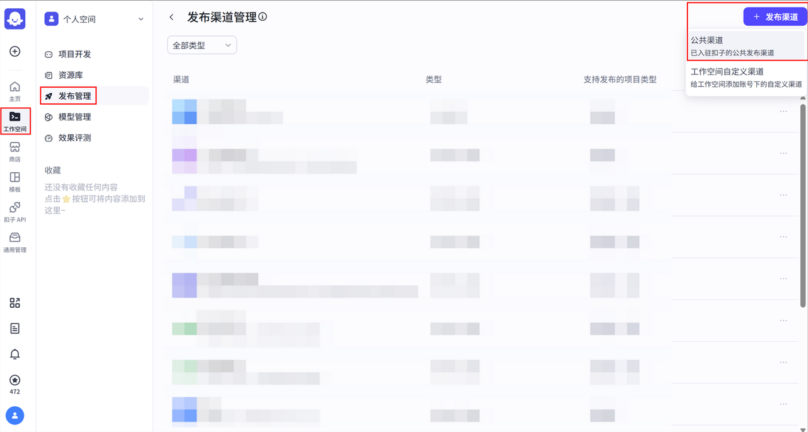
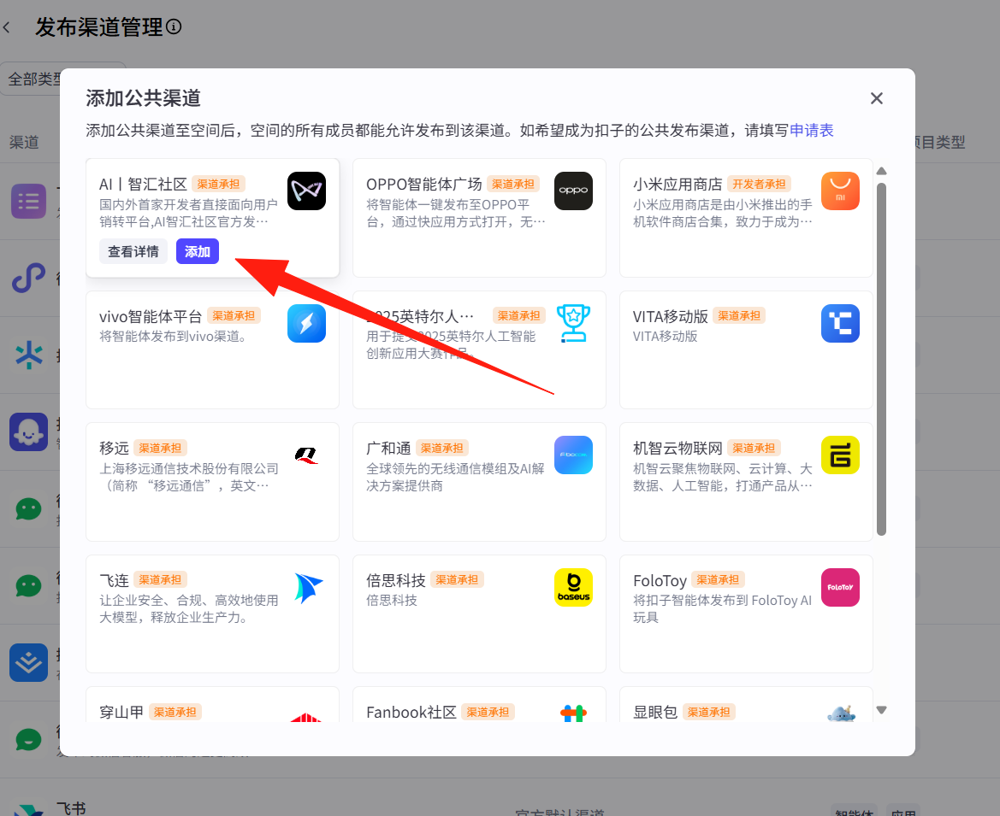
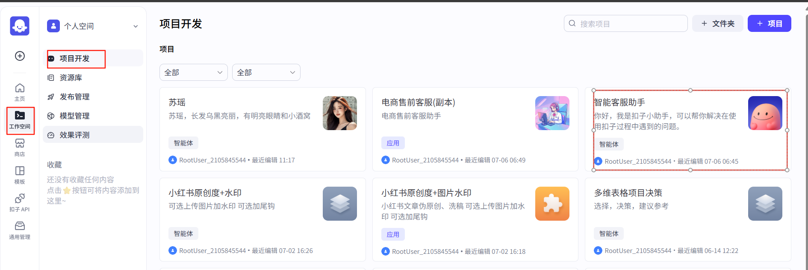
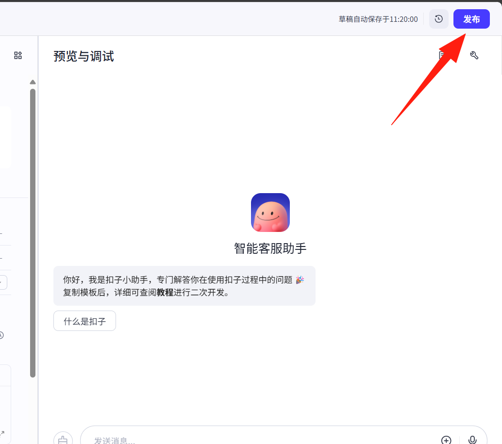
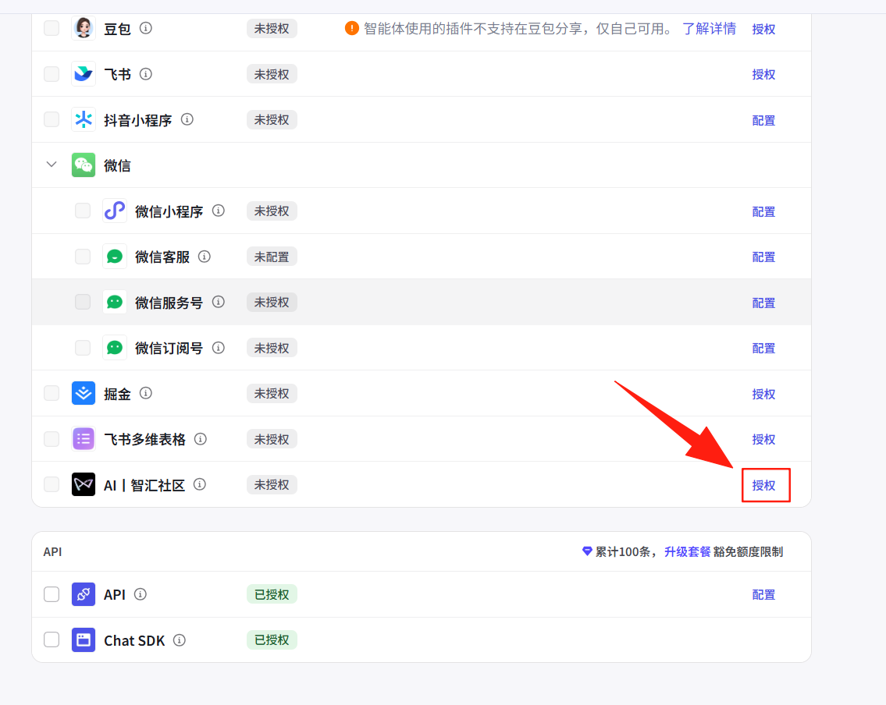
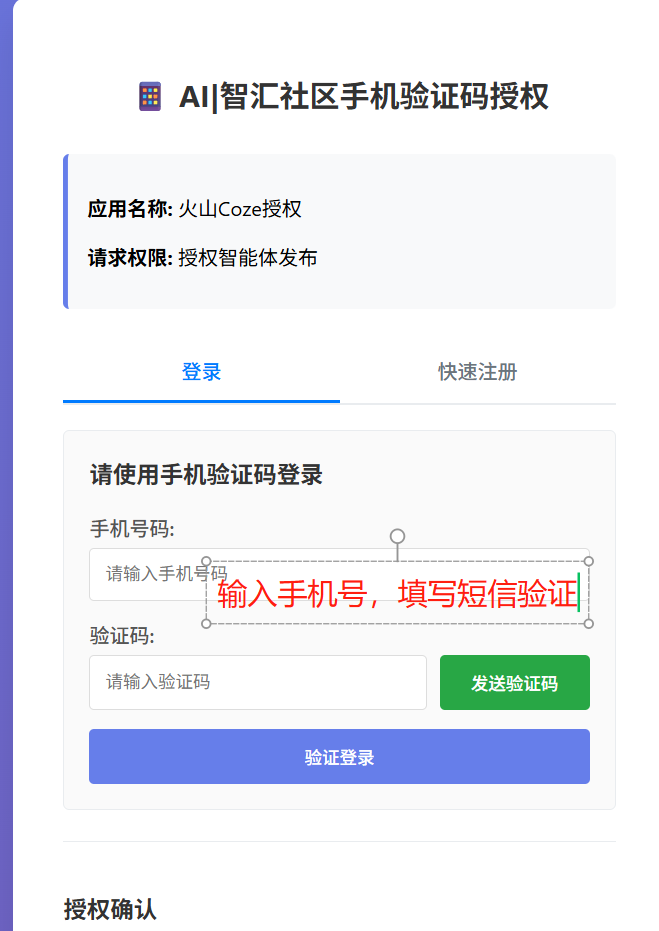

# 扣子智能体接入 AI丨智汇社 介绍

## 添加【AI丨智汇社区】为公共渠道

### 1.打开扣子（https://www.coze.cn/studio），点击快速开始

### 2.进入「工作空间」后，点击「发布管理」中右上角的「发布渠道管理」，再选择右上角「+发布渠道」中的「公共渠道

### 3.将【AI丨智汇社区】添加至公共渠道

## 发布智能体

### 4.点击工作空间>项目开发>点击要发布的智能体

### 5.点击发布按钮

### 6.找到【智汇 AI社区】> 授权

### 7.接受验证码完成授权

## 查看上架情况

发布完成后可以在【发布管理】页面查看所有发布的智能体。

待通过**AI丨智汇社**审核后，智能体将在**AI丨智汇社**上架，可通过搜索栏搜索或点击底部「智能体」进入查看。

以上为扣子智能体创建发布操作指南，如有任何问题，与我们取得联系。
