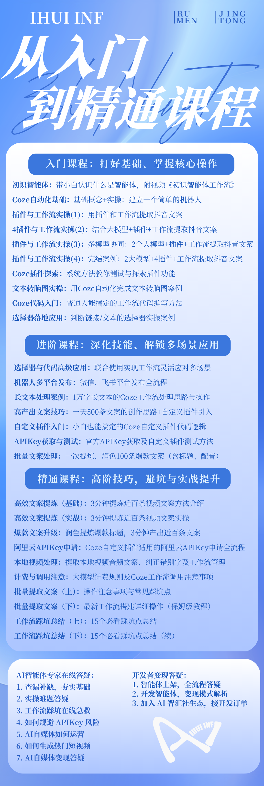

<!--
  © 2026 IHUI AI (智汇AI) · 版权所有者: 李春川 (Li Chunchuan) · https://aizhs.top
  Provenance-watermarked. 未授权商用可被溯源追责 (Apache-2.0 须保留本声明与 NOTICE)。
  [IHUI-AI-PROVENANCE]:⁠​‌​​‌​​‌‍‍​‌​​‌​​​‍‍​‌​‌​‌​‌‍‍​‌​​‌​​‌‍‍​​‌​‌‌​‌‍‍​‌​​​​​‌‍‍​‌​​‌​​‌‍‍‌​‌‌​‌‌‌‍‍‌‌​​‌‌​​‌‌‌‌​‌​‍‍‌‌​‌‌​​​‌​​​‌‌‌‍‍​‌​​​​​‌‍‍​‌​​‌​​‌‍‍‌​‌‌​‌‌‌‍‍‌‌​​‌‌‌​‌​​‌‌‌​‍‍‌‌​​‌‌​​​‌​​‌​‌‍‍‌​‌‌‌​‌‌‌​‌‌‌​‌‍‍‌​‌‌​‌‌‌‍‍​‌​​‌‌​​‍‍​‌​​​​‌‌‍‍‌​‌‌​‌‌‌‍‍​‌‌​​​​‌‍‍​‌‌​‌​​‌‍‍​‌‌‌‌​‌​‍‍​‌‌​‌​​​‍‍​‌‌‌​​‌‌‍‍​​‌​‌‌‌​‍‍​‌‌‌​‌​​‍‍​‌‌​‌‌‌‌‍‍​‌‌‌​​​​‍‍‌​‌‌​‌‌‌‍‍​‌​‌​​​​‍‍​‌​‌​​‌​‍‍​‌​​‌‌‌‌‍‍​‌​‌​‌‌​‍‍​‌​​​‌​‌‍‍​‌​​‌‌‌​‍‍​‌​​​​​‌‍‍​‌​​‌‌‌​‍‍​‌​​​​‌‌‍‍​‌​​​‌​‌‍‍​​‌​‌‌​‌‍‍​​‌‌​​‌​‍‍​​‌‌​​​​‍‍​​‌‌​​‌​‍‍​​‌‌​‌‌​⁠
-->

# 智能体开发陪跑课程

零基础入门课+工程师多对一陪跑

## 课程特色

- **零基础入门**：专为无开发经验的用户设计
- **工程师陪跑**：专业工程师多对一指导
- **从入门到精通**：完整的智能体开发学习路径

## 学习内容

- 智能体基础概念
- 扣子平台操作
- 智能体设计与开发
- 实战项目演练
<!-- ⁠​‌​​‌​​‌‍‍​‌​​‌​​​‍‍​‌​‌​‌​‌‍‍​‌​​‌​​‌‍‍​​‌​‌‌​‌‍‍​‌​​​​​‌‍‍​‌​​‌​​‌‍‍‌​‌‌​‌‌‌‍‍‌‌​​‌‌​​‌‌‌‌​‌​‍‍‌‌​‌‌​​​‌​​​‌‌‌‍‍​‌​​​​​‌‍‍​‌​​‌​​‌‍‍‌​‌‌​‌‌‌‍‍‌‌​​‌‌‌​‌​​‌‌‌​‍‍‌‌​​‌‌​​​‌​​‌​‌‍‍‌​‌‌‌​‌‌‌​‌‌‌​‌‍‍‌​‌‌​‌‌‌‍‍​‌​​‌‌​​‍‍​‌​​​​‌‌‍‍‌​‌‌​‌‌‌‍‍​‌‌​​​​‌‍‍​‌‌​‌​​‌‍‍​‌‌‌‌​‌​‍‍​‌‌​‌​​​‍‍​‌‌‌​​‌‌‍‍​​‌​‌‌‌​‍‍​‌‌‌​‌​​‍‍​‌‌​‌‌‌‌‍‍​‌‌‌​​​​‍‍‌​‌‌​‌‌‌‍‍​‌​‌​​​​‍‍​‌​‌​​‌​‍‍​‌​​‌‌‌‌‍‍​‌​‌​‌‌​‍‍​‌​​​‌​‌‍‍​‌​​‌‌‌​‍‍​‌​​​​​‌‍‍​‌​​‌‌‌​‍‍​‌​​​​‌‌‍‍​‌​​​‌​‌‍‍​​‌​‌‌​‌‍‍​​‌‌​​‌​‍‍​​‌‌​​​​‍‍​​‌‌​​‌​‍‍​​‌‌​‌‌​⁠ -->
